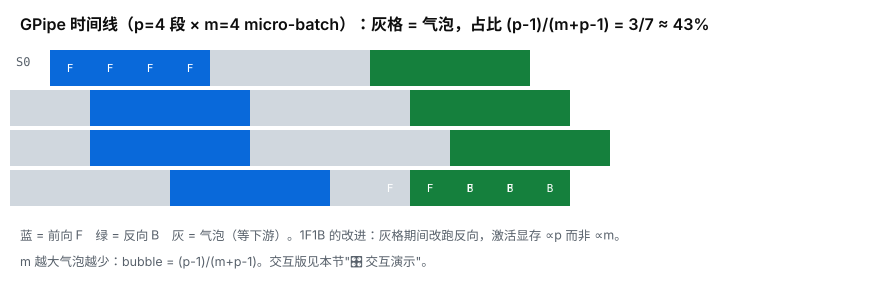
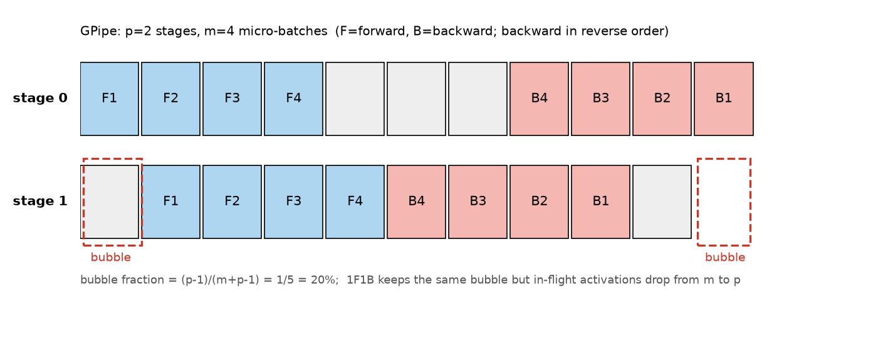

# 04 — 张量并行、流水线并行与工业栈（进阶可选）

> 🧭 最后一章是"进阶可选"：前两节的并行把模型状态切开了，但如果**单层权重/激活**就装不下，
> 要把一层之内的计算切开（张量并行 TP），或者让不同的卡负责不同的层（流水线并行 PP）。
> 这两种并行的代码复杂度显著更高——理解机制 + 亲手验证过一次最小实现，就是本章的合格线；
> 不要求在生产里自己写 TP/PP（那是 Megatron/DeepSpeed/nanotron 的工作）。
>
> 本章数字与公式全部在脚本 05/06 中实测可复现。

## 🎯 学习目标

完成本章后，你将能够：

- ✅ **画出** Megatron MLP 的列/行并行切法与 f/g 共轭算子，解释"每层每方向恰一次 all-reduce"
- ✅ **推导** bubble $= (p-1)/(m+p-1)$，比较 GPipe 与 1F1B 的激活驻留（m 份 vs p 份）
- ✅ **验证**"按层切开不改变数学"：脚本 06 流水线 loss 与单进程一致到 ~1e-6
- ✅ **复述** 3D 并行分工与"读配置"顺序：机内 TP 优先 → PP 权衡气泡 → 剩余给 DP

## 📖 前置知识

**必须掌握：**

- **03 章**：ZeRO/FSDP 的通信原语（all-gather / reduce-scatter）

**建议掌握：**

- **脚本 05/06**：本章的实证载体（torchrun 双卡验证，单进程也兼容）
- [Part 7 03 章](../../Part7_minimind/tutorial/03_gqa_and_ffn.md)：TP"按注意力头切分"引用这里的多头结构

## 1. 张量并行（Megatron 式）：把一层切成两半

以 MLP $Y = \mathrm{gelu}(X \cdot W_1^{\mathsf{T}}) \cdot W_2^{\mathsf{T}}$ 为例
（PyTorch `nn.Linear` 存的是 $W^{\mathsf{T}}$：`W1:(H4,IN)`、`W2:(OUT,H4)`），Megatron 的切法：

```
W1（第一层）列并行：按输出维切 → 各 rank 算 gelu(X·W1_rᵀ)，前向无通信
W2（第二层）行并行：按输入维切 → 各 rank 算 H_r·W2_rᵀ → all-reduce 求和 = 完整 Y
```

**形状链逐跳走一遍**（数字例：batch $b$=8、seq $s$=16、$h$=256、FFN 宽 $4h$=1024、tp=2）：

| 步骤 | 形状 | 通信 |
|---|---|---|
| 输入 $X$ | $(b, s, h) = (8, 16, 256)$ | — |
| $X_r = X$（人人拿全量输入） | $(8, 16, 256)$ | 无 |
| $H_r = \mathrm{gelu}(X \cdot W_{1,r}^{\mathsf{T}})$，$W_{1,r}$ 按输出维切一半：$(512, 256)$ | $(8, 16, 512)$ | **无**（gelu 在分片内部，逐元素） |
| $Y_r = H_r \cdot W_{2,r}^{\mathsf{T}}$，$W_{2,r}$ 按输入维切一半：$(512, 256)$ | $(8, 16, 256)$ | 无（得到的是**部分和**） |
| $Y = \sum_r Y_r$（g 算子 all-reduce） | $(8, 16, 256)$ | **1 次 all-reduce** |

> ⚠️ **术语辨析："按行切 = 列并行"不矛盾**
> Megatron 说"**列并行**"指的是按权重的**输出维**（数学上的 $W_1 \in \mathbb{R}^{h \times 4h}$ 的**列**）切；
> 而 $W_1$ 在 PyTorch 里**转置存**（`W1:(4h, h)`），"按输出维切"落到存储上就是切 `W1` 的 **dim0（行）**。
> 所以"切 W1 的行 = 切 W1ᵀ 的列 = 列并行"是同一件事——脚本 05 注释"A: out×in 按行切 = 列并行"
> 说的就是这层换算。判断口诀：**列并行切输出维、行并行切输入维；存储矩阵按 `nn.Linear` 的
> 转置存法再换算一次**。
>
> 🔎 另一处"教程简化"要心里有数：脚本 05 的 g 是 `AllReduceSum`（autograd.Function），
> f 的 backward 用 backward 后手工 `all_reduce(X_tp.grad)` 实现（脚本 L89）——
> 教学等价实现，Megatron 原版是两个共轭 autograd 算子，语义相同。

- 🔑 为什么能"中间无通信"？因为 gelu 作用在**分片内部**：H 的列被切开，每列的计算只依赖
  W1 的对应行块。两个共轭算子：**f**（forward 恒等 / backward all-reduce）与
  **g**（forward all-reduce / backward 恒等）→ 每层 forward 恰 1 次、backward 恰 1 次
  all-reduce。
- [脚本 05](../scripts/05_tensor_parallel.py) 实测（RTX 4090×2, torch 2.6.0+cu124, NCCL）：

```
前向 max |Y_tp - Y_dense| = 5.96e-07  → ✅（<1e-5 验收线）
梯度 max |dX_tp - dX_dense| = 5.82e-11 → ✅
```

（单进程 world=1 跑同一脚本误差恒为 `0.00e+00`——切分退化为恒等，对照验收请用 ≥2 卡。）

- Attention 同构：QKV 投影按**头**切（天然列并行，呼应 Part 7 GQA 的多头结构），
  输出投影行并行。
- ⚠️ TP 的通信在**每层内部**，频率极高 → 只适合 NVLink 互联的同一台机器内（机内 8 卡），
  跨机用 TP 会把带宽吃光。进阶：all-reduce 还能拆成 reduce-scatter + all-gather，
  顺带把 LayerNorm/Dropout 的激活也分片（sequence parallelism，arXiv 2205.05198）。

## 2. 流水线并行（GPipe / 1F1B）：按层接力




> 🎛️ **交互演示**：下面把 GPipe 时间线和 bubble 公式做成了可玩的（槽位口径与正文推导完全一致：F=B 等长、总槽 2(m+p−1)、气泡 2(p−1)）——拖 p/m 或点预设，看时间线里红底气泡格怎么随充填/排空伸缩、气泡占比从 50% 惨案一路压过 10% 目标线；悬停任意格子能读出它属于哪个 stage / micro-batch。教材"p=8 需 m≥64"的答案可以在图上直接验证。

```widget
pipeline_bubble
1250
```

```
4 层模型、2 个 stage：
  stage0（rank0）：embedding + blocks[0:2]   stage1（rank1）：blocks[2:] + head
数据切成 m=4 个 micro-batch 填流水线（F=forward, B=backward）：
  stage0: F1 F2 F3 F4 ──────────────── B4 B3 B2 B1
  stage1:    F1 F2 F3 F4 ──── B4 B3 B2 B1
```



**怎么读这张图**（中文对照）：stage 1 的 forward 要等 stage 0 送来第一个激活（启动填充），
backward 也要从 stage 1 先开始再传回——两端各留出 $(p-1)$ 个空槽，这就是气泡；
backward 与 forward 反序（B4→B3→B2→B1），脚本 06 用 `reversed(range(n_micro))` 实现同一时序。

**bubble 公式怎么来的**（3 行排槽推导）：设每个 micro-batch 的 forward 耗 1 槽、backward 耗 1 槽
（F=B 等长假设）。流水线两端各要 $(p-1)$ 个槽做填充/排空，所以

$$\text{total slots} = 2m + 2(p-1) = 2(m+p-1), \qquad \text{bubble slots} = 2(p-1)$$

两式相除、约掉因子 2，即得气泡占比：

$$\text{bubble} = \frac{2(p-1)}{2(m+p-1)} = \frac{p-1}{m+p-1}$$

（这个推导对 $m < p$ 也成立：如 $p=4, m=1$，bubble $= 3/4 = 75\%$——空槽比工作槽还多。）

- [脚本 06](../scripts/06_pipeline_parallel.py) 用两个自定义 autograd.Function
  （Send/RecvActivation，forward 传激活、backward 传梯度）实现了最小 GPipe，
  实测**流水线 loss 与单进程整模型完全一致（4.380254 == 4.380254，CPU/GPU 档同值，
  本机实测一致）**——"按层切开不改变数学"的最硬证据。
- 🔑 **bubble 公式**：气泡占比 $= \dfrac{p-1}{m+p-1}$。$p=2, m=4 \to 20\%$；$m$ 增大气泡被摊薄
  （$m=8 \to 11\%$），但 $m$ 个 micro-batch 的激活也要驻留（GPipe）；**1F1B** 调度交错执行
  forward/backward，把激活驻留从 $m$ 个降到 $p$ 个——大模型流水线的标配。
- ⚠️ 工程实测坑（本课开发机踩到）：4090+4090D 混合机型上 NCCL 的 send/recv 点对点会
  互相卡死（集合通信正常）。脚本 06 的解法：点对点单独建 **gloo 组、CPU 中转**。
  教训：分布式问题不总是逻辑 bug，通信后端与硬件拓扑的组合也要怀疑。

## 3. 拼起来：3D 并行与工业栈

$$N_{\text{total}} = \text{TP} \times \text{PP} \times \text{DP}$$

（自检：乘积必须等于总卡数，如 TP=8 × PP=2 × DP=2 = 32 卡。）

LLaMA 2 70B 官方报告用约 2000 张 A100（80GB）训练、**MFU 43.9%**
（Touvron et al. 2023, [arXiv 2307.09288](https://arxiv.org/abs/2307.09288)）——
具体拆法未完全公开，按下面的习惯推
（读配置的习惯：TP 尽量小且机内 → PP 其次 → 剩下全部给 DP；再叠 ZeRO-1/激活重计算）

工业参考栈（按"想继续深入"排序）：

| 资源 | 适合谁 |
|---|---|
| [nanotron](https://github.com/huggingface/nanotron) | 想读"能跑通的 3D 并行极简实现"（PP 有 AFAB/1F1B，ZeRO-1，MoE 专家并行） |
| [Ultra-Scale Playbook](https://huggingface.co/spaces/nanotron/ultrascale-playbook) | 想系统学"集群训 LLM"（530 卡 Llama-1B 全过程讲解，本课的下一站） |
| Megatron-LM / DeepSpeed | 生产级 TP/PP/ZeRO 的原始出处（读文档理解语义即可，不必上手） |
| torchtitan | PyTorch 官方的 LLM 预训练脚手架（FSDP2 + 并行组合的现成配置） |

## 学完本章你能...

- ✅ 画出 MLP 的列/行并行切法，解释 f/g 算子与"每层恰 2 次 all-reduce"
- ✅ 画出 GPipe 时间线，算 bubble $= (p-1)/(m+p-1)$，说出 1F1B 省了什么
- ✅ 复述 TP 适合机内（NVLink）、PP 消息少但气泡大、DP 最便宜的分工逻辑
- ✅ 说出"读配置"的顺序：先 TP 后 PP 剩 DP，再叠 ZeRO 与激活重计算

**课后练习**

<details>
<summary>Q1: 为什么 TP 的 all-reduce 不能像 DDP 那样与计算重叠，导致它对带宽最敏感？</summary>
A: DDP 的梯度 all-reduce 在 backward 尾声、可按桶异步化，与"其余层反传"重叠；TP 的
all-reduce 在【每一层的正中间】，前后都是依赖它的计算，遮不住。所以 TP 只放机内
（NVLink 单向 ~450GB/s / 双向 900GB/s 级，NVLink 4.0 规格；上一代 NVLink 3.0 为双向
600GB/s，见 NVIDIA H100/A100 官方规格页），跨机（InfiniBand 200–800 Gbps ≈ 25–100 GB/s，
厂商规格）会被通信吃掉大半 MFU。
</details>

<details>
<summary>Q2: p=8 个 stage，想让 bubble < 10%，micro-batch m 至少多大？代价是什么？</summary>
A: $(p-1)/(m+p-1) < 0.1 \Rightarrow 7/(m+7) < 0.1 \Rightarrow m + 7 > 70 \Rightarrow m > 63$，
取整数即 $m \ge 64$（$m=63$ 时 $7/70$ **恰好 = 10.00%**，不满足严格的"小于 10%"；
$m=64$ 时 $7/71 \approx 9.86\%$ 才达标）。代价：GPipe 下 64 个 micro-batch 的激活
都要驻留 → 激活显存爆炸，所以要换 1F1B（激活驻留降到 p 个）+ 梯度检查点。
</details>

<details>
<summary>Q3: 4×8 卡（机内 4 台、每台 8 卡）训一个 70B，你会怎么分配 TP/PP/DP？</summary>
A: 4 台 × 8 卡 = 32 卡。TP=8（占满机内 NVLink）→ 剩 32/8 = 4 个"流水线单元"→ PP=2 × DP=2
（或 PP=4 × DP=1），按激活显存与气泡权衡（配 1F1B）；DP 部分叠 ZeRO-1。
这不是唯一解——面试重点是给出"机内 TP 优先、气泡与显存权衡、剩余给 DP"的推理链。
</details>

## 📝 课后作业

👉 [Assignment 10](../../../assignments/assignment_10/) 题 4（TP 分块数学）+ 🌟 题 5（bubble 计算器）

## 全课程毕业

```
Part 1-5   会训练                     Part 6-8   会造模型、会后训练
Part 9     懂硬件                     Part 10    懂集群
下一站：nanotron / Ultra-Scale Playbook / llm.c —— 带着这套地基去读它们 ✈️
```

---

[← 上一章：显存账本与 ZeRO/FSDP](03_memory_zero_fsdp.md) | [Part 10 README](README.md)
