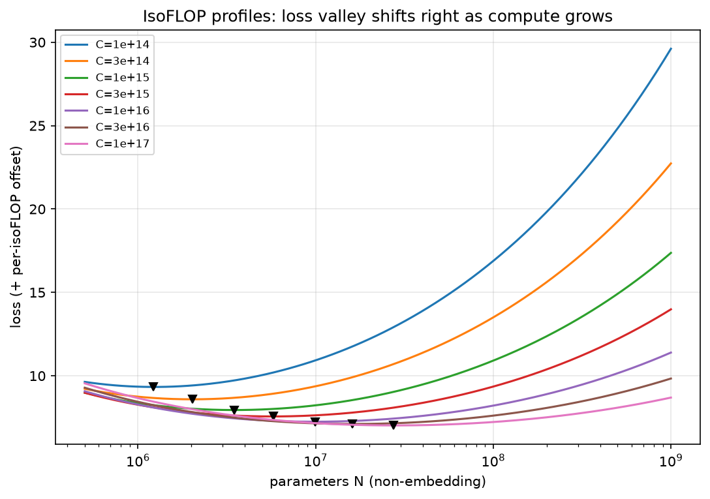
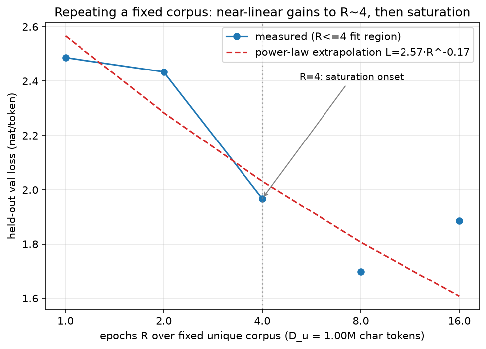

# 00 — Scaling Law 开篇：数据要攒多少才够？

> 🧭 Part 13 的主题是"把数据洗到多干净、攒到多少才够"。但"够"字需要一个**度量衡**：
> 删掉 10% 的语料值多少 loss？多攒 5B token 能换几个点？这些问题在 Scaling Law
> 出现之前只能拍脑袋。本章是这个 Part 的**开篇**（建议先读，再进 01 章手写
> MinHash）：我们把 Chinchilla 的
> `L(N,D) = E + A/N^α + B/D^β` 从"背诵常数"变成"亲手拟合"
> （跑 [scripts/00_scaling_laws.py](../scripts/00_scaling_laws.py) 的三种模式），
> 让后面所有的去重/过滤决策都有一条公式来算账。

## 学习目标

完成本章后，你将能够：

- ✅ **推导** Chinchilla 三项式：从 Kaplan 幂律出发，逐步推出
  `L(N,D)=E+A/N^α+B/D^β` 并解释三个参数各自的物理含义
- ✅ **拟合**：用 Huber 损失 + `scipy.optimize` 把一组 `(N, D, final_loss)` 记录
  拟合成五参数（`fit_chinchilla`），并知道什么网格设计会让拟合病态
- ✅ **解释** 过训练（over-training）与数据约束：为什么 R≤4 个 epoch 的重复
  近似免费、R>16 几乎无效，以及 Llama 3 为什么敢把 8B 模型训到 1875 t/p
- ✅ **设计** 数据预算：给定算力/模型规模，用 t/p（tokens per parameter）语言
  决定"该攒多少数据、去重删多少可以接受"

## 前置知识

**必须掌握：**
- **[Part 7 · 预训练流程](../../Part7_minimind/tutorial/README.md)**：知道预训练在
  训什么（next-token prediction、cross-entropy loss）。为什么需要：本章的所有
  `final_loss` 就是这个量。

**建议掌握：**
- **[Part 8 · 01 GPT 与预训练](../../Part8_post_training/tutorial/01_gpt_and_pretrain.md)**：
  本章 `scan`/`epoch` 模式自建的 1M~6M 参数小 GPT 就是它的缩小版
  （LayerNorm + learned PE + MHA + ReLU FFN 经典款）。
- 对数坐标与幂律：`log y = a - b·log x` 的直线化。

**可选：**
- 微积分（Lagrange 乘数法）：最优 N:D 配比推导用到，跳过证明直接用结论也行。

## 🧭 问题引入：数据洗到多干净、攒到多少才够？

Part 13 要做的事情很清楚：去重、过滤、混料。但每一道工序都在**删数据**
（FineWeb 的 5-gram 去重 + 质量过滤就是这样的流水线）：

- MinHash 去重删掉一档规模
- 质量过滤器再删一档
- 最后你要问：**删掉的这些，值多少 loss？剩下的语料要训多少 epoch？**

没有 Scaling Law 时的决策方式：拍脑袋 + 消融实验烧钱。有的企业真的为"该训
1 个 epoch 还是 4 个 epoch"各烧一次训练来对比。有了 Scaling Law：

```
loss = E + A/N^α + B/D^β        ← 一条公式刻画 (参数, 数据, loss) 三者关系
         ↓ 推导
给定算力 C=6ND，最优的 N 和 D 各是多少？（→ 本章数学推导）
         ↓ 推广
数据重复 R 次 ≈ 什么效果？（→ epoch 模式实测）
```

> 💡 **类比**：Scaling Law 是预训练的"物价表"。去重就像把菜里的烂叶子摘掉——
> 摘掉多少可接受，得先知道一斤好菜值多少钱（E 和 B/D^β），以及烂叶子
> 本来值多少（重复数据在 R>4 后的折扣）。

> 🔑 **关键概念** t/p（tokens per parameter）= D/N：训练 token 数除以参数量。
> Chinchilla 结论 ≈ 20 t/p；Llama 3-8B 是 1875 t/p。整个"该攒多少数据"
> 的讨论都可以压缩成这一个数字。

## 历史脉络

| 年份 | 事件 | 论文 |
|------|------|------|
| 2020 | Kaplan 幂律：loss 随 N、D、C 各自成幂律下降；建议优先扩参数 | [2001.08361](https://arxiv.org/abs/2001.08361) |
| 2022 | **Chinchilla**：修正 Kaplan，N 和 D 应等比例扩，最优 ≈20 t/p；70B→67B/1.4T 同算力反超 Gopher | [2203.15556](https://arxiv.org/abs/2203.15556) |
| 2023 | Muennighoff：数据受限下的 scaling——重复 4 个 epoch 内近似免费，16 后趋零 | [2305.16264](https://arxiv.org/abs/2305.16264) |
| 2023 | Schaeffer：涌现能力可能是指标的"海市蜃楼" | [2304.15004](https://arxiv.org/abs/2304.15004) |
| 2024 | Besiroglu 等：Chinchilla 复现再分析 + inference-aware 修正 | [2401.00448](https://arxiv.org/abs/2401.00448) |
| 2024 | Llama 3：8B 模型 15T token（1875 t/p），"过训练"成为主流 | [2407.21783](https://arxiv.org/abs/2407.21783) |
| 2024 | Krajewski：MoE 的细粒度（granularity）成为新 scaling 变量 | [2402.07871](https://arxiv.org/abs/2402.07871) |

## 数学推导

### 第 1 步：Kaplan 幂律（单变量）

Kaplan et al.（2020）的实验观察：固定其他因素，loss 随参数量 N 成幂律：

```
L(N) = E + A · N^(-α)

两边取对数（减去 E 后）：
ln(L - E) = ln A - α · ln N     ← 在 log-log 图上是一条直线
```

- `E`：不可约损失（irreducible loss）——数据的内在熵，参数再多也压不下去
- `A`：尺度系数；`α`：幂指数（Kaplan 的 N 指数远小于 Chinchilla 后来
  拟合的 α=0.34——这个差异正是两篇论文结论冲突的源头之一）

> 📝 为什么会有幂律？理论解释至今没有定论（ spectra、神经正切核、随机矩阵
> 都给过解释）。工程上的态度：**当经验规律用，但要知道它的适用边界**。

对 D（数据）和 C（算力）有完全对称的形式：`L(D)=E+B·D^(-β)`、
`L(C)=E+...C^(-γ)`。Kaplan 把 C 的指数做外推后得出"**优先扩参数**"的结论。

### 第 2 步：算力怎么算——6ND 的来历

一次 forward：每个参数大约参与 2 次 FLOPs（一次乘一次加）× N 个参数 × D 个
token ≈ `2ND`。backward 要算梯度，约为 forward 的 2 倍 ≈ `4ND`。合计：

```
C ≈ 6ND        （FLOPs；忽略 attention 的 O(T·d) 项，长上下文时要修正）
```

这就是所有 isoFLOP 分析的"预算约束"。

### 第 3 步：Chinchilla 三项式（双变量）

Kaplan 的单变量幂律有个隐患：扫 N 时 D 固定（或扫 D 时 N 固定），两项误差
互相污染。Chinchilla（Hoffmann et al. 2022）直接给出**联合形式**：

```
L(N, D) = E + A/N^α + B/D^β
```

| 参数 | Chinchilla 拟合值 | 含义 |
|------|------|------|
| E | 1.69 | 不可约损失（数据条件熵下界） |
| A | 406.4 | 容量项系数：模型不够大要付的代价 |
| α | 0.34 | 容量项指数 |
| B | 410.7 | 数据项系数：token 不够多要付的代价 |
| β | 0.28 | 数据项指数 |

（来源：2203.15556 Table 3 的参数化拟合；注意 N 是**非 embedding 参数**。）

三项的直觉：

```
loss
  │ E ───────────────────────── 熵下界：谁也压不过去
  │      B/D^β                 数据项：多看 token 就降
  │  A/N^α                     容量项：模型大就降
  └────────────────→ N, D
```

### 第 4 步：最优配比（Lagrange 推导，本教程的核心公式）

**问题**：给定算力预算 C，怎么分给 N 和 D？

**目标**：min `L(N,D) = E + A·N^-α + B·D^-β`，约束 `C = 6ND`。

把 `D = C/(6N)` 代入，对 N 求导置零：

```
d/dN [ A·N^(-α) + B·(6N/C)^(β) ] = 0
-α·A·N^(-α-1) + β·B·(6/C)^β·N^(β-1) = 0
        ↓ 移项
α·A·N^(-α) = β·B·D^(-β)          ← 两个代价项在边际上相等（经济学直觉）
        ↓ 解出
N_opt = (αA/βB)^(1/(α+β)) · (C/6)^(β/(α+β))
D_opt = (βB/αA)^(1/(α+β)) · (C/6)^(α/(α+β))
```

> 🔑 **关键洞察**：`α·A·N^(-α) = β·B·D^(-β)` 是"边际收益相等"条件——
> 再花 1 FLOPs 在扩参数上省的 loss = 花在加数据上省的 loss。
> 与经济学中"预算约束下的最优消费组合"完全同构。

代入 Chinchilla 参数，N、D 随 C 的指数分别是 `β/(α+β)≈0.45` 和
`α/(α+β)≈0.55`——**近似等比例增长**，t/p ≈ 20 且随 C 缓慢变化。
这就是 `--mode fit` 输出里 t/p 从 11（C=1e14）缓慢爬到 21.5（C=1e17）的来源。

> ⚠️ **Kaplan vs Chinchilla 到底差在哪（LR horizon 的坑）**：Kaplan 的一部分
> 训练没有把每个 (N,D) run 的学习率调度调到**该 run 自己的 token 预算**
> ——小/短的 run 相当于被提前掐断，loss 被系统性高估，于是结论偏向"数据
> 不重要、堆参数"。Chinchilla 的修正之一就是逐 run 设置 cosine horizon。
> Besiroglu et al.（2401.00448）的再分析进一步指出 Kaplan 的三参数拟合
> 存在方法学问题。**这不是历史八卦**：你自己的 scan 实验里，如果所有 run
> 共用同一条 LR schedule，会得到一模一样的偏差（脚本 `lr_at()` 的注释
> 就是这条红线）。

### 第 5 步：数据约束——重复 R 次值多少？

上面全部假设"数据无限多"。现实里 unique 语料是有限的，只能重复：

```
R = D / D_u    （D = 训练 token 总数，D_u = unique token 数，R = epoch 数）
```

Muennighoff et al.（2305.16264）的系统实验结论（本课 `--mode epoch` 复现）：

- **R ≤ 4**：重复数据近似等于新鲜数据（loss 沿"新鲜数据幂律"继续下降）
- **4 < R ≤ 16**：边际收益递减，重复 token 开始"打折"
- **R > 16**：趋近于零——再多的 epoch 也压不动 loss

公式化描述：把幂律里的 D 换成"有效 token" `D*`，`D*` 随 R 增长但饱和
（R 大时 `D* → 常数`）。epoch 模式打印的 `R_eff/R（折扣）` 列就是它的实测版。

### 第 6 步：过训练时代——为什么 Llama 3 敢用 1875 t/p

Chinchilla 的"最优"只算**训练算力**。但模型训完要**部署推理**：8B 推一次的
成本 ≈ 每 token 2N FLOPs，部署期的总推理 FLOPs 往往远超训练。

| 模型 | 参数 | 训练 token | t/p | 相对 Chinchilla 最优（~20） |
|------|------|-----------|-----|--------------------------|
| Chinchilla | 67B | 1.4T | 21 | 1×（基准） |
| Llama 2-70B | 70B | 2T | ≈29 | 1.4× 过训练 |
| Llama 3.1-8B | 8B | 15T | **≈1875** | ≈90× 过训练 |

（Llama 3 数据见 2407.21783；8B 的 Chinchilla 最优约 1600~2000 亿 token。）

逻辑链：**推理成本主导 → 同等总成本下，小模型+多数据比大模型+少数据便宜 →
最优 t/p 远大于 20**。Besiroglu et al.（2401.00448）把这个逻辑形式化为
inference-aware scaling：把部署期推理 FLOPs 计入目标函数，解出来的 N 明显
更小、D 明显更大。

> 💡 这正是数据工程在 2024 年后突然更重要的原因：模型小了，**数据配额变大
> 几十倍**，去重/过滤/混料的每一个决策都被放大。

### 附：涌现能力之争（衔接 Part 8 评估学）

Scaling law 说 loss 平滑下降，那"模型到某个规模突然会做数学/推理"是怎么回事？

- **Schaeffer et al.（[2304.15004](https://arxiv.org/abs/2304.15004)）**：
  许多"涌现"是**指标选择**造成的假象——用不连续指标（如 exact match
  全对才算分）时，平滑增长的 capability 会被折成阶跃；换成连续指标
  （如 token 级概率）曲线是平滑的。
- **Jason Wei（涌现综述 2206.07682 的一作）的
  [博客回应](https://www.jasonwei.net/blog/common-arguments-regarding-emergent-abilities)**：
  指标 artifact 的论证不充分——即使在连续指标下，部分能力的增长斜率
  仍随规模显著变陡；且"对用户而言可感知的阈值"有工程意义。

> 🔗 这场争论的实用教训与 [Part 8 · 07 评估学](../../Part8_post_training/tutorial/07_evaluation.md)
> 直接相关：**你汇报的"能力跳变"可能只是你选的指标在跳变**。选指标前先问
> 它是连续的还是阶跃的。

### 附：MoE 的 scaling——粒度作为新变量（衔接 Part 7）

MoE 把"参数量 N"拆成两件事：**总参数（所有专家）**与**每次前向激活的参数**。
Krajewski et al.（[2402.07871](https://arxiv.org/abs/2402.07871)）系统扫描了
**专家粒度**（granularity，总参数固定时切多少个专家）：细粒度 MoE 在相同
训练算力下 loss 更优——因为 6ND 里的"有效 N"应按激活参数算，而表达能力
随专家数提升。所以在 MoE 语境下读 scaling law 时要问一句：**公式里的 N
是总参数还是激活参数？**（[Part 7 · 03 章](../../Part7_minimind/tutorial/03_gqa_and_ffn.md)
手写过 MoE，可对照。）

## 代码实现

[scripts/00_scaling_laws.py](../scripts/00_scaling_laws.py)，三种模式：

```bash
python 00_scaling_laws.py --mode fit     # 零 GPU，~2s：合成数据拟合 + isoFLOP 图
python 00_scaling_laws.py --mode scan    # 单卡 ~25s：网格真训小 GPT + 自己的 scaling law
python 00_scaling_laws.py --mode epoch   # 单卡 ~31s：固定语料 × R epoch 饱和实验
```

两个跨脚本复用的接口（作业会 import 它们，签名不许变）：

```python
def chinchilla_loss(N, D, params):
    """L(N,D) = E + A/N^alpha + B/D^beta；params=(E,A,alpha,B,beta)"""

def fit_chinchilla(records, n_starts=8, huber_delta=0.05, seed=13, E_fixed=None):
    """records = [(N, D, final_loss), ...] → (E, A, alpha, B, beta)
    Huber + scipy.least_squares，A/B 用 log 参数化，8 起点随机重启"""
```

### 形状追踪：scan/epoch 模式的数据通路

```
token 池 (n_tokens,) uint8        # scan: 马尔可夫重采样；epoch: input.txt
  │ ChunkSampler / EpochLoader：切成互不重叠 chunk（B×T=8192 token）
  ↓ view(B, T)
seq (B=32, T=256)
  │ x = seq[:, :-1]   y = seq[:, 1:]        # 因果错位：预测下一个 token
  ↓
x, y (32, 255) int64
  │ token_embed + pos_emb → (32, 255, d)
  │ L × Block（Pre-LN + MHA + FFN）        # 形状不变
  │ ln_f → lm_head → (32, 255, V)
  ↓ cross_entropy(logits.reshape(B*T, V), y.reshape(B*T))
loss 标量（nat/token）
```

关键实现点（都有坑，注释在现场）：

1. **LR horizon 逐 run 设置**（`lr_at` 的注释）：cosine 的 `total_steps`
   = 本 run 的 token 预算 ÷ 每步 token 数。这是 Kaplan 偏差的直接对策。
2. **Huber 而非最小二乘**：真实网格总有坏点，Huber 在 |r|>δ 后线性化，
   坏点自动降权。
3. **多起点**：幂律拟合非凸，8 次随机重启取代价最小者。
4. **B 取小换步数**（B=32, T=256）：同量 token 下更多优化步——开发时实测
   B=256 时步数太少，模型连"掉出均匀分布盆地"都来不及。

## 实测（三模式真实输出）

> 📊 环境标注：RTX 4090（24GB）单卡 · torch 2.6.0+cu124 · Python 3.12 ·
> scipy 1.18.1 · bf16 autocast。以下输出均为脚本真实运行结果（非编造）。

### 模式一：fit —— 16 次噪声抽取平均后全部 <5%

```text
[1] 合成网格: 64 个 (N, D) 点 × 16 次独立 3% 噪声抽取
    真值来自 Hoffmann 2203.15556 Table 3: E=1.69 A=406.4 α=0.34 B=410.7 β=0.28

[2] 单次噪声抽取的拟合结果（看方差，不验收；截选）
     A: 真值 406.400  单次拟合 360.954  偏差 +11.2%    ← 单次会偏 10%+

[3] 16 次独立噪声实现 → 拟合 → 参数平均（0.4s）
        参数         真值         平均拟合      相对误差    跨抽取std 判定
         E      1.690        1.692     0.13%     0.052 PASS
         A    406.400      416.292     2.43%    38.762 PASS
     alpha      0.340        0.342     0.53%     0.007 PASS
         B    410.700      424.322     3.32%    69.751 PASS
      beta      0.280        0.281     0.44%     0.010 PASS
    → ✅ 全部参数相对误差 <5%

[4] isoFLOP 剖面（用拟合参数画；谷底 = 该算力预算下的最优 N）
       C (FLOPs)      N_opt      D_opt  D/N (t/p)
           1e+14   1.23e+06   1.35e+07       11.0
           1e+15   3.48e+06   4.78e+07       13.7
           1e+16   9.85e+06   1.69e+08       17.2
           1e+17   2.78e+07   5.99e+08       21.5
```



读图要点：每条 U 形曲线是**同一算力预算**下 loss 随 N 的变化——左边是
"模型太小、算力浪费在数据上"，右边是"模型太大、数据不够喂"；谷底（▼）
随 C 增大右移，且 t/p 缓慢爬升，与 Chinchilla 的 ~20 t/p 吻合。

> 📝 **为什么网格要跨 5 个数量级**（N 从 1e5 到 1e10、D 从 1e7 到 1e12）：
> 让 N 项和 D 项各有"主导角"与"可忽略角"，5 个参数才可辨识。开发首版
> 用了窄网格（D 项始终占比 <30%），B 的拟合误差 262%——参数沿平坦方向漂移。
> 单次噪声抽取的系数误差天然有 ±10~15%（跨抽取 std 列），16 次抽取取平均
> 才能稳定达标。这正是工业 scaling 实验报"均值±std"的原因。

### 模式二：scan —— 3×3 网格真训 + 自拟合（~25s，输出截选）

```text
[1] 语料池：input.txt 拟合的 3 阶马尔可夫重采样（'无限唯一数据'区）
    池大小: 24.0M token（>= 最大 D，单 run 内 token 最多见 1 次）
    vocab=65（char 级）  熵下界 E=2.616 nat/token vs 随机猜测 ln(65)=4.174

[3] (N, D, val_loss) 网格表                    ← 双向单调！
             N          D      t/p   val_loss
      1.24e+05      2e+06     16.1     2.9687
      1.24e+05      6e+06     48.2     2.9438
      1.24e+05      2e+07    160.9     2.7942
       2.6e+05      2e+06      7.7     2.9543
       2.6e+05      6e+06     23.0     2.9268
       2.6e+05      2e+07     76.9     2.7699
      9.88e+05      2e+06      2.0     2.9426
      9.88e+05      6e+06      6.1     2.8267
      9.88e+05      2e+07     20.2     2.7575

[4] fit_chinchilla 拟合
    自由 5 参数: E=0.0000  A=1.04  α=0.100  B=4.18  β=0.031   ← 病态！
    固定 E=2.616（语料熵下界可独立测量——合成语料独有的优势）:
       E=2.616  A=421.3  α=0.742  B=52.7  β=0.354
       相对残差: 均值 +0.02%  最大绝对值 2.08%

[5] 计算最优配比
       C (FLOPs)      N_opt      D_opt  D/N (t/p)
        1.49e+12   6.32e+04   3.93e+06       62.3
        1.18e+13   1.23e+05    1.6e+07      129.6
        1.19e+14    2.6e+05    7.6e+07      292.4

    📊 学生结论: 本玩具尺度（char 级、≤1M 参数）最优 D/N ≈ 62~292 t/p
```

三段式解读：

1. **网格表双向单调**——固定 N 加 D 降 loss，固定 D 加 N 也降 loss。
   这是拟合有意义的必要条件（首版网格 N 太大时 D 方向完全平的）。
2. **自由拟合病态**（E 被顶到 0）：玩具网格的动态范围只有 ~0.2 nat，
   E 在网格内不可辨识——fit 模式用了 12 个数量级才钉住它。**解法**：
   本课语料是合成的，熵下界可以直接测量（2.616），固定 E 后指数立刻正常
   （α=0.74、β=0.35，残差 2%）。
3. **学生结论的解读**：玩具最优 t/p≈62~292，远高于 Chinchilla 的 20——
   因为这个任务的可学结构在 ~0.3M 参数就饱和了，多余预算全部流向数据。
   **N:D 没有普适值，只有"对给定任务/尺度测量出来的值"**——这本身就是
   本模式最重要的教学输出。

### 模式三：epoch —— R≤4 近似线性，R=16 饱和+过拟合（~31s）

```text
[1] 真实语料: data/input.txt（tiny shakespeare）
    训练（unique）: 1.004M token   验证（held-out）: 112K token
[2] 模型: 6.10M 参数（d=288, L=6），R = [1, 2, 4, 8, 16]

    ✔ R= 1  D= 1.00M  train=2.4934  val=2.4866
    ✔ R= 2  D= 2.00M  train=2.4075  val=2.4337
    ✔ R= 4  D= 4.00M  train=1.8899  val=1.9676
    ✔ R= 8  D= 8.00M  train=1.4214  val=1.6988
    ✔ R=16  D=15.99M  train=0.9505  val=1.8849   ← val 反升！

[4] 幂律拟合（仅用 R<=4 的点）: L = 2.567 · R^(-0.169)
      R     实测 val       幂律预测       偏差  判定
      1     2.4866     2.5671    -3.1%  线性区内 ✓
      2     2.4337     2.2835    +6.6%  线性区内 ✓
      4     1.9676     2.0313    -3.1%  线性区内 ✓
      8     1.6988     1.8069    -6.0%  未饱和
     16     1.8849     1.6073   +17.3%  饱和（实测高于外推）

[5] 有效 token 数
      R      名义 D      有效 D    R_eff/R（折扣）
      1     1.00M     1.21M          1.21x
      2     2.00M     1.38M          0.69x
      4     4.00M     4.85M          1.21x
      8     8.00M    11.57M          1.44x
     16    15.99M     6.25M          0.39x    ← 重复 token 只值 0.39 个新的
```



对照 Muennighoff（2305.16264）的结论读数：

- **R≤4**：实测贴着幂律外推（±3~7%）——重复数据当新鲜数据用，损失很小 ✓
- **R=8**：本玩具尺度仍在赚（模型离吃透 1M 语料还远）；论文尺度上这里是
  边际收益开始打折的位置（我们欠训练更严重，饱和点整体右移——玩具与真实
  的诚实差异）
- **R=16**：实测比外推差 +17.3%，**且 val 反升、train/val 分叉**
  （train 0.95 vs val 1.88）——模型在背语料而不是学语言。这就是去重的
  价值所在：把 R=16 的预算换成 4 倍 unique 数据，loss 会好得多。

## 实验设计复盘：开发时踩的三个坑（本教程最值钱的部分）

scan 模式看起来只有 25 秒，但让它"能出双向单调结果"的设计迭代了四轮。
三个坑都值得记住——**你自己做 toy 实验时一定会再遇到**：

### 坑 1：随机合成语料 = 学不动（语料坑）

**症状**：所有 run 的 loss 死死卡在 `ln(V)`（随机猜测水平），N、D 加多少都没用。

**原因**：首版用随机 Dirichlet 转移表造 3 阶马尔可夫语料。纯 3 阶结构
**没有任何低阶入口**（unigram 均匀、bigram 无信号），而 SGD 学 n-gram
统计需要"先学简单再爬复杂"的阶梯——自然语言天然有（先 unigram 再
bigram 再 …），随机表没有。注意力从零自举出"看前 3 个 token"的模式，
在几百步内根本爬不出来（我们实测 2441 步纹丝不动）。

**解法**：在真实文本（input.txt）上拟合 3 阶插值马尔可夫再重采样——
**继承真实文本的难度谱**（各阶行熵是 Zipf 式平滑分布），又有无限唯一数据。

### 坑 2：容量不 binding = 没有模型方向梯度（网格坑）

**症状**：按规格网格 N∈{1M,3M,10M} 训完，固定 D 时三个模型的 loss 相差
<0.01——拟合出的 α≈0，谷底在网格外面。

**原因**：这个任务的可学结构 ~0.3M 参数就吃下了，1M/3M/10M 全部"够用"，
容量项 `A/N^α` 从未被激活。**谷底必须落在网格内**，拟合才有意义。

**解法**：把 N 缩一个数量级到 {0.12M, 0.26M, 1M}（脚本注释里有说明）。
这也是 Chinchilla 论文强调的：isoFLOP 实验的 (N,D) 候选要覆盖谷底两侧。

### 坑 3：大 batch = 步数不够（步数坑）

**症状**：B=256 时 D=2M 的 run 只有 30 步优化，loss 从初始化掉到均匀分布
水平就停住。

**原因**：玩具尺度的 token 预算小，大 batch 把优化步数吃光了。真实大模型
实验 batch 也大，但它们的 token 预算大 5 个数量级，步数反而多。

**解法**：B=32、T=256——同量 token 换 8 倍步数。

> 💡 三个坑合起来的教训：**toy 实验不是"缩小版的真实实验"**。缩小规模会
> 改变优化动力学（步数）、任务难度谱（语料）、以及哪个资源先饱和（网格）。
> 用 toy 复现经典结论前，先确认这三件事仍然同构。

## 常见陷阱

### 陷阱 1：所有 run 共用一条 LR schedule

**症状**：scan 网格里小 D 的 run loss 明显偏高，拟合出"数据不重要"的结论。

**原因**：短 run 的 cosine 还没衰减到低点就结束，系统性欠训练——这就是
Kaplan 偏差的机制。

**解法**：`total_steps` 逐 run 设置成 `D_run / (B×T)`（脚本 `lr_at()`）。

### 陷阱 2：拟合时不看参数边界

**症状**：拟合结果里 E≈0（顶到下界）或指数顶到 0.01/1.5 的边界值。

**原因**：网格动态范围不够，参数沿平坦方向漂移到边界（scan 首版的真实经历）。

**解法**：扩网格跨度；或固定可独立测量的参数（如本课的 E=语料熵下界）。

### 陷阱 3：用训练 loss 而不是验证 loss 做 scaling

**症状**：R=16 的"loss"还在下降，得出"重复数据一直有用"的错误结论。

**原因**：多 epoch 后模型开始记忆语料，训练 loss 反映的是背诵能力。

**解法**：一律用 held-out 验证 loss（epoch 模式的 val 切片从不参与训练；
train/val 分叉本身就是记忆的探测器）。

## 练习与思考

### 概念检验

<details>
<summary>Q1: 为什么 Chinchilla 三项式里的 E 对自然语言是 1.69 nat 而不是 0？</summary>

A: E 是数据的**条件熵下界**：给定前文，下一个 token 的内在不确定性。
自然语言本身有随机性（同一个前文可以接多种合理的续写），再大的模型
也不可能把 loss 压到 0。本课 scan 语料的 E=2.616 就是这个含义——它是
"这门语言从信息论上最便宜的可达 loss"。玩具实验的优势是 E 可以直接
测量（生成器知道条件分布），自然语言的 E 只能靠拟合外推。

</details>

<details>
<summary>Q2: Llama 3-8B 用 1875 t/p 训练，比 Chinchilla 最优过训练约 90 倍。这违反 scaling law 吗？</summary>

A: 不违反。Chinchilla 的"最优"目标函数是**最小化训练算力换 loss**；
Llama 3 优化的是**部署总成本（训练 + 海量推理）**。推理成本与参数量成正比
（每 token 约 2N FLOPs），所以把 N 缩小、D 放大，虽然训练算力"浪费"了，
推理便宜了几十倍。Besiroglu et al.（2401.00448）的 inference-aware
分析就是这个逻辑的形式化。另外过训练的模型在同参数量下更好，蒸馏时也更值钱。

</details>

<details>
<summary>Q3: 你的 scan 网格里，固定 C=6ND，把 (N,D) 从 (1M, 20M) 改成 (4M, 5M)——loss 会怎么变？为什么这能用来找谷底？</summary>

A: 沿同一条 isoFLOP 线移动：(1M,20M) 的 t/p=20 偏"数据侧"（模型偏小，
容量项 A/N^α 偏大），(4M,5M) 的 t/p=1.25 偏"参数侧"（数据项 B/D^β 偏大）。
loss 先降后升，最低点就是该算力下的最优配比——这正是 isoFLOP 实验找谷底
的原理（fit 模式的 U 形曲线族）。实际操作要跑同一 C 下的多个 (N,D) 候选。

</details>

### 动手实践

<details>
<summary>练习 1: 扩网格重拟合</summary>

**任务**：跑 `--mode scan --full`（N 到 3M、D 到 60M 的 4×3 网格，约 3 倍
smoke 时间），把新 records 喂给 `fit_chinchilla`（记得对比自由拟合与
`E_fixed=H_floor` 两种）。

**验收标准：**
- [ ] 网格表在 N、D 两个方向都单调
- [ ] 汇报 E 固定拟合的 (α, β) 与 smoke 版（α=0.742, β=0.354）的差异
- [ ] 解释：网格变大后，最优 t/p 是升高还是降低？为什么？

**步骤提示**：
```python
# 脚本已经支持：python 00_scaling_laws.py --mode scan --full
# 想自己调网格：改 run_scan_mode 里的 N_targets / D_targets，
# records = [(N, D, val_loss), ...] 直接喂 fit_chinchilla(records, E_fixed=2.616)
```

</details>

<details>
<summary>练习 2: 加数据 vs 多 epoch，谁划算？</summary>

**任务**：基于 epoch 模式的实测曲线回答：你有 8M token 的训练预算和 1M
的 unique 语料，(a) 重复 8 遍；(b) 去重放松一点攒到 8M unique（假设幂律
L=2.567·R^(-0.169) 对新鲜数据近似成立）。哪个 loss 更低？

**验收标准：**
- [ ] (b) 用幂律外推 D=8M 新鲜数据的 loss（R_eff=8）
- [ ] (a) 用实测 R=8 的 val loss（1.6988）对比
- [ ] 一句话结论 + 指出这对去重策略意味着什么

**步骤提示**：
```python
a = 2.567; gamma = 0.169
fresh_8M = a * 8 ** (-gamma)   # (b) 新鲜数据幂律外推
repeat_8 = 1.6988              # (a) epoch 模式实测
# 对比并解释：差距就是"重复折扣"，也是去重的价值上限
```

</details>

### 扩展思考

- 本课 scan 的最优 t/p≈62~292，Chinchilla 是 ~20，Llama 3 是 1875——
  **t/p 由什么决定？**（提示：任务有效复杂度、模型尺度、推理成本三者）
- 如果把 scan 语料换成"代码"，你预期 α、β 怎么变？（代码的 n-gram 熵更低、
  结构更规则）
- Muennighoff 的结论在你的生产场景里怎么用：unique 数据固定时，
  "训几个 epoch 收手"应该怎么定？

## 学完本章你能...

- ✅ 手推 Chinchilla 三项式与最优配比公式（Lagrange 两条线）
- ✅ 用 `chinchilla_loss` / `fit_chinchilla` 拟合自己的 scaling 数据，
  并诊断病态拟合（参数顶边界、E 不可辨识）
- ✅ 解释 20 t/p → 29 t/p → 1875 t/p 的演化逻辑（训练最优 → 推理感知）
- ✅ 用 R≤4 近似免费 / R>16 趋零的结论，回答"去重删多少、重复几遍"的预算问题
- ✅ 避开 toy scaling 实验的三个坑（语料难度谱、网格容量 binding、batch 换步数）

## 参考资源

- 📄 Hoffmann et al. 2022, *Training Compute-Optimal Large Language Models*（Chinchilla）[arXiv 2203.15556](https://arxiv.org/abs/2203.15556)
- 📄 Kaplan et al. 2020, *Scaling Laws for Neural Language Models* [arXiv 2001.08361](https://arxiv.org/abs/2001.08361)
- 📄 Muennighoff et al. 2023, *Scaling Data-Constrained Language Models* [arXiv 2305.16264](https://arxiv.org/abs/2305.16264)
- 📄 Besiroglu et al. 2024, *Chinchilla Scaling: A replication attempt* [arXiv 2401.00448](https://arxiv.org/abs/2401.00448)
- 📄 Schaeffer et al. 2023, *Are Emergent Abilities of LLMs a Mirage?* [arXiv 2304.15004](https://arxiv.org/abs/2304.15004) · Jason Wei 的[博客回应](https://www.jasonwei.net/blog/common-arguments-regarding-emergent-abilities)
- 📄 Krajewski et al. 2024, *Scaling Laws for Fine-Grained Mixture of Experts* [arXiv 2402.07871](https://arxiv.org/abs/2402.07871)
- 📝 Lilian Weng, *Scaling Laws, Carefully* [博客](https://lilianweng.github.io/posts/2026-06-24-scaling-laws/)
- 🎓 Stanford CS336 *Language Models from Scratch*（scaling laws 专题）[课程主页](https://stanford-cs336.github.io/)
- 🤗 datablations（小模型数据消融的公开实验集）[HF 主页](https://huggingface.co/datablations)

## 下一步

有了预算语言，现在可以回答 Part 13 的第一个工程问题：**语料里有多少重复、
怎么把它们找出来删掉？**下一章手写工业去重的核心算法（MinHash + 分带 LSH，
~60 行纯标准库）。

👉 [01 — 手写 MinHash + LSH 去重](01_dedup_from_scratch.md)
