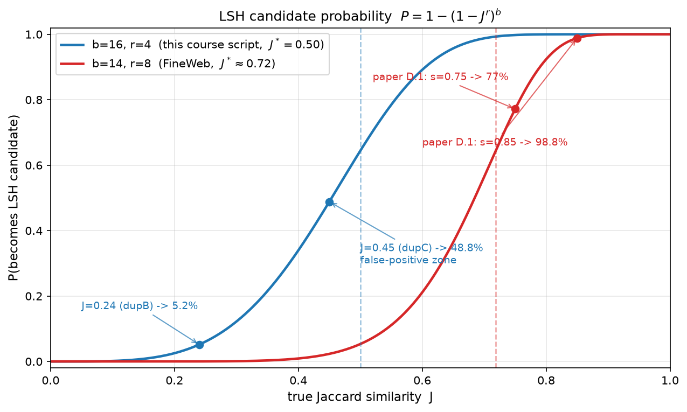
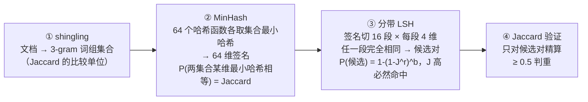

# 01 — 手写 MinHash + 分带 LSH 去重

> 🧭 去重是数据工程的核心工序：网络语料里精确与近似重复都大量存在——Lee et al. 2021
> （[arXiv:2107.06499](https://arxiv.org/abs/2107.06499)）分析发现 C4 **验证集中 4.6% 的
> 样本在训练集里有近似副本**（记忆/泄漏的直接证据），而去重让模型**用少得多的数据达到
> 相同甚至更好的效果**；FineWeb 逐快照去重后仍保留 15T tokens（去重远不是"删点数据"）。
> 本章手写工业去重的完整算法（跑 [scripts/01_minhash_dedup.py](../scripts/01_minhash_dedup.py)，
> 纯标准库，CPU 几秒）。
>
> 📝 **前读指引**：如果还没读 [00 章 Scaling Law 开篇](00_scaling_laws.md)，建议先花
> 二十分钟过一遍——"去重删掉的数据值多少 loss、剩下的语料训几个 epoch 划算"
> （R>4 后重复 token 急剧打折）正是本章每一刀删减背后的算账依据。

## 学习目标

完成本章后，你将能够：

- ✅ **手写** MinHash + LSH 去重算法（核心 4 函数 + main ≈ 64 行）
- ✅ **解释** MinHash 的数学原理和概率性质
- ✅ **画出** LSH 的分带机制和召回率曲线（S 曲线），并用拐点公式反推 b/r
- ✅ **设计** 去重管线的参数（band、row、阈值）

## 前置知识

**必须掌握：**
- Jaccard 相似度：$J(A,B) = \dfrac{|A\cap B|}{|A\cup B|}$
- 暴力法为什么不可行：$N$ 篇文档要 $O(N^2)$ 次两两比较——**十亿级语料下等于不可算**，
  这正是 MinHash+LSH 存在的理由（先"疑似对"再精算，把 $O(N^2)$ 压到近线性）

## 理论背景

### 问题引入：为什么需要去重？

预训练数据虽然"多"，但存在大量重复：

1. **精确重复**：同一文档逐字出现多次（C4 只做了行级三行窗口去重，文档级重复大量残留）
2. **近似重复**：同一文档的不同版本（如不同网站转载、改写）
3. **负面影响**：模型"记住"而非"理解"，加剧过拟合与训练-测试泄漏

> 💡 **类比**：重复数据像是同一道菜反复吃。吃 10 遍同一道菜不会让你成为美食家，
> 只会让你对这道菜产生偏见。

### 数学推导：MinHash 的概率性质

**问题设定**：两个集合 $A$、$B$，Jaccard 相似度 $J(A,B) = \dfrac{|A\cap B|}{|A\cup B|}$。

#### Step 1：定义 MinHash

$$h(S) = \min_{x \in S} h(x)$$

> 白话：把哈希函数看成给全集元素"随机发牌"，$h(S)$ 就是集合 $S$ 手里最小的那张牌的
> **牌面**（返回的是哈希值，不是元素本身）。

#### Step 2：概率性质

$$P[h(A) = h(B)] = J(A,B)$$

**前提（重要）**：把 $h$ 看成对全集元素的**随机排列**（洗牌）——不同元素几乎不撞出
相同的哈希值。哈希空间足够大（如 $2^{31}$）时，这个近似在工程上完全成立。

**证明**（拆成两个方向 + 一步对称性）：

- **（→）** 若 $A\cup B$ 中哈希最小的元素落在交集 $A\cap B$ 里，则它同时是 $A$ 的最小
  和 $B$ 的最小，两边必相等；
- **（←）** 反之，若这个最小元素只属于 $A$（不在 $B$ 中），它唯一决定了 $h(A)$，
  而 $h(B)$ 只能来自更靠后的元素——两边必不相等；
- **（对称性）** 洗牌是均匀的：最小元素等可能落在并集的任何位置，"最小元素落入交集"的概率为

$$P = \frac{|A\cap B|}{|A\cup B|} = J(A,B) \qquad \blacksquare$$

**小例子自查**：$A=\{1,2\}$，$B=\{2,3\}$，$J=1/3$。列出 $U=\{1,2,3\}$ 的全部
$3! = 6$ 种排列，"最小元素是 2"（落在交集）的恰好 2 种——$2/6 = 1/3 = J$ ✓

#### Step 3：多次哈希估计

用 $k$ 个**相互独立**的哈希函数构造签名向量，并以"签名一致的比例"作估计量：

$$\mathrm{sig}(A) = [h_1(A),\ h_2(A),\ \dots,\ h_k(A)], \qquad J_{\mathrm{est}} = \frac{1}{k}\sum_{i=1}^{k} I[h_i(A) = h_i(B)]$$

其中 $I[\cdot]$ 是**指示函数**：括号内成立取 $1$，否则取 $0$。

这个估计量有三条性质，每条都只用到"$k$ 次独立、每次成功概率为 $J$ 的伯努利试验"：

- **无偏**：$E\big[J_{\mathrm{est}}\big] = J(A,B)$；
- **方差**：$\mathrm{Var}\big[J_{\mathrm{est}}\big] = \dfrac{J(A,B)\,\big(1-J(A,B)\big)}{k}$
  （单次伯努利的方差是 $J(1-J)$，取平均再除以 $k$）；
- **采样噪声量级** $\sigma \approx \sqrt{J(1-J)/k}$：代入 $J=0.73$、$k=64$ 得
  $\sigma\approx 0.055$——这正是后面实测输出 [4] 里"签名一致率 0.69 vs 真实 0.73"
  那个差的来源（$1\sigma$ 之内，正常波动）。$k$ 越大，估计越准。

### 数学推导：LSH 的分带机制

LSH（Locality-Sensitive Hashing）的核心思想是：**把签名向量切成多段（band），
只要有一段完全相同就认定为候选对**。

**问题设定**：签名维度 $k$，切成 $b$ 个 band，每个 band 有 $r$ 行：$k = b \times r$。

#### Step 1：分带

$$\mathrm{band}_1 = [h_1, \dots, h_r], \quad \mathrm{band}_2 = [h_{r+1}, \dots, h_{2r}], \quad \dots, \quad \mathrm{band}_b = [h_{(b-1)r+1}, \dots, h_k]$$

#### Step 2：候选对判定

两篇文档是候选对，**当且仅当**存在某个 band $i$，使得 $\mathrm{band}_i(A) = \mathrm{band}_i(B)$。

#### Step 3：概率分析

四步推导，每步只用到"独立"（短公式用行内写法，便于在列表里跟读）：

1. **单维相等**（MinHash Step 2 的性质）：$P[h_i(A) = h_i(B)] = J$。
2. **段内独立**：某个**固定** band（如 $\mathrm{band}_1$）$r$ 维全同的概率，是 $r$ 个 $J$ 连乘——$P = J^r$。
3. **段间独立**：$b$ 个 band 各自"不全同"的概率是 $(1-J^r)$，全都不相同——$P = (1-J^r)^b$。
4. **取对立事件**："至少一个 band 相同"，即成为候选对——$P = 1-(1-J^r)^b$。

> ⚠️ 注意第 2 步说的是"某个**固定** band 全同的概率 $J^r$"，第 4 步才是"任意一个
> band 命中"——两者数值差别巨大（$J=0.5, r=4$ 时前者 6.25%、后者 64%），别混。

**性质**：

- $J$ 高时，$P$ 接近 $1$（高召回）；
- $J$ 低时，$P$ 接近 $0$（低误报）；
- $b$ 与 $r$ 控制"召回-误报"的权衡——这条曲线长什么样、怎么调，见下一小节的 S 曲线。

**关键洞察**：

- 在签名预算 $k = b\times r$ 固定的约束下，$b$ 与 $r$ **此消彼长**：$b$ 越大（$r$ 随之
  越小），S 曲线整体左移——召回与误报**同时**升高；
- $r$ 越大则筛选越严格；
- 实践中 FineWeb 的配置是 $b=14,\ r=8$（见下文最佳实践表：目标相似度 ≥75%）。

### S 曲线：召回率曲线与等效阈值

> 🎛️ **交互演示**：下面把这条 S 曲线做成了可玩的——拖 b/r/J 三个滑条，实时看候选概率曲线、
> 拐点 $J^*=(1/b)^{1/r}$（红色虚线）与当前文档对的命中概率（橙点）；预设里「本课脚本 16×4」
> 和「FineWeb 14×8」正是下方静态图的两组配置。试把 J 拖到 0.45：$P\approx 48.8\%$——
> 后文实测里 (doc03, dupC) 的误报就是这么来的。

```widget
lsh_s_curve
1230
```

把"成为候选的概率" $P = 1-(1-J^r)^b$ 画成 $J$ 的函数，是一条陡峭的 S 形曲线——
**这就是 LSH 的召回率曲线**。下图画出本章两组真实配置：



> 图注：横轴是两篇文档的真实 Jaccard 相似度 $J$，纵轴是它们成为 LSH 候选对的概率。
> 蓝线 $b{=}16, r{=}4$（本课脚本，虚线拐点 $0.50$）；红线 $b{=}14, r{=}8$（FineWeb，
> 拐点 $\approx 0.72$）。蓝线上的两个点就是后面实测输出里的 dupC（误报区，48.8%）与
> dupB（漏检区，5.2%）；红线上的两个点是 FineWeb 论文附录 D.1 的验证点
> （$s{=}0.75$ 命中 77%、$s{=}0.85$ 命中 98.8%——与曲线逐点吻合）。

想用数字时查这张表（图的逐格版本，正文引用以表为准）：

| $J$（真实相似度） | $P$：$b{=}16, r{=}4$（**本课脚本**） | $P$：$b{=}14, r{=}8$（**FineWeb**） |
|---|---|---|
| 0.24（dupB，重改写） | 5.2% | ≈0% |
| 0.30 | 12.2% | 0.09% |
| 0.45（doc03/dupC） | **48.8%** | 2.3% |
| 0.50（本课判重阈值） | 64.4% | 5.3% |
| 0.70 | 98.8% | 56.4% |
| 0.75 | 99.8% | **77.2%** |
| 0.85 | ≈100% | **98.8%** |
| 0.90 | ≈100%（漏检 $3.8\times10^{-8}$） | 99.96% |

🔑 **从这张图/表一眼看穿三件事**：

- **① 等效阈值**：S 曲线的拐点在 $J^* \approx (1/b)^{1/r}$。代入两组配置：$(1/16)^{1/4} = 0.50$（恰好等于本课脚本的判重阈值 0.5）、
  $(1/14)^{1/8} \approx 0.72$（FineWeb 论文表述为"目标抓住相似度 ≥75% 的文档"，
  其附录 D.1 给出 $s=0.75$ 时命中概率 77%、$s=0.85$ 时 98.8%——与上表逐格吻合）。

- **② 反推 b/r 的工作法**：给定目标阈值 $J^*$ 与签名预算 $k$，找 $b$、$r$ 使
  $(1/b)^{1/r} \approx J^*$ 且 $b\times r \le k$。例如"要 0.5 的阈值、预算 64 维"
  → $b=16$、$r=4$，就是本课脚本的配置。

- **③ 中间地带是灰区**：$J=0.45$ 在 $16\times4$ 下候选概率 48.8%——将近一半。这正是
  下一节实测输出里 `(doc03, dupC)` 误报的定量解释：**误报是设计内的常态，
  不是小概率意外**。

## 代码实现

### 四阶段管线（核心 4 函数 + main ≈ 64 行）

上面四步数学，对应下面这条四阶段管线——先读懂每阶段在做什么，再对照代码：



运行 [scripts/01_minhash_dedup.py](../scripts/01_minhash_dedup.py) 验证以上步骤。

**教程 ↔ 脚本记号对照**（教程用 $k/b/r$，脚本用参数名——面试手写时两套名字都要认得）：

| 教程记号 | 脚本名 | 本课取值 | 说明 |
|---|---|---|---|
| $k$（签名维度） | `NUM_HASHES` / 形参 `num_hashes` | 64 | 哈希族由 `(a·h+b) mod P` 仿射参数生成，`seed=7` 固定 |
| $b$（band 数） | `BANDS` / 形参 `bands` | 16 | $k = b\times r = 64$（脚本内置 assert 强制这条约束） |
| $r$（每 band 行数） | `ROWS` / 形参 `rows` | 4 | |
| —（稳定哈希） | `zlib.crc32` | — | 跨进程稳定，保证教程数字可复现（见"错误 1"） |

### 形状追踪：MinHash 签名过程

```
┌─────────────────────────────────────────────────────────────────────────────┐
│  MinHash 签名过程（标注每步的"形状"）                                        │
│                                                                             │
│  输入文档: "the cat sat on the mat"（5 个词）                               │
│    ↓ shingling (3-gram)：len(words)-k+1 = 3 个窗口                         │
│  集合 S = {"the cat sat", "cat sat on", "sat on the", "on the mat"}         │
│          （|S| = 4 个 shingle）                                             │
│    ↓ 64 个哈希函数                                                          │
│  sig(S) = [h_1(S), h_2(S), ..., h_64(S)]                                   │
│           = [min(h_1(x) for x in S), min(h_2(x) for x in S), ...]          │
│           （对 |S|=4 个 shingle 哈希各取最小 → 签名长度 64）                │
│    ↓ 分带 LSH (16 bands × 4 rows = 64 维)                                  │
│  band_1 = [h_1(S), h_2(S), h_3(S), h_4(S)]                                │
│  band_2 = [h_5(S), h_6(S), h_7(S), h_8(S)]                                │
│  ...                                                                        │
│  band_16 = [h_61(S), h_62(S), h_63(S), h_64(S)]                           │
│                                                                             │
│  候选对判定: 任意 band 完全相同 → 候选对                                      │
└─────────────────────────────────────────────────────────────────────────────┘
```

**实测输出（脚本 01，纯标准库，CPU <1s，开发机实测）**：

```
[1] 暴力 Jaccard（真值）      : 2 对: [('doc00', 'dupA'), ('doc09', 'dupD')]
[2] LSH 候选对                : 3 对: [('doc00', 'dupA'), ('doc03', 'dupC'), ('doc09', 'dupD')]
[3] LSH 候选 + Jaccard≥0.5    : 2 对: [('doc00', 'dupA'), ('doc09', 'dupD')]

[4] 性质: 签名一致率 0.69 ≈ 真实 Jaccard 0.73   （P[minhash 相等] = Jaccard，64 维采样）
[5] 去重结果: 14 → 12 篇（丢弃 ['dupA', 'dupD']）
```

🔑 **四个必须理解的点**：

- **① 候选概率公式是"召回-误报"的调节旋钮**：$P = 1-(1-J^r)^b$，等效阈值
  $J^* \approx (1/b)^{1/r}$（FineWeb：5-gram、112 维签名 = 14 band × 8 row，
  目标相似度 ≥75%，见最佳实践表）。

- **② 候选 3 对 → 验证后 2 对：多出来的 `(doc03, dupC)` 是 LSH 的候选误报，而"被验证步
  挡掉"正是管线设计的点睛之笔**。

  查上面的 S 曲线表：$J=0.45$ 在 $16\times4$ 配置下候选概率高达 **48.8%**
  （它的 64 维签名采样一致率是 0.53，把有效相似度又抬高了一点）——**误报是设计内的
  常态而非小概率意外**。LSH 的设计哲学就是**用高召回换误报**：宁可多报、绝不漏报
  （对照 [1]，真重复 2 对零漏召），然后把确定性交给第④步 Jaccard 精算兜底
  （对照 [3]，最终结果零误报）。"宽进严出"两段合起来，才是这条管线的正确性来源——
  **如果删掉验证步，doc03/dupC 这类"半数概率都会撞进候选"的中间相似度对就会成批被
  误删**（对比：真小概率事件是 $J=0.24$ 的 dupB 撞进候选——只有 5.2%）。

- **③ 重改写的同义文档 dupB（$J\approx0.24$，候选概率仅 5.2%）实测连候选都不是**——
  它是"语义重复"而非"字面重复"，那是语义去重（embedding 聚类）的领地，
  成本高一个量级。

- **④ 阈值与 shingle 的 $k$ 都是超参**——没有普适值，工业界按下游效果消融确定。

### 调试展示：三个真实踩过的坑

以下三个错误都来自本课脚本开发与审查的实测记录（不是虚构的"教学案例"）。

#### 错误 1：每次运行结果都不一样（复现性 bug）

**症状：** 脚本两次运行的 `[2] LSH 候选对` 数量/成员不同，教程引用的数字对不上；
换一台机器、甚至重开一个终端，结果就漂移。

**原因：** MinHash 里用了 Python 内建 `hash()` 对 shingle 字符串做基础哈希——
`hash()` 对 `str` 按进程加盐（`PYTHONHASHSEED` 随机化），**跨进程不可复现**。
同一篇文档每次运行得到不同签名 → 分桶结果漂移。（本课审查实测抓到的 bug，
脚本 `minhash_signature` 里的注释就是现场记录。）

**解法：** 换成跨进程稳定的哈希，如 `zlib.crc32`（本课脚本用的）或 `hashlib.md5`：

```python
# ❌ 每次进程启动结果都不同
hashes = [hash(s) for s in shingle_set]
# ✅ 跨进程稳定
import zlib
hashes = [zlib.crc32(s.encode('utf-8')) & 0x7FFFFFFF for s in shingle_set]
```

> ⚠️ 这是"教程数字可复现"的底线：任何要写进文档的实验数字，底层的哈希必须稳定。
> 本课脚本的哈希族参数还用 `seed=7` 固定——你运行得到的数字与上面逐字符一致。

#### 错误 2：两篇完全不同的短文档被判为"完全重复"

**症状：** 对两篇互不相关的短文档判重——`jaccard(shingles('hi there'),
shingles('ok bye'))` 返回 `1.0`；语料里一批超短文档互相判重，`[5]` 的去重结果
一步删掉了大片文档。

**原因：** 词数 $< k$ 的文档，`range(len(words) - k + 1)` 为空 → shingle 集合是
**空集**；而代码约定"两个空集的 Jaccard = 1.0"（避免除零），于是**所有短于
$k$ 个词的文档两两之间都是"完全重复"**。实测：`shingles('hi there')` 与
`shingles('ok bye')` 都是 `set()`，Jaccard 恰为 1.0。

**解法：** 在 shingling 之前先过滤超短文档（工业界 `words_num_filter` 的
`min_num` 就是干这个的），或对空集合返回哨兵值而非 1.0：

```python
if len(words) < k:
    return set()          # 集合为空
# 调用方：len(shingle_set) == 0 的文档直接跳过去重（视为"不可比较"）
```

> 📝 本课脚本的 `jaccard()` 仍保留"双空集=1.0"约定（函数内有注释标记），靠语料
> 无超短文档而安全——这是玩具脚本的省事，不是生产做法。

#### 错误 3：候选对爆炸，LSH 退化成暴力法

**症状：** `[2] LSH 候选对` 从 3 对涨到全部两两成对。实测复现：把本课 14 篇语料的
调用改成 `bands=20, rows=4`（$20\times4=80 > 64$），候选对立刻变成
**91 对 = $\binom{14}{2}$ 全对**（语料更大时同罪：50 篇就是 1225 对 =
$\binom{50}{2}$），运行时间随 $n^2$ 增长——LSH 的加速优势消失。

**原因：** `bands × rows` 与签名维度不一致。若签名 64 维但配了 `bands=20,
rows=4`（=80 > 64），越界的 band 切片切出**空 tuple `()`**——所有文档在这个
band 上"完全相同"，于是全部两两成为候选。Python 切片不抛 `IndexError`，
所以这个错误**静默发生**。

**解法：** 加一行断言，让配置错误尽早炸出来（**本课脚本已内置这条 assert**，
`lsh_candidates` 开头就是）：

```python
assert num_hashes == bands * rows, \
    f"签名维度 {num_hashes} ≠ bands×rows={bands}*{rows}，LSH 将退化为暴力比较"
```

### 性能数据（量级估算，口径透明）

| 方法 | 复杂度 | 估算（假设写明） | 精度 |
|------|--------|---------------|------|
| 暴力两两比较 | $O(N^2)$ 对 | $N=10$ 亿 → $\binom{N}{2}\approx 5\times10^{17}$ 对；按每对 $1\,\mu s$（百级 shingle 的集合交并）≈ **$5\times10^{11}$ 秒 ≈ 1.6 万年**（不可行） | 100% |
| MinHash + LSH | $O(N\cdot k)$ 签名 + 候选精验 | FineWeb 用它逐快照去重 96 个 CommonCrawl 快照，产出 15T tokens 数据集 | 召回见 S 曲线（$s\ge0.85$ 命中 98.8%） |
| 精确去重（整篇 hash） | $O(N)$ | 单机顺序扫描，小时级 | 100%（仅精确重复） |

> 📊 数据来源：FineWeb 论文（[arXiv:2406.17557](https://arxiv.org/abs/2406.17557)）
> §3.4 与附录 D.1；暴力行的算式已给出，可自行代入不同"每对耗时"假设。

### 常见陷阱

#### 陷阱 1：shingle 大小选择不当

**症状：** 去重效果不好，或误报太多

**原因：** shingle 太小（误报多）或太大（漏召回）

**解法：** 文本用 3-5 gram，代码用 token 级别

#### 陷阱 2：band/row 参数选择不当

**症状：** 召回率低，或误报率高

**原因：** $b/r$ 比例不合适

**解法：** 根据目标阈值反推：要等效阈值 $J^*$，解 $(1/b)^{1/r} \approx J^*$
（预算 $k=b\times r$ 内找整数解；两个实例见 S 曲线小节的"三件事"②）

#### 陷阱 3：哈希函数数量不够

**症状：** 签名估计不准

**原因：** $k$ 太小，方差大（$\sigma\approx\sqrt{J(1-J)/k}$，见 MinHash 推导 Step 3）

**解法：** $k$ 取 112 到 256 是常见配置（FineWeb 用 112）

### 最佳实践

#### FineWeb 的去重配置（出处：论文 §3.4 / 附录 D.1，arXiv:2406.17557）

| 参数 | 值 | 说明 |
|------|-----|------|
| shingle | 5-gram | 英文分词后取 5-gram |
| $k$ | **112**（$=14\times8$，自洽 ✓） | 签名维度；RefinedWeb 用 9,000 哈希，被论文点名"需要大得多的算力"——112 是精度/算力的折中 |
| $b$ | 14 | band 数量 |
| $r$ | 8 | 每 band 行数 |
| 目标相似度 | ≥75% | 等效阈值 $(1/14)^{1/8} \approx 0.72$；$s=0.75$ 命中 77%、$s=0.85$ 命中 98.8%（附录 D.1） |

> ⚠️ 自查习惯：拿到任何 b/r 配置先验算 $k = b\times r$——**本表初版曾把 $k$ 误写成
> 128**（$14\times8=112\neq128$，恰是"错误 3"教的断言要抓的毛病），审计时被学生试点抓出。

## 学完本章你能...

- ✅ 手写四阶段去重管线，解释每阶段的数学性质
- ✅ 用 $1-(1-J^r)^b$ 设计"召回-误报"预算（给 $J$ 目标反推 b/r：解 $(1/b)^{1/r} \approx J^*$）
- ✅ 区分字面重复（MinHash）与语义重复（embedding）的处理边界
- ✅ 说出 FineWeb 的具体去重配置并解释为什么（5-gram / 112 = 14×8 / ≥75%）

**概念检验**

<details>
<summary>Q1: J=0.9、r=4、b=16 时漏掉这对的概率是多少？J=0.3 呢？</summary>

A: $J=0.9$：
$1-(1-0.9^4)^{16} \approx 1-(1-0.656)^{16} = 1-0.344^{16} \approx 1.0$（必然命中，
漏掉概率 $3.8\times10^{-8}$）。

$J=0.3$：$1-(1-0.3^4)^{16} \approx 12.2\%$——低相似对偶尔误报，靠第④步验证挡住。
这就是"高相似必召回、低相似低误报"的选择性。

</details>

<details>
<summary>Q2: 为什么用 64 个不同哈希函数而不是一个哈希取 64 个最小值？</summary>

A: 需要的是 64 个"独立随机排列"的最小值估计。取同一哈希的 64 个最小值是高度相关的
（几乎来自同一排序）：每个位置上"两集合最小值相等"的**边际概率仍是 $J$**（无偏性
还在），但 64 个位置不再独立——方差不再按 $1/k$ 收缩，等效样本量远小于 64，
估计噪声大增。这就是既要"$k$ 个哈希"又要"相互独立"的原因。工程上用
$(a\cdot h+b) \bmod P$ 的仿射族模拟独立排列。

</details>

> 📖 **名词速查（Q3 会用到）**：SimHash（Charikar, 2002）——另一族局部敏感哈希，
> 签名的对象是**特征向量**（如一个文档的 TF-IDF 向量），两篇文档 SimHash 签名的
> 汉明距离近似向量夹角；Google 用它做网页近重复检测。一句话对比：**MinHash 签
> 集合、比 Jaccard；SimHash 签向量、比余弦/汉明距离**。

<details>
<summary>Q3: MinHash 和 SimHash 有什么区别？什么时候用哪个？</summary>

A: MinHash 估计 Jaccard 相似度（集合比较），SimHash 估计余弦相似度（向量比较）。
MinHash 适合文本去重（把文档看成 shingle 集合，字面比较），SimHash 适合向量近邻
（把文档表示成特征向量再比；当特征是 embedding 时比较的就是语义相似度——
"SimHash=语义"这个说法只在向量本身是语义向量时成立）。
FineWeb 用 MinHash，因为文本去重是集合比较问题。

</details>

**动手实践**

> ⚠️ 以下三个函数的参考实现就在 `scripts/01_minhash_dedup.py` 里——**先合上脚本
> 自己写，写完再对照**（不然等于抄答案）。每个练习附自测断言，先跑断言再看脚本。

<details>
<summary>练习 1: 实现 MinHash 签名函数</summary>

**任务：** 实现一个函数，计算集合的 MinHash 签名。

**验收标准：**
- [ ] 输入：集合 S，哈希函数数量 k
- [ ] 输出：签名向量 $[h_1(S), h_2(S), \dots, h_k(S)]$
- [ ] 使用 $(a\cdot h+b) \bmod P$ 模拟独立哈希函数

**步骤提示：**
```python
def minhash_signature(S, k=64):
    """
    Steps:
        1. 生成 k 个哈希函数的参数 (a, b)
        2. 对每个哈希函数，计算 min(h(x) for x in S)
        3. 返回签名向量
    """
    # TODO: Implement
    pass
```

**自测断言：**
```python
sig = minhash_signature({"a b", "b c", "c d"}, k=8)
assert len(sig) == 8                       # 维度 = k
assert sig == minhash_signature({"a b", "b c", "c d"}, k=8)  # 同输入同输出（可复现）
assert all(0 <= v < 2**31 for v in sig)    # 哈希值域合理
```

</details>

<details>
<summary>练习 2: 实现 LSH 候选对生成</summary>

**任务：** 实现一个函数，从签名向量生成候选对。

**验收标准：**
- [ ] 输入：所有文档的签名向量，band 数量 b，每 band 行数 r
- [ ] 输出：候选对列表
- [ ] 使用分带机制

**步骤提示：**
```python
def lsh_candidates(signatures, b=16, r=4):
    """
    Steps:
        1. 将签名向量分成 b 个 band
        2. 对每个 band，建立哈希桶
        3. 同一桶内的文档是候选对
        4. 返回去重后的候选对列表
    """
    # TODO: Implement
    pass
```

**自测断言：**
```python
sigs = {
    "A": [1, 1, 1, 1,  9, 9, 9, 9],
    "B": [1, 1, 1, 1,  8, 8, 8, 8],   # 与 A 的 band_1 相同
    "C": [2, 1, 1, 1,  7, 7, 7, 7],   # 与 A/B 任何 band 都不同
}
assert lsh_candidates(sigs, b=2, r=4) == [("A", "B")]
```

</details>

<details>
<summary>练习 3: 实现 Jaccard 验证函数</summary>

**任务：** 实现一个函数，计算两个集合的 Jaccard 相似度。

**验收标准：**
- [ ] 输入：集合 A 和 B
- [ ] 输出：Jaccard 相似度（0-1）
- [ ] 正确处理空集合

**步骤提示：**
```python
def jaccard_similarity(A, B):
    """
    Steps:
        1. 计算交集 |A∩B|
        2. 计算并集 |A∪B|
        3. 返回 |A∩B| / |A∪B|
        4. 处理空集合情况
    """
    # TODO: Implement
    pass
```

**自测断言：**
```python
assert jaccard_similarity({"a", "b"}, {"a", "b"}) == 1.0
assert jaccard_similarity({"a"}, {"b"}) == 0.0
assert jaccard_similarity({"a", "b", "c"}, {"b", "c", "d"}) == 0.5   # |∩|=2, |∪|=4
```

</details>

## 📝 课后作业

完成本章后，去 Assignment 13 完成练习：

👉 [Assignment 13](../../../assignments/assignment_13/)

## 下一步

把这 60 余行核心代码交给工业版：Data-Juicer 的 YAML 管线、200+ 算子与审计体系。

👉 [02 — Data-Juicer 管线](02_data_juicer_pipeline.md)
