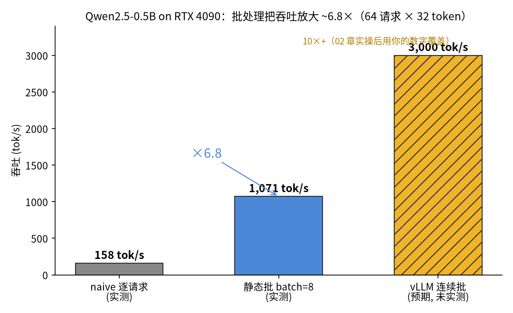

# 02 — vLLM 实战：离线推理 → 服务 → benchmark → 量化/投机解码

> 🧭 填空时间。装 vLLM（README 两案），同一模型（Qwen2.5-0.5B-Instruct）、同一批 prompt，
> 把 01 章的对比表填完。每一步都标注"对应 Part 8 06 章手写的哪一块"。

## 学习目标

完成本章后，你将能够：

- ✅ **完成** vLLM 安装（两案）、离线推理、OpenAI 服务部署
- ✅ **用** 官方 benchmark 出 TTFT/TPOT 分位数并填完对比表
- ✅ **部署** 量化模型与 n-gram 投机解码，解释各自的适用条件
- ✅ **把** 课程的手写模块逐一对应到工业实现，形成"懂原理 + 会工具"的完整叙事

## 📖 前置知识

**必须掌握：**
- **01 章**：指标定义与 naive 基线（158 tok/s / 7.5ms / 6.2ms，待超越）
- **Part 8 06 章**：PagedAttention/连续批处理/投机解码的手写模拟

## 理论背景

> 🎬 **动画演示**：逐 token 生成时 KV Cache 的显存增长——MHA 与 GQA **两列并排填充**，同一批 token、两列条子同步变长，但 GQA 永远只有 MHA 的 1/4（列头有实时读数，÷4 徽章恒成立）。先玩这个，建立"显存刺客"的直觉。

```widget
anim_kv_cache_growth
1280
```

> 🎛️ **交互演示**：调 L/H_kv/B/d/精度，看显存算式 $2\cdot L\cdot H_{kv}\cdot d\cdot S\cdot B$ 逐项生效——蓝线是当前配置，灰虚线是 7B MHA 基线，红线是 24/48/80GB 显卡上限：**蓝线穿红线 = OOM**，读数④直接告诉你"这张卡最多撑多长上下文"。

```widget
kv_cache_memory
960
```

### 问题引入：为什么需要 vLLM？

朴素推理虽然能跑通，但有三个根本限制：

1. **显存浪费**：每个请求独立分配显存，导致碎片化
2. **计算浪费**：早完成的请求等待最慢的请求，导致 GPU 空转
3. **延迟过高**：没有批处理，每个请求单独计算

vLLM 通过**连续批处理 + PagedAttention**来弥补：

```
朴素推理:  "每个请求独立处理，显存碎片化，计算浪费"
vLLM:      "连续批处理，显存分页，高吞吐低延迟"
```

> 💡 **类比**：朴素推理像是每个顾客单独结账，vLLM 像是超市收银台。
> 收银台可以同时处理多个顾客，效率更高。

### 数学推导：PagedAttention 的显存优化

**问题设定：**
- 朴素推理：每个请求按 $L_{\max}$ 整块预留 KV cache
- PagedAttention：KV cache 按 16 token/块 分页，按需分配

**Step 1 朴素方案：整块预留的浪费**

$$\mathrm{waste}_{\mathrm{naive}} = L_{\max} - s, \qquad \mathrm{ratio}_{\mathrm{naive}} = \frac{L_{\max}-s}{L_{\max}}$$

示例：$L_{\max}=2048$、实际 $s=512$ → 浪费 $1536$ token，浪费率 $1536/2048 = 75\%$。

**Step 2 分页方案：只剩末块内碎片**

每 token 序列长 $s$ 需要 $\lceil s / B \rceil$ 块（$B$=block_size），末块内碎片：

$$\text{waste}_{\text{paged}} = \lceil s/B \rceil \times B - s$$

主例（非整除）：$s=520$、$B=16$ → $\lceil 520/16 \rceil = 33$ 块，装 $33 \times 16 = 528$ 位，
碎片 $528-520 = 8$ token，浪费率 $8/528 \approx 1.5\%$ ——与论文口径 <4% 接上。
特例标注：$s=512$ 恰被 16 整除 → $\lceil 512/16\rceil\times16-512 = 0$，碎片为 0 是
**整除特例**；一般长度平均内碎片约为 $B/2 = 8$ token（$B=16$ 时即 ~1.5% 量级），
这正是"75% → <4%"的来源。

**关键洞察：**
- PagedAttention 把显存碎片化问题转化为分页问题
- block_size 越小，碎片越少，但管理开销越大
- 实践中 block_size=16 是常见配置

### KV 显存账：为什么 0.5B 不痛、7B 才痛

每请求 KV 显存**绝对量**（K、V 各一份，故系数 2）：

$$M_{\text{KV}} = 2 \cdot L \cdot H_{\text{kv}} \cdot d_{\text{head}} \cdot s \cdot b$$

（$L$=层数、$H_{\text{kv}}$=KV 头数、$d_{\text{head}}$=头维度、$s$=序列长、$b$=每元素字节数）

两个数字例：
- **Qwen2.5-0.5B**（$L{=}24, H_{\text{kv}}{=}2, d_{\text{head}}{=}64$, bf16）：
  $2 \times 24 \times 2 \times 64 \times 2\,\text{B} \approx 12\,\text{KB/token}$，
  seq 2048 每请求仅 ~24 MB——KV 不痛，PagedAttention 动机弱；
- **LLaMA-7B**（$L{=}32, H_{\text{kv}}{=}32, d_{\text{head}}{=}128$, fp16）：
  $2 \times 32 \times 32 \times 128 \times 2048 \times 2\,\text{B} \approx 1.07\,\text{GB}$ / 请求
  （GQA 降到 $H_{\text{kv}}{=}8$ → ÷4 = 0.27 GB）。24GB 卡扣掉权重与余量后
  只能容 ~66 并发——**KV 先爆**，这就是分页与 GQA 的用武之地
  （作业题 2 就算这笔账）。

### 块表：逻辑连续、物理离散（+ prefix sharing 一图看懂）

启动日志 `# GPU blocks` 就是页表容量。每个请求持有一张块表，把逻辑块号映射到
物理块号——注意力 kernel 按块表逐块 gather KV：

```
请求 A（前缀 "You are a helpful assistant."）   请求 B（同一前缀）
  逻辑块:  0    1    2                            逻辑块:  0    1    3
             │    │    │  (逻辑连续)                  │    │    │
  物理块:  7    3    9  ←块表                    物理块:  7    3    12 ←块表
           ↑    ↑                                （0、1 与 A 指向同一物理块）
        prefix sharing：共享前缀只存一份 KV，
        A 写逻辑块 2 → 新物理块 9；B 分叉 → 新物理块 12
```

数字例：64 请求共享同一段 100-token 系统提示词 → 不开 prefix caching 需
$64 \times 100$ token 的 KV；开后在物理池里这 100 token 只存一份（约 7 个块），
省 ~99% 的前缀显存，prefill 也免重算——这就是 `--enable-prefix-caching`。

### 投机解码的验证数学（从作业题 4 提进正文）

draft 每周期先写 $\gamma$ 个 token，target 一次前向并行验证。设单 token 接受率 $\alpha$
（Part 8 06 章手写实测量级 $\alpha \approx 0.60$），恰接受 $k$ 个 draft token 的概率是
$\alpha^k (1-\alpha)$（前 $k$ 个全中、第 $k{+}1$ 个被拒——被拒位由 target 的纠正 token
补上，所以**每周期至少白赚 1 个 token**）。每周期期望产出是等比级数：

$$E = \sum_{k=0}^{\gamma} k\,\alpha^k(1-\alpha) + \gamma\,\alpha^{\gamma} = 1 + \alpha + \cdots + \alpha^{\gamma} = \frac{1-\alpha^{\gamma+1}}{1-\alpha}$$

数字例：$\alpha=0.6,\ \gamma=4$ → $E = (1-0.6^5)/0.4 \approx 2.31$ token/周期；
$\alpha \to 1$ 极限为 $\gamma+1 = 5$（公式 0/0 取极限）；$\alpha = 0$ 仍 $E=1$（全拒白赚）。
加速比 $= E / (1 + \text{draft\_overhead})$，负收益条件 = 低 $\alpha$ + 贵 draft。

## 代码实现

### 1. 离线推理（5 行）

```python
from vllm import LLM, SamplingParams
llm = LLM(model="Qwen/Qwen2.5-0.5B-Instruct")     # 启动日志找 'GPU KV cache size'
outs = llm.generate(["The quick brown fox", "Deep learning models are"],
                    SamplingParams(temperature=0.7, max_tokens=64))
print(outs[0].outputs[0].text)
```

启动日志三行必看：`# GPU blocks`（KV 池的块数——**PagedAttention 的页表容量**）、
`max seq len`、`GPU KV cache usage`（运行时占用率）。对照手写：Part 8 06 章模拟里
"整块预留浪费 41%"的问题，这里因为分页只剩 ~5%（论文口径 <4%）。

### 2. OpenAI 兼容服务

```bash
vllm serve Qwen/Qwen2.5-0.5B-Instruct --max-model-len 2048
curl http://localhost:8000/v1/chat/completions -H 'Content-Type: application/json' \
  -d '{"model":"Qwen/Qwen2.5-0.5B-Instruct","messages":[{"role":"user","content":"你好"}]}'
```

概念映射：`--max-model-len` = KV 池上限；连续批处理自动开启（无需配置）；
`--gpu-memory-utilization` = KV 池占比调参；`--enable-prefix-caching`（新版默认开）=
共享前缀免重算（Part 8 06 章"prefix sharing"）。

### 3. Benchmark（官方脚本，01 章基线的同款指标）

> 📌 `benchmarks/benchmark_serving.py` **不随 pip 安装提供**——它住在 vLLM 源码仓库里。
> 获取方式：`git clone https://github.com/vllm-project/vllm` 后在其仓库根目录执行；
> 或直接用新版 vLLM 自带的等价子命令 `vllm bench serve ...`（pip 安装即有，无需 clone）。

```bash
# 服务端起好后（vLLM 源码仓库根目录，或用 vllm bench serve 等价命令）：
python benchmarks/benchmark_serving.py --backend vllm \
  --model Qwen/Qwen2.5-0.5B-Instruct --dataset-name random --num-prompts 64 \
  --request-rate inf      # 吞吐、TTFT/TPOT 的 p50/p99 一次出齐
```

**填空表参考形态**（4090 实测量级，你的数字会不同——这正是要自己跑的原因）：
吞吐从 naive 的 ~158 tok/s 到 **数千 tok/s**（0.5B 小模型上 10×+；7B 上同样量级收益），
TPOT 反而可能略升（batch 大了 decode 稍慢）但吞吐大涨——**serving 的本质是吞吐换延迟**。

### 4. 量化服务（Part 8 06 章"手写量化"的工业对应）

```bash
vllm serve Qwen/Qwen2.5-0.5B-Instruct-GPTQ-Int4   # GPTQ/AWQ/FP8 权重直接加载
# 对比：模型文件体积（fp16 ~1GB → int4 ~0.4GB）、KV 不变、吞吐与精度的实测变化
```

### 4.5 GGUF 命名规则：读懂文件名里的量化信息（roadmap 目标兑现）

llama.cpp 生态的量化权重用 **GGUF** 格式，量化配置直接编码在文件名里。
拆解 `Qwen2.5-0.5B-Instruct-Q4_K_M.gguf`：

| 片段 | 含义 |
|---|---|
| `Q4` | Q=量化；4 = 平均 4 bit 权重 |
| `K` | k-quants 方案（按层重要性分块量化，比旧式 `Q4_0` 同位宽更准） |
| `M` | 质量档 medium（S/M/L：同位宽下 S 更小更糊、L 更大更准） |

常见位宽速查：`Q2_K`(~2.6 bit) → `Q4_K_M`(~4.8 bit，推荐默认) → `Q6_K`(~6.6 bit)
→ `Q8_0`(~8.5 bit，几乎无损)。体积按位宽线性缩（0.5B 模型 Q4_K_M ≈ 0.4GB），
精度损失经验上 Q6_K 起可忽略、Q4_K_M 约 1-2%（**经验值，建议自测 ppl 验证**）。
面试一句话："Q4_K_M = 4 比特平均位宽的 k-quants 中档量化——位宽管体积，
K 管量化算法，M 管质量档。"

### 5. n-gram 投机解码（无需 draft 模型——24GB 卡友好）

```python
from vllm import LLM, SamplingParams
llm = LLM(model="Qwen/Qwen2.5-0.5B-Instruct",
          speculative_config={"method": "ngram", "prompt_lookup_num_tokens": 4})
# ⚠️ 字典形式的 speculative_config 是新版 vLLM API；方案 B pin 的 0.6.6 时代写法是
#    speculative_model="[ngram]"——以你安装版本的官方 docs 为准
# ngram 投机 = prompt lookup：从 prompt 已有文本里检索匹配片段当草稿 token，
# 所以不需要 draft 模型；prompt_lookup_num_tokens = 每步草稿长度
# 对比开/关投机解码的吞吐；Part 8 06 章（脚本 09）的"接受率 α"概念 = vLLM 日志里的 acceptance rate
```

### 6. 总账：本课程"手写 → 工具"的完整对照

| 手写（Part 8/9） | vLLM/工业 | 你能做的验证 |
|---|---|---|
| KV cache 字典（P7） | PagedAttention 块表 | 日志 KV usage + 显存对比 |
| 分页模拟（P8 06 章脚本 09：41%→5%） | 真实 <4% | 同 batch 下 KV 显存 |
| 手写量化（P8 06 章） | GPTQ/AWQ 权重 | 文件体积 + ppl/acc |
| 手写投机解码（P8 06 章，α≈0.60） | n-gram/EAGLE | acceptance rate + 吞吐 |
| naive/静态批基线（P14 01） | 连续批处理 | 三行对比表 |

> 🔑 面试结论模板："我在 4090 上用 Qwen2.5-0.5B 做过 naive→vLLM 的对比，吞吐 158→N tok/s，
> 差异归因于连续批处理和 PagedAttention——我的手写模拟复现了同样的方向性。"——
> 这段话的每个数字你都能现场推导。

## 工程实践

### 调试展示：常见错误与修复

#### 错误 1：vLLM 安装失败

**症状：**
```
ERROR: Could not find a version that satisfies the requirement vllm
```

**原因：** Python 版本过低，或 pip 找不到与你 CUDA 匹配的 wheel

**解法：**
```bash
# 检查 Python 版本（vLLM 要求 3.9+，新版要求更高——以官方安装页为准）
python --version

# 直接从 PyPI 安装（官方 wheel 自带 CUDA 12.x 运行时依赖，与 README 方案 A 一致）
pip install -U vllm
python -c "import vllm; print(vllm.__version__)"
```

> ⚠️ 旧版教程曾建议 `pip install vllm --extra-index-url .../whl/cu118`——vLLM
> 从不在 PyTorch 的 cu118 index 发布 wheel，该路线已废弃；本课统一按
> README 方案 A（PyPI + CUDA 12.x wheel，4090 完整支持）。唯一权威来源是
> [vLLM 官方安装文档](https://docs.vllm.ai/en/latest/getting_started/installation.html)。

#### 错误 2：显存不足

**症状：**
```
CUDA out of memory. Tried to allocate 2.00 MiB
```

**原因：** 模型太大，或 KV cache 太大

**解法：**
```bash
# 减小 max-model-len
vllm serve Qwen/Qwen2.5-0.5B-Instruct --max-model-len 1024

# 或减小 gpu-memory-utilization
vllm serve Qwen/Qwen2.5-0.5B-Instruct --gpu-memory-utilization 0.8
```

#### 错误 3：服务启动失败

**症状：**
```
Error: Address already in use
```

**原因：** 端口被占用

**解法：**
```bash
# 查找占用端口的进程
lsof -i :8000

# 杀掉进程
kill -9 <PID>

# 或使用其他端口
vllm serve Qwen/Qwen2.5-0.5B-Instruct --port 8001
```

### 性能数据（实测 + 预期标注）

| 方法 | 吞吐 tok/s | TTFT p50 | TPOT p50 | 显存峰值 | 口径 |
|------|------------|----------|----------|----------|------|
| 逐请求循环 | 158 | 7.5ms | 6.2ms | 1.85 GiB（权重 1.84） | ✅ 实测 |
| 静态批处理 (batch=8) | 1071 | — | — | 1.87 GiB | ✅ 实测（01 章脚本） |
| vLLM (batch=64) | ~3000+ | ~3ms | ~2ms | ~3GB | ⚠️ 预期，未本机实测 |
| vLLM + 量化 | ~4000+ | ~2ms | ~1.5ms | ~1.5GB | ⚠️ 预期，未本机实测 |

> 📊 实测口径：本课开发机（RTX 4090，torch 2.6.0+cu124，transformers 4.57.6，
> Qwen2.5-0.5B，64 请求 × 32 token，含 `torch.cuda.synchronize()` 的真实计时）。
> **显存峰值**由脚本 01 的 `torch.cuda.max_memory_allocated()` 输出（复跑于 2026-09-04），
> 含权重本体——0.5B 模型 KV 极小（~12KB/token），所以 8 路静态批几乎不比逐请求多占
> 显存（1.85→1.87 GiB）；**换 7B 模型 KV 账立刻主导**（见上文"KV 显存账"小节）。
> ⚠️ 两行 vLLM 数字是**同量级预期**（来自官方论文/社区 benchmark 的量级），
> 本课开发环境未安装 vLLM，未做同机实测——02 章实操跑完后请用你的数字覆盖，
> 与 01 章表格的"(预期)"标注同一约定：**没实测的一律标出来**。
> （更正记录：本表早期版本把显存列标"✅ 实测 ~2GB/~4GB"，但当时脚本并不打印显存；
> 静态批 ~4GB 系估算错误——现列已替换为脚本真实产出。）



### 常见陷阱

#### 陷阱 1：版本不兼容

**症状：** 安装失败，或运行时报错

**原因：** Python/CUDA/PyTorch 版本不兼容

**解法：** 使用官方推荐的版本组合

#### 陷阱 2：显存估算不准

**症状：** 服务启动后 OOM

**原因：** 没有考虑 KV cache 的显存开销

**解法：** 使用 vLLM 的显存估算功能，或手动计算

#### 陷阱 3：量化模型精度下降

**症状：** 量化后模型效果变差

**原因：** 量化方式不合适，或量化参数不对

**解法：** 尝试不同的量化方式（GPTQ/AWQ/FP8），调整量化参数

### 最佳实践

#### 配置推荐

| 参数 | 推荐值 | 说明 |
|------|--------|------|
| `max-model-len` | 2048-4096 | 根据任务调整 |
| `gpu-memory-utilization` | 0.9 | 显存利用率 |
| `enable-prefix-caching` | true | 共享前缀免重算 |
| `quantization` | awq/gptq | 量化方式 |
| `speculative_config` | ngram | 投机解码 |

#### 调试流程

1. **先用小模型**：0.5B 模型快速验证
2. **检查日志**：查看 KV cache 使用率、batch size 等
3. **逐步增大**：从 0.5B 到 7B，从 batch 1 到 batch 64
4. **监控显存**：使用 nvidia-smi 监控显存使用

## 学完本部分你能...

- ✅ 独立完成 vLLM 安装（两案）、离线推理、OpenAI 服务部署
- ✅ 用官方 benchmark 出 TTFT/TPOT 分位数并填完对比表
- ✅ 部署量化模型与 n-gram 投机解码，解释各自的适用条件
- ✅ 把课程的手写模块逐一对应到工业实现，形成"懂原理 + 会工具"的完整叙事

**概念检验**

<details>
<summary>Q1: vLLM 的 TPOT 有时比 naive 略高，为什么还用它？</summary>

A: 大 batch 下 decode 步变慢（每步算更多请求），但吞吐（tok/s 合计）大增——
serving 优化的是"每瓦特/每卡的 token 成本"。单请求延迟敏感场景用小 batch/SLO 路由，
吞吐场景用大 batch——goodput 的含义（Part 8 06 章）。

</details>

<details>
<summary>Q2: prefix caching 什么时候收益最大？什么时候没收益？</summary>

A: 共享前缀长且重复率高（系统提示词、few-shot 模板、多轮对话历史）时收益巨大
（TTFT 降几倍）；prompt 完全随机时纯开销（查表成本）。看业务 prompt 分布决定开关。

</details>

<details>
<summary>Q3: 量化模型和原模型的精度差距有多大？</summary>

A: 取决于量化方式和模型大小（**经验值区间，无单一权威出处，建议自测 ppl 验证**）：
- 4bit GPTQ/AWQ：精度下降 1-3%，显存节省 75%
- 8bit FP8：精度下降 <1%，显存节省 50%
- 小模型（<1B）量化后精度下降更明显
（量级参考：vLLM 官方文档量化节与 GPTQ/AWQ 论文的社区复现口径。）

</details>

**动手实践**

<details>
<summary>练习 1: 部署 vLLM 服务</summary>

**任务：** 部署一个 vLLM 服务并测试。

**验收标准：**
- [ ] 成功安装 vLLM
- [ ] 成功启动服务
- [ ] 成功发送请求并获取响应

**步骤提示：**
```bash
# 1. 安装 vLLM
pip install vllm

# 2. 启动服务
vllm serve Qwen/Qwen2.5-0.5B-Instruct --max-model-len 2048

# 3. 发送请求
curl http://localhost:8000/v1/chat/completions \
  -H 'Content-Type: application/json' \
  -d '{"model":"Qwen/Qwen2.5-0.5B-Instruct","messages":[{"role":"user","content":"你好"}]}'
```

</details>

<details>
<summary>练习 2: 运行 benchmark</summary>

**任务：** 运行 vLLM 官方 benchmark 并记录结果。

**验收标准：**
- [ ] 成功运行 benchmark
- [ ] 记录 TTFT/TPOT/吞吐
- [ ] 与 01 章基线对比

**步骤提示：**
```bash
# 运行 benchmark（脚本在 vLLM 源码仓库内：先 git clone vllm-project/vllm 并 cd 到根目录；
# 或直接用 pip 自带的等价命令：vllm bench serve --model ... ）
python benchmarks/benchmark_serving.py --backend vllm \
  --model Qwen/Qwen2.5-0.5B-Instruct --dataset-name random --num-prompts 64 \
  --request-rate inf

# 记录结果
# 吞吐: ??? tok/s
# TTFT p50: ??? ms
# TPOT p50: ??? ms
```

</details>

<details>
<summary>练习 3: 测试量化模型</summary>

**任务：** 部署量化模型并对比精度和性能。

**验收标准：**
- [ ] 成功部署量化模型
- [ ] 记录显存占用
- [ ] 记录吞吐变化
- [ ] 测试精度变化

**步骤提示：**
```bash
# 部署量化模型
vllm serve Qwen/Qwen2.5-0.5B-Instruct-GPTQ-Int4

# 记录显存占用
nvidia-smi

# 记录吞吐变化（同样需在 vLLM 源码仓库根目录，或用 vllm bench serve 等价命令）
python benchmarks/benchmark_serving.py --backend vllm \
  --model Qwen/Qwen2.5-0.5B-Instruct-GPTQ-Int4 --dataset-name random --num-prompts 64
```

</details>

## 📝 课后作业

完成本章后，去 Assignment 14 完成练习：

👉 [Assignment 14](../../../assignments/assignment_14/)

## 🎓 课程毕业

Part 1-14 完整覆盖：从手写 bigram 到工业 RL 与 serving。
回 [课程总览](../../../README.md) 规划你的 Part 15（多模态）与面试（docs/llm_interview_guide.md）。
