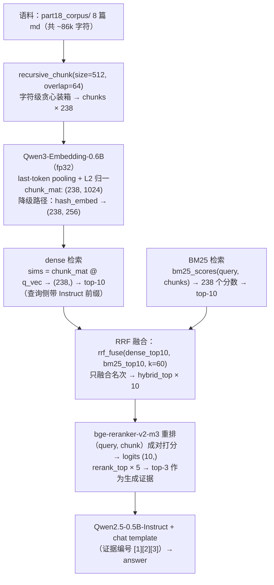
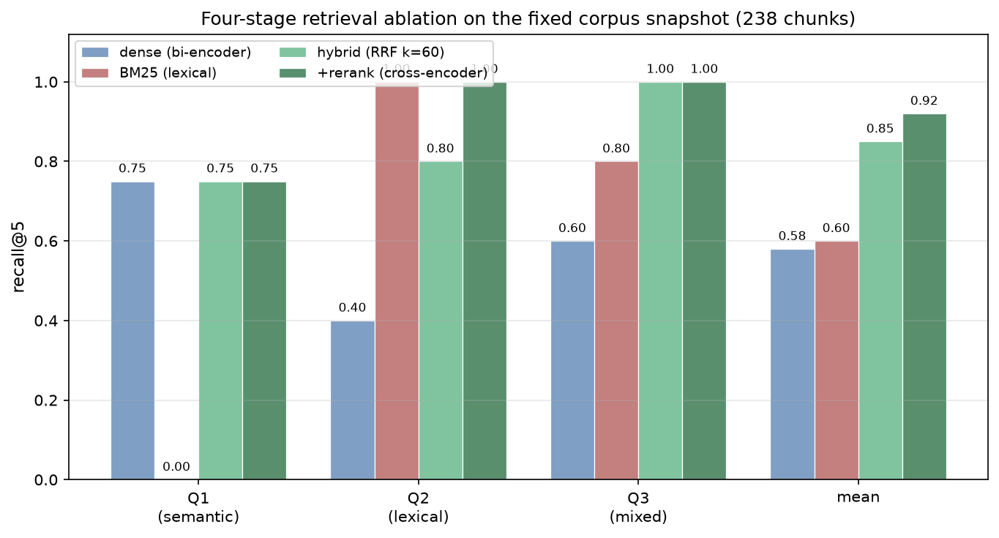

# 01 — 从朴素 RAG 到混合检索：手写五件套

> 🧭 Part 6 你手写了注意力，Part 8 你微调了 instruct 模型——但模型的知识仍被锁在
> 参数里（闭卷考试）。本章在本仓库 8 篇真实 Markdown（固定快照
> `data/part18_corpus/`，取自 docs/）上，不借助任何
> RAG 框架，手写最小而五脏俱全的检索增强管线**五件套**：
> **递归分块 → 嵌入 → BM25 → RRF 混合 → cross-encoder 重排**，最后让 0.5B 模型
> 带着证据回答。跑 [scripts/01_minimal_rag.py](../scripts/01_minimal_rag.py)
> （RTX 4090 实测 13-15 秒；模型缺失时自动降级，脚本永不崩）。

## 学习目标

完成本章后，你将能够：

- ✅ **手写** RAG 五件套：递归分块 / 稠密嵌入 / BM25 / RRF 融合 / cross-encoder 重排
- ✅ **推导** BM25 的 TF 饱和与文档长度归一项、RRF 的倒数排名公式
- ✅ **解释** dense 与 BM25 各自的盲区，以及"混合 + 重排"为什么能逐级抬升 recall
- ✅ **配置** Qwen3-Embedding 的官方用法（last-token pooling、查询侧指令前缀）
- ✅ **设计** 可复现的降级路径（hashing trick 嵌入、跳过重排），让管线在没有
  GPU / 没有模型的环境里依然 rc=0

## 前置知识

**必须掌握：**
- [Part 6 Transformer](../../Part6_transformer/tutorial/README.md)——嵌入模型和
  cross-encoder 本质都是 Transformer 编码器；cosine 相似度就是点积（Part 6 注意力里
  QK^T 的归一化版）
- [Part 8 SFT](../../Part8_post_training/tutorial/README.md)——instruct 模型与 chat
  template（生成环节用 Qwen2.5-0.5B-Instruct 的对话模板拼 prompt）

**建议掌握：**
- [Part 13 数据工程](../../Part13_data_engineering/tutorial/01_dedup_from_scratch.md)——
  "精确算不动就设计可算的近似"的哲学一脉相承：LSH 用分带哈希近似 Jaccard，
  BM25 用 TF 饱和近似"词项重要性"；本仓库语料的清洗/去重也发生在这一站
- [Part 8 量化与服务](../../Part8_post_training/tutorial/README.md)——fp16/fp32
  的显存权衡（本章嵌入模型用 fp32、生成模型用 fp16 的原因）

**可选：**
- [Part 14 推理部署](../../Part14_inference_vllm/tutorial/README.md)——生产级 RAG
  的生成侧要架在 vLLM/SGLang 上，检索侧只是它前面的一个模块

## 理论背景

### 问题引入：为什么需要 RAG？

没有检索增强之前，让 LLM 回答知识型问题有三个绕不开的痛点：

1. **知识截止**：参数里的知识冻结在训练截止日，问"我们仓库的路线图"必然瞎编
2. **私有数据不可见**：内部文档、数据库、本仓库的 8 篇 md 从未进过训练集
3. **幻觉无追溯**：模型给出的"事实"没有出处，无法审计

> 💡 **类比**：微调是"让学生把教材背下来再去考试"（贵、慢、背不动新教材）；
> RAG 是"开卷考试"——先去书架（检索）翻出相关页（chunk），再照着答题（生成）。
> 背书擅长"风格与能力"，翻书擅长"事实与出处"，两者不冲突（后面 02 章会讲怎么选）。

RAG 的最初形态（Lewis et al. 2020, arXiv [2005.11401](https://arxiv.org/abs/2005.11401)）
就是把一个可微检索器接进生成器。今天工业界的标配流水线长这样：

```
                ┌──────────── 离线索引 ────────────┐
 文档 → 分块(chunk) → 嵌入(embed) → 向量库(暴力/ANN)
                └──────────────────────────────────┘
                ┌──────────── 在线检索 ────────────┐
 query → 嵌入 ──┤ dense 检索 ─┐                    │
 query ─────────┤ BM25 检索 ──┼→ RRF 融合 → 重排 ──┼→ top-k 证据
                └─────────────┴────────────────────┘
                ┌──────────── 生成 ────────────────┐
 query + 证据 → instruct 模型 → 带引用的回答
                └──────────────────────────────────┘
```

### 数学推导

#### ① BM25：从 TF-IDF 到"饱和 + 长度归一"

**直觉**：一个词在一篇文档里出现 10 次，不等于比出现 1 次"重要 10 倍"；
一篇长文档堆词的机会天然更多，不 penalize 长度就会偏向长文。

**符号表**（本章全部推导共用；注意本章的"文档"指的是 **chunk**）：

| 符号 | 含义 | 本课程的取值 |
|---|---|---|
| $N$ | chunk 总数 | 238（是 238 个 chunk，**不是** 8 篇文档） |
| $\mathrm{tf}(t,d)$ | 词 $t$ 在 chunk $d$ 中的出现次数（token 计） | — |
| $df(t)$ | 含有词 $t$ 的 chunk 数 | — |
| $\lvert d\rvert$、$\mathrm{avgdl}$ | chunk 的 token 数、全体 chunk 的平均 token 数 | 代码里 `len(dt)` 是 **token 数**，不是字符数 |
| $k_1,\ b$ | 饱和速度、长度归一强度（超参） | 1.2、0.75（经验默认） |

**Step 1：TF-IDF 起点**

$$\mathrm{score}(t, d) = \mathrm{tf}(t, d) \cdot \mathrm{IDF}(t), \qquad \mathrm{IDF}(t) = \log\big(N / df(t)\big)$$

两个问题：其一，$\mathrm{tf}$ 线性增长 → 长文刷分（见 Step 2）；其二，注意
$\log(N/df)$ 在 $df \le N$ 时**恒非负**——真正会变负的是**不加 1 的变体**
$\log\big((N-df+0.5)/(df+0.5)\big)$（$df$ 接近 $N$ 时内部小于 1）。Step 4 的"+1 平滑"
正是为了把这个变体修成恒正——原文只说"趋于 0 甚至为负"而没说是哪个式子为负，
曾让数学弱的同学对着恒非负的 $\log(N/df)$ 自我怀疑（试点实测卡点）。

**Step 2：TF 饱和**

把 $\mathrm{tf}$ 部分乘一个渐近线为 $(k_1+1)$ 的因子：

$$\mathrm{tf} \;\to\; \frac{\mathrm{tf}\,(k_1+1)}{\mathrm{tf} + k_1}$$

$\mathrm{tf} \to \infty$ 时因子趋于 $k_1+1$——增长越来越慢、最后封顶，这就是"饱和"；
$k_1$ 控制封顶速度。**数字感受**（$k_1=1.2$，上限 $2.2$）：

| $\mathrm{tf}$ | 1 | 3 | 10 | 100 | →∞ |
|---|---|---|---|---|---|
| 饱和因子 | 1.00 | 1.57 | 1.96 | 2.17 | 2.20 |

**Step 3：文档长度归一（BM25 最终形态）**

$$\frac{\mathrm{tf}\,(k_1+1)}{\mathrm{tf} + k_1\,\big(1 - b + b\cdot\tfrac{|d|}{\mathrm{avgdl}}\big)}$$

注意"因子为 1"指的是**分母括号里的长度部分**：$\lvert d\rvert = \mathrm{avgdl}$ 时
$1-b+b\cdot 1 = 1$（长度既不加倍也不缩半）；$\lvert d\rvert$ 是平均长度两倍时括号变为
$1-b+2b = 1+b = 1.75$——长 chunk 的 TF 权重被压。$b$ 控制归一强度：
$b=0$ 完全不看长度，$b=1$ 完全按长度缩放。

**Step 4：平滑 IDF（本课程实现采用）**

$$\mathrm{IDF}(t) = \ln\!\Big(1 + \frac{N - df(t) + 0.5}{df(t) + 0.5}\Big)$$

这就是对 Step 1 末尾那个"会变负的变体"整体加 1——恒正。$+0.5$ 是 Okapi BM25 的
标准平滑参数（延续至今的教科书取值，无需自己发明）；用 $\ln$ 还是 $\log_{10}$
只差一个常数尺度，不影响排序，代码与公式统一用 $\ln$。

**最终公式**：

$$\mathrm{score}(q, d) = \sum_{t \in q} \mathrm{IDF}(t) \cdot \frac{\mathrm{tf}(t,d)\,(k_1+1)}{\mathrm{tf}(t,d) + k_1\big(1-b+b\cdot\tfrac{|d|}{\mathrm{avgdl}}\big)}$$

**贯穿小算例**（代入一次就有感觉）：$N=238$，某稀有词 $df=10$，chunk $d$ 中
$\mathrm{tf}=3$、$|d| = 1.5\,\mathrm{avgdl}$：
$\mathrm{IDF} = \ln(1 + 228.5/10.5) \approx 3.13$；
TF 因子 $= 3\times2.2 / (3 + 1.2\times1.875) \approx 1.26$；
该词贡献 $\approx 3.13 \times 1.26 \approx 3.9$ 分——稀有词 + 中等频次，
一击就是近 4 分，这就是 BM25 的"词法命中"。

> 🔑 **关键概念**：BM25 是"词法检索"——只看字面 token 是否匹配，完全不懂
> "组内相对策略梯度"和"GRPO"是一回事。这正是它的盲区，也是 dense 检索的用武之地。

> 📝 **与 Part 13 的互文**：LSH 用分带哈希把 O(N²) 的 Jaccard 比较变成近似可算；
> BM25 用 TF 饱和 + 长度归一把"词项重要性"变成可算的打分。工程检索的智慧从来
> 不是"算得更准"，而是"把不可算的目标准则改造成可算的代理"。

#### ② RRF：只融合名次，不融合分值

dense 给的是 cosine（$[-1,1]$），BM25 给的是无界正分——两把尺子量出的数字
不可直接加。加权融合要先做尺度标定（min-max？z-score？），标定错了就全错。

**RRF（Reciprocal Rank Fusion）的答案**：丢掉分值，只看名次——每个榜单各投一票
（$\mathrm{rank}$ 从 1 起，$k=60$ 为 RRF 论文默认值）：

$$\mathrm{score}(x) = \sum_{\mathrm{lists}} \frac{1}{k + \mathrm{rank}(x)}$$

**直觉**：第 1 名得 $1/61 \approx 0.0164$，第 2 名得 $1/62 \approx 0.0161$……相邻名次
的得分差被 $k$ 压平（差约 $1/k^2 \approx 0.0003$；对比 $1/\mathrm{rank}$ 的头两名差
$0.5$）——于是一个"两个榜单都进前 10"的文档（双榜第 5 也有 $2/65 \approx 0.031$）
轻松赢过"单榜第 1"（$0.0164$）。

**极限性质**（作业题 3 会用测试验证）：$k \to \infty$ 时得分排序退化为
"入选榜单数优先、名次和次之"的计数排序。推导只差一步泰勒展开
（条件 $\mathrm{rank} \ll k$；$k=60$、$\mathrm{rank}\le10$ 时近似误差 $<1\%$）：

$$\frac{1}{k+r} = \frac{1}{k}\Big(1+\frac{r}{k}\Big)^{-1} \approx \frac{1}{k}\Big(1-\frac{r}{k}\Big), \qquad r \ll k$$

代入即见：常数 $1/k$ 不影响排序，剩下 $-\mathrm{rank}/k^2$ 按"名次和"升序——
先比入选榜数（每多一榜多一个 $1/k$ 量级的头项），再比名次和。

> 🔑 **关键概念**：RRF 天然免尺度标定、免调参——这是它取代加权混合成为工业
> 默认的原因。但"免调参"不等于"最优"：权重网格搜索仍能挤出最后几个点
> （作业 🌟 题 5 就是这个实验）。

#### ③ 稠密检索：cosine 与 last-token pooling

嵌入模型把文本映射到单位球面上的向量，相关文本夹角小：

$$\cos(q, d) = \frac{q \cdot d}{\lVert q\rVert\,\lVert d\rVert}$$

实现上先做 L2 归一化，cosine 退化为一次矩阵乘：`sims = chunk_mat @ q_vec`
（`(N, D) @ (D,) → (N,)`，一行算完 238 个 cosine）。

Qwen3-Embedding 是**因果**（decoder-only）嵌入模型，官方用法是取
**最后一个有效 token** 的隐状态做 pooling（[官方模型卡](https://huggingface.co/Qwen/Qwen3-Embedding-0.6B)），
且查询侧要拼任务指令前缀：

```python
QUERY_INSTR = ('Instruct: Given a web search query, retrieve relevant passages '
               'that answer the query\nQuery: ')
# 文档侧不加前缀；池化用 last_token_pool（左填充直接取末列，右填充逐样本取最后有效位）
```

> ⚠️ 拿 BERT 式 mean-pooling 去用 Qwen3-Embedding 是最常见的"静默劣化"——
> 不报错、不掉零，就是召回悄悄变差（见本章陷阱 3）。

#### ④ Cross-encoder 重排：为什么贵一个量级却还值得

bi-encoder（嵌入检索）把 query 和文档**各自**编码再比对——可以离线算、可以 ANN，
但两个向量从没"见过面"。cross-encoder 把 `(query, 文档)` 拼成一对**一起**过模型，
注意力可以在每个 token 层面互相对质——精度高一个量级，算力也贵一个量级
（无法离线、无法 ANN）。所以工业管线的定式是：**便宜的 bi-encoder 从百万里
捞 top-10/20，昂贵的 cross-encoder 只对这几十个精排**。

> 💡 类比：bi-encoder 是"两人各写一份简历再比对关键词"，cross-encoder 是
> "当面逐句对质"。

### 历史脉络

- **2020**：Lewis et al. 提出 RAG（arXiv [2005.11401](https://arxiv.org/abs/2005.11401)），
  DPR（[2004.04906](https://arxiv.org/abs/2004.04906)）确立双塔检索
- **1990s→今**：BM25（Okapi, 1994）从图书馆检索活到今天的搜索引擎默认基线——
  五件套里最老的零件反而是最扛造的
- **2021/2023**：混合检索进入工业栈——Weaviate v1.15（2021-10）上线 hybrid search
  即带 rank fusion（RRF 式，[官方融合算法博文](https://weaviate.io/blog/hybrid-search-fusion-algorithms)）；
  Elasticsearch 在 8.8（2023-06）以 technical preview 引入 RRF
  （[8.8 发布博客](https://www.elastic.co/blog/whats-new-elasticsearch-8-8-0)，8.14 起
  转正为 retriever API）
- **2024-25**：contextual retrieval（Anthropic）、late chunking（Jina）修补
  "chunk 失去上下文"的结构性缺陷（→ [02 章](02_advanced_rag.md)）
- **现在**：Agentic RAG 把"检索几轮、检索什么"也交给模型决策（→ Part 19）

## 代码实现

### 数据流与形状追踪



### 逐行解释

#### 五件套之一：递归分块

```python
def recursive_chunk(text, size=512, overlap=64):
    if not text or not text.strip():     # 空文本/纯空白 → 直接返回空（脚本同款防御）
        return []
    max_atom = size - overlap - 2   # 给 overlap 前缀 + 连接空格留位

    def split_atoms(s, seps):       # 优先大分隔符，切不动就下钻小分隔符
        if len(s) <= max_atom:
            return [s]
        if not seps:                # '\n\n'→'\n'→'。'→' ' 都切不动 → 硬切
            return [s[i:i + max_atom] for i in range(0, len(s), max_atom)]
        sep, rest = seps[0], seps[1:]
        # '。'是内容字符：用捕获组保留（split 会丢分隔符，破坏"不丢字符"不变量）
        parts = re.split(f'({re.escape(sep)})', s) if sep == '。' else s.split(sep)
        pieces = []
        for part in parts:
            pieces.extend(split_atoms(part, rest))
        return pieces

    atoms = [a for a in split_atoms(text.strip(), ['\n\n', '\n', '。', ' ']) if a.strip()]
    chunks, cur = [], ''
    for atom in atoms:
        if cur and len(cur) + len(atom) + 1 > size:   # 装不下 → 结算
            chunks.append(cur)
            cur = cur[-overlap:]    # 上下文桥：跨块语义靠这 64 个字符续命
        cur = atom if not cur else cur + ' ' + atom
    if cur.strip():
        chunks.append(cur)
    return chunks
```

> ⚠️ **本代码块与脚本逐行一致**（含 `'。'` 捕获组那一行）。试点实测教训：早先教程
> 版把捕获组那行简化掉了，学生照抄后 `s.split('。')` 丢句号，作业题 1 的
> "不丢字符"不变量当场爆炸——`split('。')` 会把句号**吃掉**，捕获组 `re.split('(。)', s)`
> 才能把句号保留成独立原子段。抄代码时别省这一行。

- **为什么递归**：优先在段落边界切（语义完整），段落本身超长才下钻到句子、
  空格——这是 LangChain `RecursiveCharacterTextSplitter` 的同款思想
- **为什么 overlap**：一句话恰好被切在边界上时，64 字符重叠保证它的头或尾
  至少完整出现在一个 chunk 里
- **三条可测试的不变量**（作业题 1 就是测它们）：`len(chunk) ≤ size`；
  相邻 chunk 首尾重叠恰为 `overlap`；去掉重叠段拼接后不丢任何非空白字符

#### 五件套之二：手写 BM25

```python
def bm25_scores(query, chunks, k1=1.2, b=0.75):
    n = len(chunks)
    if n == 0:
        return []                                      # 空 chunks 防御
    doc_toks = [_tokens(c) for c in chunks]            # 中英混合：英文词 + 中文二元
    avgdl = sum(len(d) for d in doc_toks) / n          # 平均文档长度（token 数）
    df = {}
    for dt in doc_toks:                                # 文档频率 df（含 df 的词 IDF 低）
        for term in set(dt):
            df[term] = df.get(term, 0) + 1
    scores = []
    for dt in doc_toks:
        tf = {}
        for term in dt:
            tf[term] = tf.get(term, 0) + 1
        s = 0.0
        for qt in _tokens(query):                      # 查询词按出现次数累加
            if qt not in tf:
                continue
            idf = math.log(1 + (n - df[qt] + 0.5) / (df[qt] + 0.5))
            denom = tf[qt] * (k1 + 1)                  # 分子：tf·(k1+1)
            norm = tf[qt] + k1 * (1 - b + b * len(dt) / avgdl)   # 分母：饱和+长度归一
            s += idf * denom / norm
        scores.append(s)
    return scores
```

与推导逐项对上：`idf` 行就是 Step 4 的平滑 IDF；`denom/norm` 合起来是 Step 2+3 的
饱和与长度归一因子。中文没有空格，`_tokens` 对中文取**单字 + 相邻二字 bigram**——
这是 BM25 处理中文的经典做法（作业里我们把它作为已提供的辅助函数，你专注
IDF/TF 主干）。

#### 五件套之三：RRF 融合

```python
def rrf_fuse(list_a, list_b, k=60):
    scores, order = {}, {}
    for lst in (list_a, list_b):
        for rank, item in enumerate(lst, start=1):
            scores[item] = scores.get(item, 0.0) + 1.0 / (k + rank)
            order.setdefault(item, len(order))     # 记录首次出现序，用于并列稳定
    return sorted(scores, key=lambda it: (-scores[it], order[it]))
```

两行核心，一行防御（并列名次按出现顺序稳定输出——作业题 3 测这个）。

#### 五件套之四：嵌入（含降级路径）

```python
def hash_embed(text, dim=256):
    """降级嵌入：hashing trick（特征哈希）——确定性、零模型依赖。"""
    vec = torch.zeros(dim)
    toks = _tokens(text)
    grams = toks + [toks[i] + toks[i + 1] for i in range(len(toks) - 1)]
    for g in grams:
        h = hashlib.md5(g.encode('utf-8')).digest()   # md5：不受 PYTHONHASHSEED 影响
        idx = int.from_bytes(h[:4], 'little') % dim   # 哈希到桶
        sign = 1.0 if h[4] % 2 == 0 else -1.0         # 随机符号抵消碰撞偏置
        vec[idx] += sign
    return F.normalize(vec, dim=0)
```

> 💡 **hashing trick 的价值**：
>
> - 让脚本在"模型没下载/没有 GPU"时依然完整跑通（本章实测：dense 列 recall 从
>   0.58 掉到 0.20——**嵌入模型的贡献直接可视化**，降级日志 /tmp 可复现）；
> - 它本身是工业老技术（Vowpal Wabbit 时代的大规模类别特征编码），语义为零、
>   字面可用，正好用来体会"嵌入到底给了你什么"。

向量检索刻意用**暴力广播 cosine**：`sims = chunk_mat @ q_vec`，一次矩阵乘算完
238 个 chunk。注释里写明：不手写 ANN（HNSW/IVF）——百万级语料换
FAISS 的 `IndexFlatIP` 起步，思想不变，索引结构才是新东西。

#### 五件套之五：重排与生成

```python
# 重排：把 (query, chunk) 成对喂给 bge-reranker-v2-m3，logit 越大越相关
logits = model(**tok(pairs, ...)).logits.squeeze(-1)   # (B,)
order  = torch.argsort(logits, descending=True)

# 生成：证据编号 [1][2][3] 喂给 0.5B-Instruct（小模型对数字编号的遵从度
# 远高于长格式引用），贪心解码保证可复现
```

### 调试展示：三个真实错误

#### 错误 1：模型未下载直接崩

**症状**：
```
OSError: We couldn't connect to 'https://huggingface.co/Qwen/Qwen3-Embedding-0.6B'
```
**原因**：`AutoModel.from_pretrained` 在缓存缺失 + 无网络时抛异常，整条管线死在
第一屏。
**解法**：`load_embedder()` 用 try/except 包住加载，失败返回 `None`，调用方走
`hash_embed` 降级并打印大写警告 + `huggingface-cli download` 指引。重排器/生成器
同理（跳过 / 抽取式降级）。**教程级脚本的铁律：降级路径不崩、rc=0。**

> 📝 想亲手复现这个降级（而不是触发下载）：在有网机器上直接删缓存跑会先去
> **下载约 1.2GB 权重**（试点实测 130 秒还没下完）——复现"无模型降级"请加
> `HF_HUB_OFFLINE=1`，强制离线、立刻走 try/except 分支：
> `HF_HUB_OFFLINE=1 python 01_minimal_rag.py`

#### 错误 2：路径依赖当前目录

**症状**：从仓库根目录跑 `python courses/Part18_rag/scripts/01_minimal_rag.py` 正常，
从别的目录跑报 `FileNotFoundError: .../part18_corpus/...`。
**原因**：相对路径按 **cwd** 解析，而运行目录不保证。
**解法**：一律 `os.path.dirname(os.path.abspath(__file__))` 起算（本仓库脚本规范，
Part 13 起就写在 scripts-guide 里）。

#### 错误 3：Qwen3-Embedding 用了 mean-pooling

**症状**：不报错，但 dense 检索 recall 明显偏低、top-1 常是无关文档。
**原因**：因果嵌入模型的有效语义集中在**最后一个 token**（它看完了全文）；
对中间 token 做 mean 会稀释掉"读完全文后的总结态"。
**解法**：照官方实现 `last_token_pool`（注意左右填充分支），查询侧拼
`Instruct: ... Query: ` 前缀。

## 实测输出

> 📊 环境标注：RTX 4090 (24GB)，torch 2.6.0+cu124，transformers 4.57.6；
> Qwen3-Embedding-0.6B fp32，Qwen2.5-0.5B-Instruct fp16，bge-reranker-v2-m3 fp32；
> 语料 = `data/part18_corpus/` 固定快照（8 篇 md → 238 个 chunk，min/mean/max = 93/420/512 字符）
> ——**快照固定，教程数字可复现**（脚本缺快照时自动退回 docs/，此时数字随 docs/ 更新漂移）；
> 总耗时 13-15s（实测 13.2-13.8s；共享 GPU 上多次运行有波动）。
> 重排与生成的"本机实测"耗时（性能表）为量级参考——脚本没有逐阶段计时日志，
> 引用时说"亚秒级/秒级"即可，别报小数点。

```
[Step 3] 检索对比：dense / BM25 / hybrid(RRF k=60) / +rerank，指标 recall@5

  Q1: GRPO 出自哪篇论文？课程里用哪个框架跑它的实战？     ← 语义型查询
    ground truth: 4 个相关 chunk
    dense  recall=0.75   bm25 recall=0.00   hybrid recall=0.75   +rr recall=0.75
    [debug] Q1 与 dense 第一名的 cosine = 0.6566（查询侧带官方 Instruct 前缀）

  Q2: 面试要能默写的手写代码清单叫什么？                  ← 词典型查询
    ground truth: 14 个相关 chunk
    dense  recall=0.40   bm25 recall=1.00   hybrid recall=0.80   +rr recall=1.00

  Q3: 预训练数据去重为什么能提升模型质量？                ← 综合型查询
    ground truth: 9 个相关 chunk
    dense  recall=0.60   bm25 recall=0.80   hybrid recall=1.00   +rr recall=1.00

  ============================================================
   query |  dense |   bm25 | hybrid | +rerank
      Q1 |   0.75 |   0.00 |   0.75 |    0.75
      Q2 |   0.40 |   1.00 |   0.80 |    1.00
      Q3 |   0.60 |   0.80 |   1.00 |    1.00
    mean |   0.58 |   0.60 |   0.85 |    0.92
  ============================================================
```

四级消融画成图就是下面这张——"逐级抬升"一眼可见（图示数字即上表，已由试点
三名学生 + 教师三方独立复现，16 格逐格一致）：



> 图注：横轴为三个查询与均值，纵轴 recall@5；同一查询下四根柱子对应四种检索
> 形态。看点：Q1 只有 dense/hybrid 有分（BM25 词法盲区）；Q2 相反（dense 抓瞎、
> BM25 满分）；hybrid 平均 0.85 已高于任何单路，+rerank 再抬到 0.92。

**逐行解读这张表**（这是本章最重要的 30 秒）：

1. **Q1（dense 赢，BM25 零分）**：查询问"出自哪篇论文/哪个框架"，BM25 被
   "论文、出自、框架"这些中文常用 bigram 淹没——paper_reading_guide 里几十个
   chunk 都"谈论文"；而嵌入模型懂"组内相对策略梯度 ≈ GRPO"的语义近邻
2. **Q2（BM25 满分，dense 抓瞎）**："清单叫什么"是纯字面问题，稀有 token
   `TOP8` 的 IDF 一击命中；而"清单/默写/叫什么"在嵌入空间里离每个候选 chunk
   都不远不近——没有语义近邻可用
3. **hybrid（0.85）> 两个单路（0.58/0.60）**：RRF 把两份互补的名单叠起来——
   单路的盲区互相补位。注意 Q2 hybrid 反而比 BM25 低（1.00→0.80）：
   **融合不是免费的**，弱路会把强路的好名次挤出去一点点
4. **+rerank（0.92）**：cross-encoder 在 10 个候选里精排，把被融合挤掉的
   相关 chunk（Q2）捞回 top-5。重排只重排不召回——它救不了不在候选池里的文档

生成环节（同一管线的 top-3 证据喂 Qwen2.5-0.5B-Instruct，贪心解码）：

```
  Q1: GRPO 出自哪篇论文？课程里用哪个框架跑它的实战？
  证据: ['paper_reading_guide.md#c21', 'course_roadmap_v3.md#c42', 'course_roadmap_v3.md#c43']
  回答: GRPO 出自《DeepSeekMath》这篇论文，……课程中提到的实战包括：
        1. **快速上手：0.5B GRPO 实战（CLI 实操，Docker → 双卡）**。……

  Q2: 面试要能默写的手写代码清单叫什么？
  证据: ['llm_interview_guide.md#c19', 'llm_interview_guide.md#c20', 'course_roadmap_v3.md#c23']
  回答: 手写代码清单叫"TOP8"。
```

> 📝 0.5B 模型对"句末标 [编号]"的遵从不稳定（Q1 答对了内容但没带编号）——
> 证据机制在 prompt 里、抽取式降级里都有，但小模型的指令遵从是概率性的。
> 这正是 03 章要用"裁判模型"量化答案质量的原因。

**降级路径实测**（`RAG18_FORCE_FALLBACK=1`，同一脚本、零模型）：

```
⚠️  RAG18_FORCE_FALLBACK=1 —— 强制使用 hashing trick 降级嵌入
  chunk 矩阵: (238, 256)，耗时 ~0.5s，设备 cpu
   query |  dense |   bm25 | hybrid | +rerank
    mean |   0.20 |   0.60 |   0.40 |    0.40      ← dense 列从 0.58 掉到 0.20
  回答走抽取式降级（挑含查询关键词的句子 + [k:来源] 引用）
```

hashing trick 只有字面碰撞信号：dense 列掉到 0.20，**这 0.38 的差（0.58→0.20）就是嵌入模型
买到的东西**。降级不只是"不崩"，它本身就是一次消融实验。

## 工程实践

### 性能分析

| 操作 | 时间复杂度 | 本机实测（238 chunk） | 百万级语料时 |
|---|---|---|---|
| 递归分块 | O(字符数) | <0.1s | 分钟级（可并行） |
| 嵌入（0.6B fp32） | O(N·L·d²) | 2.8s（batch=16） | GPU 小时级，一次离线 |
| 暴力 cosine | O(N·d) | <0.01s（一次矩阵乘） | 不可行 → ANN（FAISS/HNSW） |
| BM25 | O(N·平均词数) | <0.1s | 倒排索引毫秒级 |
| cross-encoder 重排 | O(C·L·d²)，C=候选数 | ~0.3s / 10 候选* | 只重排 top-10/20 |
| 0.5B 生成 | O(输出长度) | ~1s / 220 token* | vLLM 批量（→ Part 14） |

> \* 重排/生成两项为量级参考：脚本无逐阶段计时日志，无法从输出直接复核——
> 这是"引用数字要能溯源"原则的已知例外，面试引用说"亚秒级/秒级"即可。

> 🚀 检索侧的工业分水岭就在"暴力 cosine → ANN"这一行：N 小于几万时暴力
> 反而最快且无损（ANN 是有损的）；不要为了"看起来专业"提前上 FAISS。

### 常见陷阱

#### 陷阱 1：chunk 切得太碎，上下文丢失

**症状**：检索指标（recall@k）很好，但生成答案"对不上问题"——检索回来的是
半句话/半张表，模型看到的关键词全在，语义链条断了。
**原因**：chunk 是检索单位也是生成证据单位；切得太碎，证据本身就是残句。
（本部分实测：同一组查询在 size=180 下 **dense 单路 recall@20** 均值从 0.65 掉到
0.53（969 个碎 chunk；Q2 0.43→0.21 最惨）；口径两点先讲清——"plain"指 dense
单路、无混合无重排、分母 $\min(|\mathrm{rel}|, 20)$；且 chunk 数变了 ground truth
命中集也会变（4/14/9 → 5/19/18），所以这是"近似单变量"探针，不是严格消融。
动手练习 3 可复现。）
**解法：**
```python
# ❌ chunk_size=64：关键词在、语义断
# ✅ 常用起点 256-1024 字符 + overlap 10%-20%，再按【下游任务指标】(不是检索指标) 调
chunks = recursive_chunk(text, size=512, overlap=64)
```
更好的证据单位 ≠ 更好的检索单位——生产系统常用"小块检索、大块返回"
（sentence-window / parent-child retrieval）。

#### 陷阱 2：hybrid 权重拍脑袋，不网格搜

**症状**：加了 BM25 混合，指标反而降（本章 Q2：BM25 单路 1.00 → hybrid 0.80）。
**原因**：两路质量不对称时，对称融合（RRF 对两榜平等）会稀释强路；加权融合的
权重 α 更是超参数，拍脑袋必错。
**解法**：固定评测集后**网格搜** α（dense 权重 0→1 步长 0.1），画 recall-α 曲线
取最优——这正是作业 🌟 题 5 `hybrid_weight_sweep` 要做的事。RRF 的 k=60 只是
"免调参的稳健默认"，不是最优解。

#### 陷阱 3：迷信嵌入模型榜单（MTEB）

**症状**：按 MTEB 榜换了"第一名"模型，自己语料上 recall 反而下降。
**原因**：榜单数字依赖特定的数据集组合、版本与环境——MTEB 维护性研究
（arXiv [2506.21182](https://arxiv.org/abs/2506.21182)）的核心工作就是把
基准的**可复现性**当工程问题对待（CI、数据集完整性检查、自动测试），
说明榜单排名本身就是需要被"维护"的易碎品；真实任务上还应参考
[RTEB](https://github.com/NovaSearch-Team/RTEB)（Real-world Text Embedding
Benchmark）这类贴近生产的评测。
**解法**：选型流程 = 榜单粗筛 → **自己的语料 + 自己的查询集**上复测 →
A/B 上线。任何"通用第一名"都要过你自己的这一关。

#### 陷阱 4：查询侧忘了加指令前缀（或文档侧错加）

**症状**：换上 Qwen3-Embedding 后 recall 不如老模型。
**原因**：官方用法要求**查询侧**拼 `Instruct: ... Query: ` 任务指令、**文档侧**
不拼；两侧写反或漏写都会静默掉点。
**解法**：照抄官方 snippet（`embed_texts(..., is_query=True)` 分支），
换模型时先跑官方 sanity check 再接管线。

### 最佳实践

1. **先跑通朴素版，再逐级加件**：五件套每一件都能单独消融（本章表格就是
   4 级消融）——不做消融的 RAG 优化等于蒙眼调参
2. **检索指标与生成指标分开看**：recall@k 高不代表答案好（证据太碎）、
   答案好也不代表检索对（模型自己知道答案）——03 章的 faithfulness/
   context precision 就是补齐这条链路
3. **配置推荐**（中文通用场景起步值）：chunk 512 字符 / overlap 64；
   BM25 k1=1.2 b=0.75；RRF k=60；候选池 top-10 重排取 top-5
4. **工业栈对照**：本课程手写件 ↔ 生产件：分块 ↔ LangChain splitter；
   暴力 cosine ↔ FAISS/Milvus；RRF ↔ Elasticsearch/Weaviate 内置；
   重排 ↔ bge-reranker/Cohere Rerank；评测 ↔ RAGAS（03 章）

## 练习与思考

### 概念检验

**Q1：BM25 里参数 b 从 0 调到 1，检索行为会怎么变？**

<details>
<summary>💡 答案</summary>

b 是文档长度归一的强度。b=0：完全不看长度，长文档靠堆词刷分（TF 无饱和上限的
旧病被 k1 单独压制，但长文仍占优）；b=1：长度因子完全线性，`|d|` 是平均长度
两倍的文档其 TF 权重被压——精确说：b=1、`|d|=2·avgdl`、tf=1、k1=1.2 时权重因子
= 2.2/(1+2.4) ≈ 0.65，即压到约 0.65 倍（tf 很大时才趋近一半）——短文档
（标题、表格行）更容易浮上来。
中英混合语料长度方差大时，0.75 是稳健折中；如果你的语料全是结构化短条目
（FAQ），调小 b 往往更好。
</details>

**Q2：RRF 为什么用 1/(k+rank) 而不是直接用 1/rank？**

<details>
<summary>💡 答案</summary>

两个原因：

- **稳健性**——1/rank 对第 1 名（1.0）和第 2 名（0.5）差距悬殊，单榜冠军几乎
  垄断融合结果；1/(k+rank)（k=60）把相邻名次的得分差压到 ~1/60² ≈ 0.0003 量级，
  "多榜一致出现"比"单榜登顶"更值钱（数字：单榜第 1 = 1/61 ≈ 0.0164，
  双榜第 5 = 2/65 ≈ 0.031），正好符合"两路都认可 = 大概率相关"的直觉。
- **抗榜单噪声**——单榜的名次抖动（因打分边界毛刺引起的第 5/第 6 互换）在 k
  压平后几乎不影响融合输出。

极限性质（作业题 3）：k→∞ 时退化为"入选数优先、名次和次之"的计数排序
（推导见正文 RRF 节的泰勒一步）。
</details>

**Q3：既然 cross-encoder 更准，为什么不全程用它检索？**

<details>
<summary>💡 答案</summary>

复杂度结构不允许。cross-encoder 必须 (query, 文档) 成对进模型：N 个文档就是
N 次前向、且**每次查询都要重算**（无法离线索引、无法 ANN 加速）。百万语料上
一次查询 = 百万次 Transformer 前向。bi-encoder 换来了可离线、可 ANN 的结构，
代价是精度。所以定式是漏斗：bi-encoder（或 BM25）从 10⁶ 捞 10 个 →
cross-encoder 精排 10 个。这与"先用便宜的近似缩小空间、再用贵的精确计算"
的 Part 13 LSH（分带粗筛 → Jaccard 精验）是同一个工程哲学。
</details>

### 动手实践

**练习 1：体验降级路径（5 分钟）**

```bash
RAG18_FORCE_FALLBACK=1 python courses/Part18_rag/scripts/01_minimal_rag.py
```
验收标准：
- [ ] 脚本 rc=0，打印至少 3 条 ⚠️ 降级警告
- [ ] dense 列 recall 明显低于主模式（本机实测 0.20 vs 0.58）
- [ ] 能说出 hashing trick 与真嵌入的本质区别（字面碰撞 vs 语义泛化）

**练习 2：加第四个查询**

在脚本的 `QUERIES` 里加一条你自己的查询（先在语料快照 `data/part18_corpus/` 里人工确认相关 chunk 应该
长什么样，再写关键词规则作为 ground truth）。
验收标准：
- [ ] 新查询的 4 级 recall 都有输出且能解释
- [ ] 观察它落在"语义型/词典型/综合型"哪一类，与本章结论对照

**练习 3：chunk 大小消融**

把 `CHUNK_SIZE` 改成 180 / 1024 各跑一次，记录 recall@5 变化。
验收标准：
- [ ] 得到"chunk 太碎丢上下文、太大稀释信号"的第一手数据
- [ ] 注意：chunk 数变了，关键词 ground truth 的命中集也会变（本章实测
  4/14/9 → 5/19/18）——对照时要连 GT 一起看，别只盯 recall 数字
- [ ] 与 02 章 contextual retrieval 实验互相印证

### 扩展思考

- 中文 BM25 用"单字 + 二元"是通用解，但领域词典（GRPO、PagedAttention）分词后
  会更好——如何在不引入重型分词器的前提下做领域词表？
- 检索质量的上限由分块决定、下限由重排兜底——这个说法对吗？设计实验验证。
- 如果语料每天更新 10%，哪几件套要重算？增量索引的断点在哪一层？

## 参考资源

- 📄 Lewis et al. 2020《RAG for Knowledge-Intensive NLP Tasks》[arXiv 2005.11401](https://arxiv.org/abs/2005.11401)
- 📄 Robertson & Zaragoza《The Probabilistic Relevance Framework: BM25 and Beyond》（BM25 权威综述）
- 📄 Cormack et al. 2009《Reciprocal Rank Fusion Outperforms Condorcet and Individual Rank Learning Methods》（RRF 原始论文）
- 🐙 [Qwen3-Embedding 模型卡](https://huggingface.co/Qwen/Qwen3-Embedding-0.6B)（last-token pooling 官方用法）
- 🐙 [BAAI/bge-reranker-v2-m3](https://huggingface.co/BAAI/bge-reranker-v2-m3)（本章重排器）
- 🐙 [Weaviate 融合算法深潜](https://weaviate.io/blog/hybrid-search-fusion-algorithms) / [Elasticsearch 8.8 发布博客](https://www.elastic.co/blog/whats-new-elasticsearch-8-8-0)（混合检索入栈时间线）
- 🔗 [Anthropic: Introducing Contextual Retrieval](https://www.anthropic.com/engineering/contextual-retrieval)（→ 02 章展开）

## 学完本章你能...

- [ ] 手写并讲清五件套每一件的角色与盲区
- [ ] 用 recall@k + 消融表量化每一件套的贡献
- [ ] 为嵌入/重排/生成配置降级路径，保证脚本永不崩
- [ ] 诊断"hybrid 反而变差""榜单模型水土不服"这类真实故障

---

[← 返回 Part 18 目录](README.md) | [下一章：02 高级 RAG →](02_advanced_rag.md)
