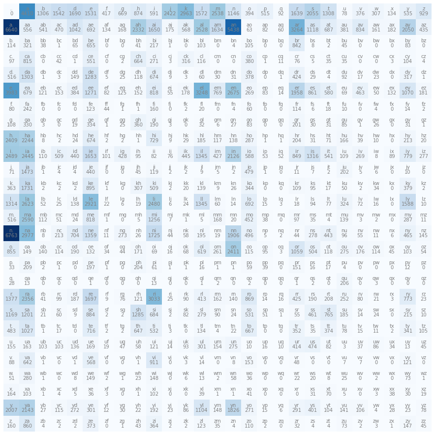

# 02 Bigram 模型：从统计到采样

这是 Part 1 的核心部分。我们从最朴素的方法开始 —— 统计字符对的出现频率，然后从频率中采样生成新名字。

---

## 1️⃣ Bigram 是什么

**Bigram** 就是"相邻的两个字符组成的一对"。对于一个名字，我们在开头和结尾各加一个特殊字符 `.`，然后拆成 bigram：

```
单词 "emma" 中的 bigram:
  .e  (开始→e)
  em  (e→m)
  mm  (m→m)
  ma  (m→a)
  a.  (a→结束)
```

Bigram 模型的假设非常简单粗暴：

> 🔑 **下一个字符是什么，只取决于当前这一个字符。**

这就是一个"马尔可夫链"——没有记忆，只看现在。虽然简单，但它是理解语言模型的最佳起点。

---

## 2️⃣ 统计 Bigram 频率

我们的字符集有 26 个字母 + 1 个特殊字符 `.` = **27 个字符**。

对数据集中所有名字统计 bigram 出现次数，可以构建一个 **27×27 的计数矩阵 N**：

- `N[i][j]` = 字符 i 后面跟着字符 j 的次数
- 行表示"当前字符"，列表示"下一个字符"

```python
# 核心逻辑（简化版）
N = torch.zeros(27, 27, dtype=torch.int32)

for word in words:
    chars = ['.'] + list(word) + ['.']
    for ch1, ch2 in zip(chars, chars[1:]):
        ix1 = stoi[ch1]  # 字符 → 索引
        ix2 = stoi[ch2]
        N[ix1, ix2] += 1
```

> 📝 完整脚本见 [`../scripts/02_bigram_counting.py`](../scripts/02_bigram_counting.py)

统计完之后，可视化一下这个矩阵：

```python
# 可视化：Bigram 计数矩阵热力图 → 生成 ../images/cell011_output00.png
import matplotlib.pyplot as plt

plt.figure(figsize=(16, 16))
plt.imshow(N, cmap='Blues')
for i in range(27):
    for j in range(27):
        chstr = itos[i] + itos[j]
        plt.text(j, i, chstr, ha="center", va="bottom", color='gray')
        plt.text(j, i, N[i, j].item(), ha="center", va="top", color='gray')
plt.axis('off')
plt.savefig('../images/cell011_output00.png', dpi=150, bbox_inches='tight')
plt.show()
```

> 完整脚本见 [`scripts/03_visualize_matrix.py`](../scripts/03_visualize_matrix.py)



> 🔑 亮点解读：第一行（以 `.` 开头的行）告诉你哪些字母最常作为名字的开头。你能看到 `a`、`e`、`k` 等字母特别亮，说明很多名字以它们开头。

---

## 3️⃣ 从计数到概率

有了计数矩阵 N，转换成概率很简单：**每一行归一化**。

```python
P = N.float()
P /= P.sum(1, keepdims=True)
```

这一行代码做了什么？让我们拆开看：

### Broadcasting 规则

```
P 的形状：(27, 27)  — 每个元素是计数值
P.sum(1, keepdims=True) 的形状：(27, 1)  — 每行的总和

当 (27, 27) / (27, 1) 时，PyTorch 自动把 (27,1) 广播成 (27,27)：
每一列都用同一个行的总和来除
```

这样 `P[i][j]` 就变成了：**已知当前字符是 i，下一个字符是 j 的概率**。

⚠️ 注意 `keepdims=True` 很重要！如果省略，`sum` 会返回形状 `(27,)`，PyTorch 会按列广播，结果就全错了。这是个经典 bug。

> 📝 完整的概率计算和采样脚本见 [`../scripts/04_probability_sampling.py`](../scripts/04_probability_sampling.py)

---

## 4️⃣ 采样生成名字

有了概率矩阵 P，我们可以用它来**生成新名字**：

```python
g = torch.Generator().manual_seed(2147483647)

for i in range(5):
    out = []
    ix = 0  # 从特殊字符 '.' 开始
    while True:
        p = P[ix]                    # 取出当前字符对应的概率分布
        ix = torch.multinomial(p, num_samples=1, replacement=True, generator=g).item()
        if ix == 0:                  # 采样到 '.' → 结束
            break
        out.append(itos[ix])         # 索引 → 字符
    print(''.join(out))
```

**生成过程**：

```
起始 → 查 P[0]（. 的行）→ 采样 → 得到 'j'
      → 查 P[10]（j 的行）→ 采样 → 得到 'u'
      → 查 P[21]（u 的行）→ 采样 → 得到 'n'
      → ... 直到采样到 '.' → 输出 "jun"
```

> 💡 `torch.multinomial` 就是"按照给定的概率分布，随机抽一个"——就像加权抽奖。

生成的名字大概长这样：

```
junide
janasah
p
cony
a
```

能看出有些像名字（junide、cony），有些很奇怪（单字母 `p`）。这就是 Bigram 模型的水平 —— 它只能看到前一个字符，信息量太少了。后续课程会逐步改进。

---

## 5️⃣ 评估模型质量：NLL Loss

生成的名字看起来还行，但我们需要一个**数字化的指标**来衡量模型好坏。

### 从似然到 NLL

思路：**模型应该给训练数据中实际出现的 bigram 赋予较高的概率**。

```
对于一个名字 "emma"：

似然 = P(e|.) × P(m|e) × P(m|m) × P(a|m) × P(.|a)
     = 所有 bigram 概率的乘积

log 似然 = log P(e|.) + log P(m|e) + log P(m|m) + log P(a|m) + log P(.|a)
         = 概率的 log 之和（乘法变加法！）

NLL = -log 似然
    = 负的 log 似然

平均 NLL = NLL / bigram 总数  ← 这就是我们的 loss ✅
```

🔑 **关键理解**：

| 量 | 越大越好还是越小越好？ |
|----|:---:|
| 似然（概率乘积） | 越大越好 |
| log 似然 | 越大越好（最大为 0） |
| NLL（负 log 似然） | **越小越好**（最小为 0） |

我们用 NLL 作为 loss，是因为：
- 概率的乘积会导致**数值下溢**（一堆小于 1 的数相乘趋近于 0）
- 取 log 把乘法变加法，数值稳定
- 取负让优化目标统一为"最小化"

```python
# 计算 NLL 的核心代码
log_likelihood = 0.0
n = 0

for word in words:
    chars = ['.'] + list(word) + ['.']
    for ch1, ch2 in zip(chars, chars[1:]):
        ix1 = stoi[ch1]
        ix2 = stoi[ch2]
        prob = P[ix1, ix2]
        log_likelihood += torch.log(prob)
        n += 1

nll = -log_likelihood
print(f"平均 NLL = {nll / n:.4f}")  # 约 2.45
```

> 📝 完整的 NLL 计算脚本见 [`../scripts/05_nll_loss.py`](../scripts/05_nll_loss.py)

### 模型平滑

⚠️ 如果某个 bigram 在训练集中**从未出现**，它的计数为 0，概率就是 0。log(0) = -∞，NLL 就炸了。

解决方法很简单：给所有计数加 1。

```python
P = (N + 1).float()   # 模型平滑 ✅
P /= P.sum(1, keepdims=True)
```

加 1 之后，所有 bigram 的概率都 > 0，不会出现 log(0)。这叫 **Laplace 平滑**（也叫 add-one smoothing）。`+1` 的大小控制了平滑的力度 —— 加得越多，分布越均匀；加得越少，越接近原始计数。

---

## 📝 课后练习

在进入下一节之前，想想这两个问题：

**Q1：** 如果不加模型平滑（N+1），对于训练集中从未出现的 bigram 会发生什么？

<details>
<summary>💡 提示</summary>

考虑当 `N[i][j] = 0` 时，`P[i][j] = 0`，然后 `log(0) = ?`。
</details>

**Q2：** 为什么用 NLL 而不是直接用似然作为 loss？

<details>
<summary>💡 提示</summary>

想想两个原因：(1) 概率相乘的数值稳定性；(2) 优化方向的一致性（我们总说"最小化 loss"）。
</details>

---

**👉 下一节，我们用神经网络来做同样的事：** [03 用神经网络重新实现 Bigram](03_neural_network.md)
