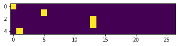

# 03 用神经网络重新实现 Bigram

上一节我们用**直接计数**的方法构建了 Bigram 模型。这一节，我们要用**神经网络**做完全一样的事。

你可能会问：为什么要用神经网络重新造轮子？

> 🔑 **答案：可扩展性。**
> 
> 直接计数法在 Bigram（只看 1 个字符）时很好用，但如果想看 3 个、5 个甚至更多字符的历史呢？组合数爆炸式增长，计数矩阵会变得巨大且稀疏。而神经网络的框架天然支持更复杂的输入，后续课程中我们只需要做微小改动就能升级模型。

---

## 1️⃣ 构建训练数据：One-Hot Encoding

神经网络的输入是数字，不能直接吃字符。我们需要把字符转换成数值向量。

**One-hot 编码**：用一个 27 维向量表示一个字符，只有对应位置是 1，其余都是 0。

```
输入字符 '.' (索引0) → one-hot [1,0,0,...,0]  (27维)
输入字符 'e' (索引5) → one-hot [0,0,0,0,0,1,...,0] (27维)
输入字符 'm' (索引13)→ one-hot [0,0,...,1,...,0]    (27维)
```

```python
import torch.nn.functional as F

# 创建训练数据
xs, ys = [], []
for word in words:
    chars = ['.'] + list(word) + ['.']
    for ch1, ch2 in zip(chars, chars[1:]):
        xs.append(stoi[ch1])
        ys.append(stoi[ch2])

xs = torch.tensor(xs)
ys = torch.tensor(ys)

# one-hot 编码
xenc = F.one_hot(xs, num_classes=27).float()  # 形状: (N, 27)
```

💡 **为什么 `.float()`？** PyTorch 的 `one_hot` 默认返回整数类型，但神经网络需要浮点数来做矩阵乘法。

> 📝 完整脚本见 [`../scripts/06_neural_network.py`](../scripts/06_neural_network.py)

```python
# 可视化：One-hot 编码矩阵 → 生成 ../images/cell032_output01.png
import matplotlib.pyplot as plt

plt.imshow(xenc)  # xenc: (N, 27) 的 one-hot 矩阵
plt.colorbar()
plt.title('One-hot Encoding')
plt.xlabel('Character Index')
plt.ylabel('Sample Index')
plt.savefig('../images/cell032_output01.png', dpi=150, bbox_inches='tight')
plt.show()
```



> 上图中，每一行是一个输入字符的 one-hot 表示。只有一列是黄色（值为 1），其余都是紫色（值为 0）。

---

## 2️⃣ 前向传播：Softmax

我们用一个简单的单层神经网络：

```
输入 xenc (N, 27)
    ↓ 矩阵乘法
xenc @ W → logits (N, 27)
    ↓ 逐元素 exp
exp(logits) → counts (N, 27)
    ↓ 行归一化
counts / counts.sum(1, keepdims=True) → probabilities (N, 27)
```

这其实就是 **Softmax**：

```python
# 初始化权重（27×27 矩阵，随机初始化）
W = torch.randn(27, 27, requires_grad=True)

# 前向传播
logits = xenc @ W          # (N, 27) — 每个输入对应 27 个输出分数
counts = logits.exp()      # (N, 27) — 确保非负（类比计数矩阵）
probs = counts / counts.sum(1, keepdims=True)  # (N, 27) — 归一化为概率
```

🔑 **直觉理解**：

| 概念 | 计数版 | 神经网络版 |
|------|--------|-----------|
| 计数矩阵 | N（直接统计） | `logits.exp()`（通过 W 计算得到） |
| 概率矩阵 | N / N.sum() | counts / counts.sum() |
| 参数 | 无（直接计数） | W（27×27 权重矩阵） |

W 就是我们要学习的参数。训练的过程就是调整 W，使得模型输出的概率分布尽可能接近真实数据。

---

## 3️⃣ 梯度下降训练

现在我们需要一个 loss 函数来衡量模型好坏 —— 就是上一节学过的 **NLL（负对数似然）**：

```python
# 对于每个训练样本，取出模型预测的目标字符概率
loss = -probs[torch.arange(len(ys)), ys].log().mean()
```

这行代码做了什么？
- `probs[torch.arange(len(ys)), ys]` — 取出每个样本中，目标字符对应的预测概率
- `.log()` — 取对数
- `.mean()` — 对所有样本取平均
- `-` — 取负，变成 NLL

训练循环：

```python
for k in range(100):
    # 前向传播
    logits = xenc @ W
    counts = logits.exp()
    probs = counts / counts.sum(1, keepdims=True)
    loss = -probs[torch.arange(len(ys)), ys].log().mean()

    # 反向传播
    W.grad = None        # 清零梯度
    loss.backward()      # 计算梯度

    # 更新参数
    W.data += -50 * W.grad  # 学习率 50（这个任务比较简单，可以用大学习率）
    
    if k % 10 == 0:
        print(f"Step {k}: loss = {loss.item():.4f}")
```

> 📝 完整的梯度下降脚本见 [`../scripts/07_gradient_descent.py`](../scripts/07_gradient_descent.py)

训练后 loss 应该收敛到约 **2.47** 左右 —— 和计数法的平均 NLL 几乎一样！

### L2 正则化 ≈ 模型平滑

还记得上一节的模型平滑 `N + 1` 吗？在神经网络版中，等价的做法是 **L2 正则化**：

```python
# 加上正则化项
reg_loss = 0.01 * (W ** 2).mean()  # 用 .mean() 而非 .sum()，使正则化强度与 NLL 量纲匹配
loss = nll_loss + reg_loss
```

💡 **直觉**：正则化惩罚 W 中过大的值，使得 `W.exp()`（即"计数"）不会太极端 → 相当于让分布更平滑 → 等价于 `N + λ`。

正则化系数 `0.01` 就相当于平滑的力度：系数越大 → 分布越平滑 → 生成结果越"平庸"。

---

## 4️⃣ 神经网络版 vs 计数版：为什么结果一样？

训练结束后，我们来看看 `W.exp()` 长什么样：

```python
# 训练后的 W 取 exp
learned_N = W.exp().detach()

# 和直接计数得到的 N 对比
# 它们几乎一模一样！
```

🔑 **为什么？** 因为两者在优化同一个目标：

- **计数版**：直接统计频率，隐式地最大化似然
- **神经网络版**：通过梯度下降最小化 NLL，等价于最大化似然

两者都是对同样的数据做**最大似然估计 (MLE)**，只不过一个直接算，一个迭代优化。既然优化目标相同，最优解当然一样！

> 💡 这也说明：**对于 Bigram 模型，直接计数就是最优解**。神经网络的优势不在这里，而在于它的框架可以轻松扩展到更复杂的模型。

---

## 📝 课后练习

**Q1：** 为什么神经网络版 Bigram 的最优解和直接计数一样？

<details>
<summary>💡 提示</summary>

两者都在做最大似然估计。计数法直接给出了 MLE 的闭式解；神经网络通过梯度下降逼近同一个解。目标相同，最优解自然相同。
</details>

**Q2：** 如果把 W 初始化为全零，训练还会收敛吗？

<details>
<summary>💡 提示</summary>

会！全零初始化意味着一开始所有 bigram 概率相等（均匀分布）。梯度会打破对称性，W 会逐步更新。不过收敛速度可能比随机初始化慢一些。
</details>

---

## 🎯 课后作业

动手实践时间！去完成课后作业来巩固这节课的内容：

👉 [课后作业 Assignment 1](../../../assignments/assignment_1/)

---

## 🔮 下一课预告

Part 2 中，我们将引入 **MLP（多层感知机）**，把上下文长度从 **1 个字符扩展到 3 个字符**。这意味着模型不再是 Bigram，而是一个能考虑更多历史信息的更强模型。

核心升级路线：

```
Part 1: Bigram (看 1 个字符) ← 你在这里
Part 2: MLP   (看 3 个字符)  ← 下一站
Part 3: ...更深的网络...
```

下节课见！🚀
