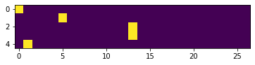

# 03 用神经网络重新实现 Bigram

上一节我们用**直接计数**的方法构建了 Bigram 模型。这一节，我们要用**神经网络**做完全一样的事。

你可能会问：为什么要用神经网络重新造轮子？

> 🔑 **答案：可扩展性。**
> 
> 直接计数法在 Bigram（只看 1 个字符）时很好用，但如果想看 3 个、5 个甚至更多字符的历史呢？组合数爆炸式增长，计数矩阵会变得巨大且稀疏。而神经网络的框架天然支持更复杂的输入，后续课程中我们只需要做微小改动就能升级模型。

---

## 1️⃣ 构建训练数据：One-Hot Encoding

神经网络的输入是数字，不能直接吃字符。我们需要把字符转换成数值向量。

**One-hot 编码**：用一个 27 维向量表示一个字符，只有对应位置是 1，其余都是 0。

```
输入字符 '.' (索引0) → one-hot [1,0,0,...,0]  (27维)
输入字符 'e' (索引5) → one-hot [0,0,0,0,0,1,...,0] (27维)
输入字符 'm' (索引13)→ one-hot [0,0,...,1,...,0]    (27维)
```

```python
import torch.nn.functional as F

# 创建训练数据
xs, ys = [], []
for word in words:
    chars = ['.'] + list(word) + ['.']
    for ch1, ch2 in zip(chars, chars[1:]):
        xs.append(stoi[ch1])
        ys.append(stoi[ch2])

xs = torch.tensor(xs)
ys = torch.tensor(ys)

# one-hot 编码
xenc = F.one_hot(xs, num_classes=27).float()  # 形状: (N, 27)
```

💡 **为什么 `.float()`？** PyTorch 的 `one_hot` 默认返回整数类型，但神经网络需要浮点数来做矩阵乘法。

> 📝 完整脚本见 [`../scripts/06_neural_network.py`](../scripts/06_neural_network.py)

```python
# 可视化：One-hot 编码矩阵
import matplotlib.pyplot as plt

plt.imshow(xenc[:100])  # 只画前 100 行，画全量 22.8 万行会非常慢
plt.colorbar()
plt.title('One-hot Encoding')
plt.xlabel('Character Index')
plt.ylabel('Sample Index')
plt.savefig('one_hot_encoding.png', dpi=150, bbox_inches='tight')
```



> 上图中，每一行是一个输入字符的 one-hot 表示。只有一列是黄色（值为 1），其余都是紫色（值为 0）。注意：教程中的图片是配套 notebook 当时生成的存档，脚本 06 本身不含绘图代码，重跑脚本不会更新这张图。

---

## 2️⃣ 前向传播：Softmax

我们用一个简单的单层神经网络：

```
输入 xenc (N, 27)
    ↓ 矩阵乘法
xenc @ W → logits (N, 27)
    ↓ 逐元素 exp
exp(logits) → counts (N, 27)
    ↓ 行归一化
counts / counts.sum(1, keepdims=True) → probabilities (N, 27)
```

这其实就是 **Softmax**：

$$\text{softmax}(z)_i = \frac{e^{z_i}}{\sum_{j=1}^{27} e^{z_j}}$$

> 💡 **为什么用 exp？** 三个理由：exp 把任意实数变成正数（好扮演"计数"）；exp 保序（分数高的字符概率仍高）；exp 光滑可导（梯度下降需要）。合起来看，softmax 像一个"软版 argmax"——不是硬选一个最大值，而是按 $e^{z_i}$ 的比例给每个选项分配概率。

先看懂 `xenc @ W` 在干什么——**它本质上是查表**。用 3×3 的小矩阵手算一遍：

<div class="derivation">

<div class="d-title">🧮 推导：one-hot @ W = 从 W 里取出对应行（3×3 数值例）</div>

取 3×3 的小 W（实际是 27×27）和字符 1 的 one-hot 向量：

$$W = \begin{bmatrix} 10 & 20 & 30 \\ 40 & 50 & 60 \\ 70 & 80 & 90 \end{bmatrix}, \qquad x = [\,0,\ 1,\ 0\,]$$

one-hot 只在第 1 个分量是 1，矩阵乘时其余两行都被乘 0 消掉：

$$xW = 0 \times W_{0} + 1 \times W_{1} + 0 \times W_{2} = [\,40,\ 50,\ 60\,] = W_{1}$$

> 🔢 **数值例**：无论 one-hot 里的 1 落在第几位，$xW$ 都等于把那一行原样取出——这就是"查表"（pluck）。

</div>

也就是说，**`xenc @ W` 的每一行，就是把 W 里对应输入字符的那一行"抠"出来**（可以叫它 pluck / 查表）。所以 W 的每一行，就是"该字符作为上下文时，27 个下一个字符各自的分数"。这也是计数版与神经网络版能等价的枢纽：计数版查的是 N 的行，神经网络版查的是 W 的行。

```python
# 初始化权重（27×27 矩阵，随机初始化）
# （脚本 06 用 Generator().manual_seed(2147483647) 固定种子以保证可复现）
W = torch.randn(27, 27, requires_grad=True)

# 前向传播
logits = xenc @ W          # (N, 27) — 每个输入对应 27 个输出分数
counts = logits.exp()      # (N, 27) — 确保非负（"伪计数"，类比计数矩阵）
probs = counts / counts.sum(1, keepdims=True)  # (N, 27) — 归一化为概率
```

🔑 **直觉理解**：

| 概念 | 计数版 | 神经网络版 |
|------|--------|-----------|
| 计数矩阵 | N（直接统计） | `logits.exp()`（通过 W 计算得到） |
| 概率矩阵 | N / N.sum() | counts / counts.sum() |
| 参数 | 无（直接计数） | W（27×27 权重矩阵） |

W 就是我们要学习的参数。训练的过程就是调整 W，使得模型输出的概率分布尽可能接近真实数据。

---

## 3️⃣ 梯度下降训练

现在我们需要一个 loss 函数来衡量模型好坏 —— 就是上一节学过的 **NLL（负对数似然）**：

```python
# 对于每个训练样本，取出模型预测的目标字符概率
loss = -probs[torch.arange(len(ys)), ys].log().mean()
```

这行代码做了什么？
- `probs[torch.arange(len(ys)), ys]` — 取出每个样本中，目标字符对应的预测概率
- `.log()` — 取对数
- `.mean()` — 对所有样本取平均
- `-` — 取负，变成 NLL

> 💡 **术语说明**：深度学习框架里常见的 `CrossEntropyLoss`（交叉熵）= softmax + NLL 的合并算子（内部用 log-softmax 实现，数值上更稳定）。我们手写的这两行就是"softmax 已经做过 + NLL"，所以叫 NLL；很多资料（含 Karpathy 原课）把两者混称——知道"交叉熵 = softmax 贴着 NLL"这层关系即可，不必焦虑。

> 📏 **训练前先立三根基准线**（均可在本机实测）：
>
> | 模型状态 | 平均 NLL |
> |---|---|
> | 瞎猜：27 字符均匀分布 | $\ln 27 \approx 3.2958$ |
> | randn 随机初始化（脚本 06 实测） | ≈ 3.76 |
> | 计数版最优（脚本 05 实测） | ≈ 2.454 |
>
> 第一行就是"及格线"：把 W 初始化为全零，则 $e^0 = 1$，softmax 恰好是均匀分布，实测 loss = 3.2958 = $\ln 27$。而 randn 起点约 3.76 **比瞎猜还差**——logits 有方差，softmax 偏离均匀，平均 NLL 反而升高。训练要先把 loss 从 3.76 跌回 3.3 以下，再向 2.45 收敛。

训练循环：

```python
for k in range(100):
    # 前向传播
    logits = xenc @ W
    counts = logits.exp()
    probs = counts / counts.sum(1, keepdims=True)
    loss = -probs[torch.arange(len(ys)), ys].log().mean()

    # 反向传播
    W.grad = None        # 清零梯度
    loss.backward()      # 计算梯度

    # 更新参数
    W.data += -50 * W.grad  # 学习率 50（这个任务比较简单，可以用大学习率）
    
    if k % 10 == 0:
        print(f"Step {k}: loss = {loss.item():.4f}")
```

> 💡 **为什么学习率可以用 50？** 这是一个特例，不是通用经验！原因：
> 1. **任务简单**：只有 27×27=729 个参数，loss 曲面很平滑
> 2. **数据量大**：22 万个样本，梯度估计很稳定
> 3. **没有隐藏层**：不存在梯度消失/爆炸问题
>
> 到了 Part 2（MLP），学习率就变成了 0.1，因为网络更深、更复杂。**通用建议**：从小学习率开始（如 0.001），观察 loss 变化，再逐步调大。

> 📝 完整的梯度下降脚本见 [`../scripts/07_gradient_descent.py`](../scripts/07_gradient_descent.py)。脚本与本片段的唯一差别：loss 里多加了正则项 `+ 0.01 * (W**2).mean()`（见下方"L2 正则化"），所以脚本打印的数值略高于纯 NLL。

实测（脚本 07，100 步、学习率 50、L2 系数 0.01）：loss 从 3.7686 降到 **2.4901**——已越过及格线 3.30，距计数版的 2.454 还差一点；其中约 0.03 是正则项贡献。若去掉正则并训练更久（约 300 步），纯 NLL 可降到 ≈ 2.46，继续逼近 2.454。教程与脚本中的目标数字以此为准（旧版教程写的"收敛到约 2.47"对应的是**无正则、更多步数**的设置，100 步跑不出来）。

### L2 正则化 ≈ 模型平滑

还记得上一节的模型平滑 `N + 1` 吗？在神经网络版中，对应的做法是 **L2 正则化**：

```python
# 加上正则化项
reg_loss = 0.01 * (W ** 2).mean()  # 用 .mean() 而非 .sum()，使正则化强度与 NLL 量纲匹配
loss = nll_loss + reg_loss
```

💡 **直觉**：正则化惩罚 W 中过大的值，把 W 往 0 推；极端情形 W 全为 0 时 $e^0 = 1$，softmax 恰是均匀分布——这正是平滑力度 $\lambda \to \infty$ 时 `N + λ` 的极限。所以两者方向一致：都是把分布往均匀拉 → 等价于"更平滑的 `N + λ`"。

正则化系数 `0.01` 就相当于平滑的力度：系数越大 → 分布越平滑 → 生成结果越"平庸"。

> ⚠️ 严谨地说，L2 与加法平滑是**类比而非严格等价**：L2 对应参数空间的高斯先验，`N + λ` 对应计数的 Dirichlet（计数加法）先验。面试时说"两者都把分布往均匀拉"比说"完全等价"更准确。

---

## 4️⃣ 神经网络版 vs 计数版：为什么结果一样？

训练结束后，我们来看看 W 学到了什么。**正确的对比方式是比较两个"分布"，而不是拿 `W.exp()` 直接和 N 比**：

```python
# 神经网络版的行分布：exp 后行归一化（softmax 的后半步）
with torch.no_grad():
    P_nn = W.exp()
    P_nn /= P_nn.sum(1, keepdims=True)

# 计数版（+1 平滑）的行分布
P_count = (N + 1).float()
P_count /= P_count.sum(1, keepdims=True)

print((P_nn - P_count).abs().max().item())
# 无正则训练约 300 步时 ≈ 0.044，训练约 3000 步时收敛到 ≈ 0.005
```

🔑 **准确的说法是"分布等价"，不是"数值相等"**：

- **等价的部分**：训练充分后，`P_nn` 与计数版 `P_count` 的逐元素最大偏差收敛到 ≈ 0.005
- **不等价的部分**：`W.exp()` 本身和 N 完全不是一个量级（实测 `W.exp()` 范围约 [0, 89]，N 范围 [0, 6763]），数值相关性也弱（3000 步后 corr 仅约 0.34）。若按字面去 `print(W.exp())` 和 `print(N)` 对比，只会怀疑自己写错了

为什么只能等价到"分布"？因为 softmax 只对行归一化敏感，对**行内平移不敏感**：给 W 的某一行整体加常数 $c$，exp 后相当于同乘 $e^c$，归一化后分布不变。所以最优解只满足

$$\text{softmax}(W_{i,:}) = P_{i,:} \quad\Longleftrightarrow\quad W_{i,:} = \log P_{i,:} + c_i$$

其中 $c_i$ 是第 $i$ 行的任意常数。"W 的最优值 = log N"这类说法省掉了归一化和这个自由度，是不精确的。

**为什么最优分布恰好是计数版的分布？** 因为两者优化同一个目标：

- **计数版**：行归一化频率 $P[i,j] = N[i,j] \,/\, \sum_{j'} N[i,j']$ 恰好是该行似然最大化的**闭式解**——在第 $i$ 行内，让 $\prod_j P[i,j]^{N[i,j]}$ 最大的概率取值就是频率本身（多项分布的 MLE）
- **神经网络版**：通过梯度下降最小化 NLL，等价于最大化同一个似然

两者都是对同样的数据做**最大似然估计 (MLE)**，只不过一个直接算，一个迭代优化，所以收敛到同一个分布。

> 💡 这也说明：**对于 Bigram 模型，直接计数就是最优解**。神经网络的优势不在这里，而在于它的框架可以轻松扩展到更复杂的模型。

### 面试考点：loss 接近 ≠ 分布接近

把两个版本的采样放在一起看（同一个 27×27 的模型，平均 NLL 只差 0.04）：

| 版本 | 平均 NLL | 采样输出 |
|------|---------|---------|
| 计数版（脚本 04，seed 2147483647） | 2.4544 | junide / janasah / p / cony / a |
| NN 版 100 步（脚本 07，seed 2147483647+10） | ≈ 2.49 | mria / mmyazzieelend / ryalarethrstendrlen / aderedieli / jely |

更扎心的实验：NN 版去掉正则、训练 300 步，纯 NLL 降到 2.4593（距闭式解 2.4544 只有 0.005），采样**仍然**出 18 个字母的乱码。

> 🔑 **平均 loss 接近 ≠ 学到的分布接近**。NLL 被高频 bigram 主导，长尾（低频条件分布）还没学准的时候，loss 只涨一点点，采样质量却最先崩。这解释了"分布等价"为什么只在小 loss 差距下渐进成立，也解释了为什么评估生成模型不能只看 loss、还要看生成样本——面试被追问"既然等价，为什么采样不一样好"，这就是标准答案。

---

## 📝 课后练习

**Q1：** 为什么神经网络版 Bigram 的最优解和直接计数一样？

<details>
<summary>💡 提示</summary>

两者都在做最大似然估计。计数法直接给出了 MLE 的闭式解；神经网络通过梯度下降逼近同一个解。目标相同，最优的**分布**自然相同（W 多了每行一个常数的自由度）。
</details>

**Q2：** 如果把 W 初始化为全零，训练还会收敛吗？

<details>
<summary>💡 提示</summary>

会！全零初始化意味着一开始所有 bigram 概率相等（均匀分布，loss = ln(27) ≈ 3.296，见 §3 的基准线）。梯度会打破对称性，W 会逐步更新。不过收敛速度可能比随机初始化慢一些。
</details>

---

## 📊 计数模型 vs 神经网络对照表

| 维度 | 计数法（Part 1 前半） | 神经网络法（Part 1 后半） |
|------|---------------------|------------------------|
| **参数** | 计数矩阵 N (27×27) | 权重矩阵 W (27×27) |
| **归一化** | `P = N / N.sum(1)` | `probs = softmax(logits)` |
| **损失函数** | NLL = `-log(P[ch1,ch2]).mean()` | NLL = `-probs[range, ys].log().mean()` |
| **平滑** | `N + λ`（Laplace 平滑） | L2 正则化 `0.01 * (W**2).mean()` |
| **采样** | `torch.multinomial(P[ix])` | `torch.multinomial(probs[ix])` |
| **优势** | 简单、快速、有闭式解 | 可扩展、可加隐藏层、可处理更多上下文 |
| **劣势** | 只能看 1 个字符 | 需要调参、训练慢 |

> 💡 **术语备注**：表里两列损失函数其实是同一个东西（NLL）。框架里的 `CrossEntropyLoss` 是 softmax + NLL 的合并算子，本节的 `probs` 已经由手写 softmax 算出，所以只剩 NLL 部分。
>
> 💡 **关键洞察**：两种方法在 Bigram 任务上**分布等价**——神经网络训练收敛后，`softmax(W 的每一行)` 与计数法的频率分布一致（即 $W_{i,:} = \log P_{i,:} + c_i$，每行带一个平移自由度）。但神经网络的优势在于**可扩展性**：Part 2 我们会加隐藏层，Part 3 加 BatchNorm，Part 5 变成 WaveNet——这些都是计数法做不到的。

---

## 🎯 课后作业

动手实践时间！去完成课后作业来巩固这节课的内容：

👉 [课后作业 Assignment 1](../../../assignments/assignment_1/)

---

## 🔮 下一课预告

Part 2 中，我们将引入 **MLP（多层感知机）**，把上下文长度从 **1 个字符扩展到 3 个字符**。这意味着模型不再是 Bigram，而是一个能考虑更多历史信息的更强模型。对应论文是这一领域的开山之作：**Bengio et al. 2003**，*A Neural Probabilistic Language Model*——Part 2-3 的做法正是它的最小复现，建议对照阅读。

核心升级路线：

```
Part 1: Bigram (看 1 个字符) ← 你在这里
Part 2: MLP   (看 3 个字符)  ← 下一站
Part 3: ...更深的网络...
```

下节课见！🚀
