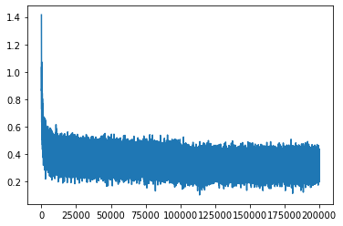

# 02 — MLP 架构

## 🧱 Embedding 层：把字符变成向量

### 什么是 Embedding？

在 Bigram 里，我们用 one-hot 向量表示字符 —— 一个长度 27 的向量，只有一个位置是 1。这样太浪费了，而且字符之间没有任何关系。

💡 **Embedding** 的想法：给每个字符分配一个**低维向量**（比如 2 维或 10 维），让模型自己学习这些向量应该长什么样。

```
字符 'a' (索引1)  →  C[1]  →  [0.3, -0.1]  (2维向量)
字符 'm' (索引13) →  C[13] →  [-0.5, 0.8]
字符 '.' (索引0)  →  C[0]  →  [0.1, 0.2]
```

`C` 是一个形状为 `(27, 2)` 的矩阵，27 个字符，每个字符 2 维。这 2 维就是字符在"空间"中的位置。

### 代码实现

```python
import torch

# Embedding 矩阵：27 个字符，每个用 2 维向量表示
C = torch.randn((27, 2))

# 查表：输入索引 5，得到对应的 2 维向量
print(C[5])        # tensor([0.xx, -0.xx])
print(C[[5, 13]])  # 也可以一次查多个 → (2, 2) 矩阵
```

🔑 关键点：`C` 就是我们要训练的参数！一开始是随机的，训练过程中会慢慢变成有意义的向量。

> 📜 完整代码见 [`../scripts/03_embedding.py`](../scripts/03_embedding.py)

---

## 🏗️ MLP 前向传播

### 网络结构

我们参考 Bengio 2003 论文的架构，搭一个两层 MLP：

```
                ┌──────────────────────────────────────────┐
                │            MLP 网络结构                  │
                │                                          │
输入:           │                                          │
  3 个字符索引  │    ┌─────┐                                │
  [5, 13, 13] ─┼───→│  C  │ Embedding (27×2)               │
                │    └──┬──┘                               │
                │       │ 查表得到 3 个 2 维向量            │
                │       ▼                                  │
                │    [emb] 拼接成 6 维向量 (3×2)           │
                │       │                                  │
                │    ┌──┴──┐                               │
                │    │ W1  │ Linear (6 → 100)              │
                │    │+b1  │                               │
                │    └──┬──┘                               │
                │       │                                  │
                │    ┌──┴──┐                               │
                │    │tanh │ 激活函数                      │
                │    └──┬──┘                               │
                │       │ 100 维隐藏层                     │
                │    ┌──┴──┐                               │
                │    │ W2  │ Linear (100 → 27)             │
                │    │+b2  │                               │
                │    └──┬──┘                               │
                │       │                                  │
                │       ▼                                  │
                │   logits (27维) → softmax → 概率          │
                └──────────────────────────────────────────┘
```

### 一步步写代码

**Step 1: Embedding + 拼接**

```python
# X 是 (N, 3) 的索引矩阵，C 是 (27, 2) 的 Embedding
emb = C[X]           # (N, 3, 2) → 每个样本 3 个字符，每个字符 2 维
emb_cat = emb.view(emb.shape[0], -1)  # (N, 6) → 拼成一维向量
```

🔑 `emb.view(emb.shape[0], -1)` 就是把 3 个 2 维向量拍扁成 1 个 6 维向量。`-1` 让 PyTorch 自动算第二维。

**Step 2: 隐藏层**

```python
W1 = torch.randn((6, 100))    # 6 → 100
b1 = torch.randn(100)

h = torch.tanh(emb_cat @ W1 + b1)  # (N, 100)
```

💡 `tanh` 把输出压到 [-1, 1] 之间，给网络非线性能力。

**Step 3: 输出层**

```python
W2 = torch.randn((100, 27))   # 100 → 27（27 个字符）
b2 = torch.randn(27)

logits = h @ W2 + b2          # (N, 27)
```

**Step 4: Softmax → 概率**

```python
counts = logits.exp()                # 等价于 Bigram 里的 N 矩阵
prob = counts / counts.sum(1, keepdim=True)  # 归一化
```

> 📜 完整代码见 [`../scripts/04_mlp_forward.py`](../scripts/04_mlp_forward.py)
>
> 🖼️ 网络结构可视化：

---

## 📉 CrossEntropy Loss

### 为什么不用手动算？

你可以手动算 loss：

```python
# 手动版本（不推荐）
logits = h @ W2 + b2
counts = logits.exp()
prob = counts / counts.sum(1, keepdim=True)
loss = -prob[torch.arange(N), Y].log().mean()
```

⚠️ 但这样有三个问题：
1. **数值不稳定**：`exp()` 对大数会溢出 → `inf`
2. **效率低**：PyTorch 没法对这三步做融合优化
3. **反向传播复杂**：自己写 grad 容易出错

### 推荐做法

```python
import torch.nn.functional as F

logits = h @ W2 + b2
loss = F.cross_entropy(logits, Y)  # 一步到位！
```

🔑 `F.cross_entropy` 内部做了：
1. 先减去最大值（防止溢出）
2. 用 log-sum-exp 技巧算 log-softmax
3. 取负对数似然的均值

数学等价，但**更快、更稳定**。

---

## 🧪 课后练习

### Q1: Embedding 维度

> 如果把 Embedding 从 2 维改成 10 维，`W1` 的形状应该是什么？（block_size=3）

<details>
<summary>点击查看答案</summary>

`W1` 的输入维度 = block_size × emb_dim = 3 × 10 = 30。所以 `W1` 的形状是 `(30, 100)`。
</details>

### Q2: view vs reshape

> `emb.view(N, -1)` 和 `emb.reshape(N, -1)` 有什么区别？什么情况下用哪个？

<details>
<summary>点击查看答案</summary>

- `view` 要求张量在内存中是连续的（contiguous），更快但不总是能用
- `reshape` 任何情况都能用，如果内存不连续会自动复制一份
- 实践中：先试 `view`，报错了再用 `reshape`
</details>

### Q3: 为什么用 tanh？

> 隐藏层为什么用 `tanh` 而不是 `sigmoid` 或 `ReLU`？你觉得各有什么优缺点？

<details>
<summary>点击查看答案</summary>

- `tanh`：输出 [-1, 1]，零中心，梯度比 sigmoid 大 → 训练更快
- `sigmoid`：输出 [0, 1]，两端梯度极小 → 容易梯度消失
- `ReLU`：简单高效，但 Bengio 2003 论文用的是 tanh，这里是跟原论文一致

实际上在后续 Part 中会看到，tanh 在这里效果不错，但隐藏层太大会导致 "dead neurons" 问题。
</details>

---

## 🧭 下一步

架构搭好了，接下来训练它！

👉 [03 — 训练与评估](03_training_and_eval.md)
