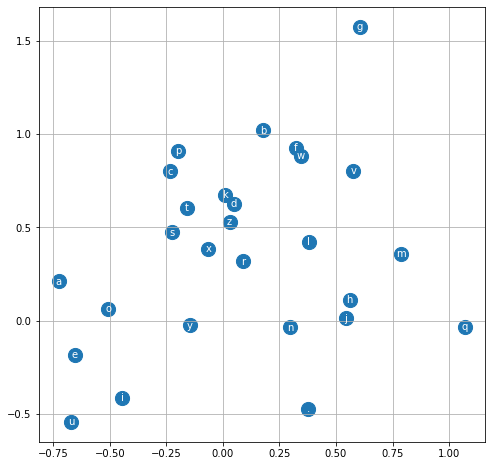

# 03 — 训练与评估

## ⚡ Minibatch SGD

### 为什么要用小批量？

全部数据有 22 万+ 个样本。如果每个迭代都过一遍所有数据：

- 一个 epoch 要算 228146 次前向 + 反向传播 😱
- GPU 利用率可能很低（矩阵太小）
- 梯度虽然精确，但更新太慢

💡 **Minibatch** 的想法：每次随机抽一小批数据（比如 32 或 64 个样本），用这批数据算梯度，更新参数。

```
全量梯度下降：                  Minibatch SGD：
┌───────────────────┐          ┌───────────────────┐
│ 用全部 22 万样本   │          │ 随机抽 32 个样本   │
│ 算一次精确梯度     │          │ 算一次近似梯度     │
│ 更新一次参数       │          │ 更新一次参数       │
│                   │          │                   │
│ ⏱️ 很慢但很准     │          │ ⚡ 很快但有点噪声  │
│                   │          │                   │
│ 1 步 / 几秒       │          │ 1000 步 / 几秒     │
└───────────────────┘          └───────────────────┘
```

⚠️ Minibatch 的梯度有噪声（不完全精确），但实践证明这个噪声反而有助于逃离局部最优。

### 代码实现

```python
for i in range(1000):
    # 随机选 32 个样本
    ix = torch.randint(0, Xtr.shape[0], (32,))
    
    # 前向传播（只用这 32 个）
    emb = C[Xtr[ix]]                   # (32, 3, 2)
    h = torch.tanh(emb.view(-1, 6) @ W1 + b1)  # (32, 100)
    logits = h @ W2 + b2               # (32, 27)
    loss = F.cross_entropy(logits, Ytr[ix])
    
    # 反向传播
    for p in parameters:
        p.grad = None
    loss.backward()
    
    # 更新参数
    for p in parameters:
        p.data += -lr * p.grad
```

🔑 注意：`Xtr[ix]` 和 `Ytr[ix]` 只取了 32 个样本，所以前向传播和反向传播都很快。

> 📜 完整代码见 [`../scripts/05_minibatch_training.py`](../scripts/05_minibatch_training.py)

---

## 📊 学习率调度

### 如何选择学习率？

Andrej 在视频里演示了一个技巧：**学习率搜索**。

```python
# 试 1000 个不同的学习率，从 0.001 到 1
lre = torch.linspace(-3, 0, 1000)  # 指数空间
lrs = 10 ** lre                     # 0.001 到 1.0

lri = []
lossi = []

for i in range(1000):
    ix = torch.randint(0, Xtr.shape[0], (32,))
    
    emb = C[Xtr[ix]]
    h = torch.tanh(emb.view(-1, 6) @ W1 + b1)
    logits = h @ W2 + b2
    loss = F.cross_entropy(logits, Ytr[ix])
    
    for p in parameters:
        p.grad = None
    loss.backward()
    
    lr = lrs[i]
    for p in parameters:
        p.data += -lr * p.grad
    
    lri.append(lre[i])
    lossi.append(loss.item())

# 画图：loss vs 学习率的指数
plt.plot(lri, lossi)
```

💡 你会看到 loss 先下降，然后在一个点之后开始爆炸 —— 那个最低点附近就是好学习率。

### 学习率衰减

找到好的学习率后（比如 0.1），训练到 loss 趋于平稳，再把学习率缩小（比如降到 0.01），继续训练。这就是**学习率衰减**：

```
loss
 │\
 │ \
 │  \___
 │      \____
 │           \____
 │                \____
 │                     ──────  ← 学习率衰减后继续降
 └─────────────────────────── 步数
```

---

## 🔍 过拟合诊断

### Train Loss vs Dev Loss

训练过程中，我们要同时看 train loss 和 dev loss：

```python
@torch.no_grad()  # 不算梯度，节省内存
def evaluate(X, Y):
    emb = C[X]
    h = torch.tanh(emb.view(-1, 6) @ W1 + b1)
    logits = h @ W2 + b2
    loss = F.cross_entropy(logits, Y)
    return loss.item()

print(f"Train loss: {evaluate(Xtr, Ytr):.4f}")
print(f"Dev loss:   {evaluate(Xdev, Ydev):.4f}")
```

🔑 三种情况：

```
情况 1: 欠拟合
  Train loss: 2.5    ← 都很高
  Dev loss:   2.6    ← 差距小
  → 模型太小 / 训练不够

情况 2: 刚刚好 ✅
  Train loss: 2.1
  Dev loss:   2.2
  → 差距小，数值低

情况 3: 过拟合
  Train loss: 1.5    ← 很低
  Dev loss:   2.5    ← 高很多
  → 模型 memorize 了训练集
```

⚠️ 我们这个 MLP 模型参数量（约 3,500，可用 `sum(p.numel() for p in parameters)` 计算）远小于数据量（约 22 万样本），所以不太会过拟合。但记住这个诊断方法，后面的模型会用上。

---

## 🎨 Embedding 可视化

训练完之后，C 矩阵（27×2）变成了什么样？

```python
import matplotlib.pyplot as plt

plt.figure(figsize=(8, 8))
plt.scatter(C[:, 0].data, C[:, 1].data, s=200)
for i in range(C.shape[0]):
    plt.text(C[i, 0].item(), C[i, 1].item(), itos[i],
             ha="center", va="center", color="white")
plt.grid("minor")
```

你会发现有趣的模式：

- **元音字母**（a, e, i, o, u）聚在一起 → 模型学到它们功能相似
- **相似功能的辅音**（如 b/p/d/t）也靠得很近
- **`.`**（起始/结束符）在比较远的位置

💡 这就是 Embedding 的魔力：模型**自己学会了**字符之间的相似关系！

> 📜 完整代码见 [`../scripts/06_visualize_embedding.py`](../scripts/06_visualize_embedding.py)
>
> 🖼️ Embedding 可视化代码：
>
> ```python
> # 可视化：Embedding 2D 投影 → 生成 ../images/cell031_output00.png
> import matplotlib.pyplot as plt
>
> plt.figure(figsize=(8, 8))
> plt.scatter(C[:, 0].data, C[:, 1].data, s=200)
> for i in range(C.shape[0]):
>     plt.text(C[i, 0].item(), C[i, 1].item(), itos[i],
>              ha="center", va="center", color='white')
> plt.grid('minor')
> plt.title('Embedding Space (2D)')
> plt.savefig('../images/cell031_output00.png', dpi=150, bbox_inches='tight')
> plt.show()
> ```
>
> 

---

## 🎲 采样生成

训练好了，让模型生成新名字！

```python
g = torch.Generator().manual_seed(2147483647)

for _ in range(20):
    out = []
    context = [0] * block_size  # [0, 0, 0] → 开始
    
    while True:
        emb = C[torch.tensor([context])]     # (1, 3, 2)
        h = torch.tanh(emb.view(1, -1) @ W1 + b1)
        logits = h @ W2 + b2
        prob = F.softmax(logits, dim=1)
        
        # 从概率分布中采样
        ix = torch.multinomial(prob, num_samples=1, generator=g).item()
        context = context[1:] + [ix]
        
        if ix == 0:  # 遇到结束符
            break
        out.append(itos[ix])
    
    print(''.join(out))
```

输出大概是：

```
mora
kiah
mel
...
```

比 Bigram 好不少！虽然还是有些奇怪的名字，但至少更像真正的英文名了。

> 📜 完整代码见 [`../scripts/07_sampling.py`](../scripts/07_sampling.py)

---

## 📝 课后作业

完成教程后，去做练习巩固：

👉 [Assignment 2](../assignment_2/)

---

## 🧪 课后练习

### Q1: Batch Size 选择

> batch_size=32 和 batch_size=1024 各有什么优缺点？如果 GPU 内存够大，应该选哪个？

<details>
<summary>点击查看答案</summary>

- **小 batch（32）**：梯度噪声大 → 探索性强，但训练曲线不平滑
- **大 batch（1024）**：梯度更精确 → 训练更稳，但每次更新慢，可能陷入局部最优
- 实践中：根据 GPU 内存选尽可能大的 batch，配合适当的学习率调整。常见范围 32~256。
</details>

### Q2: Embedding 维度的影响

> 如果把 Embedding 维度从 2 增加到 10，模型效果会变好吗？参数量会增加多少？

<details>
<summary>点击查看答案</summary>

- Embedding 参数：27 × 2 = 54 → 27 × 10 = 270（增加 216）
- W1 参数：6 × 100 = 600 → 30 × 100 = 3000（增加 2400）
- 总参数增加约 2600 个
- 效果：通常维度更大表达能力更强，但如果数据量不够，可能会过拟合
- 2 维只是为了方便可视化，实际应用中通常用更高维度
</details>

### Q3: Dev Loss 停滞

> 训练到 train loss = 2.1, dev loss = 2.3，继续训练 train loss 还在降但 dev loss 不降了。这说明什么？该怎么办？

<details>
<summary>点击查看答案</summary>

这说明模型在**训练集上过拟合**了 —— 它在 memorize 训练数据而不是学习通用规律。

可能的解决方案：
1. **增大模型**（增加隐藏层大小）—— 如果 train loss 还能降，说明模型容量不够
2. **增加正则化**（dropout, weight decay）
3. **增加数据量**
4. 在这个特定案例中，模型参数只有 ~3,500，数据有 ~22 万，所以更可能是模型太小了（欠拟合），而不是过拟合
</details>

---

## 🔮 下一课预告

这一课我们搭了 MLP，训练起来了，效果比 Bigram 好。但如果你仔细观察训练过程，会发现一些问题：

- 训练初期 loss 下降很快，但后面越来越慢
- 不同层的梯度大小差异很大
- tanh 的输出很多集中在 -1 和 1 附近（"饱和"了）

👉 **Part 3** 将解决这些问题：引入 **BatchNorm**、讨论**初始化策略**、理解**梯度流**。

想提前预习？看 Andrej 的 [Building makemore Part 3: Activations & Gradients](https://www.youtube.com/watch?v=P6sfmUTpUmc)
