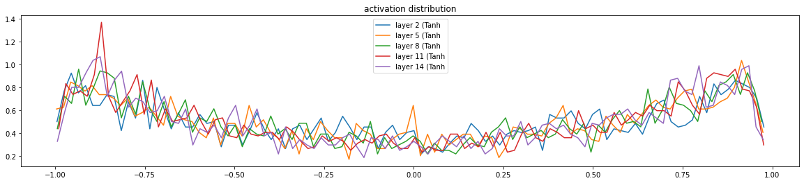

# 01 — 训练诊断：你的模型生病了

## 📖 前置知识：MLP 的"亚健康"状态

在 [Part 2](../../Part2_mlp/) 里，我们搭了一个 MLP —— Embedding → 隐藏层 → 输出层，训练后 loss 能降到 ~2.17。

看起来还行？但 Andrej Karpathy 说：**如果初始化做对了，你能白嫖一大截性能。**

这一课，我们就来当"神经网络医生" 🩺，学会诊断两个最常见的初始化问题。

---

## 🤒 症状 1：初始 Loss 过高

### 期望 vs 现实

在训练开始之前（随机初始化），模型对 27 个字符一无所知 —— 每个字符的概率应该是均匀分布 `1/27`。

对应的交叉熵 loss：

```
expected_loss = -ln(1/27) = ln(27) ≈ 3.29
```

⚠️ 但如果你跑一下没修过的网络，初始 loss 可能是 **20 甚至 30+**！

这意味着模型对某些字符"过于自信"（给了很高的概率），结果猜错了被打脸。损失函数给了极大的惩罚。

> 📜 完整诊断代码见 [`../scripts/01_diagnose_initial_loss.py`](../scripts/01_diagnose_initial_loss.py)

### 怎么修？

问题出在**输出层**。初始化时最后一层的 logits 太大了，导致 softmax 输出非常尖锐。

修复方法很简单 —— 把输出层的权重缩小：

```python
# 修复前
W2 = torch.randn((n_hidden, vocab_size))

# 修复后：缩小输出层权重
W2 = torch.randn((n_hidden, vocab_size)) * 0.01
b2 = torch.randn(vocab_size) * 0
```

```
初始 Loss 对比：

修复前: ████████████████████ 20.0+  😱
修复后: ███ 3.29               😊

差距：训练初期浪费的步数 = 白跑的 epoch！
```

🔑 **关键洞察**：初始 loss = 3.29 意味着模型说"我不知道"，这是最诚实的起点。

---

## 🤒 症状 2：tanh 饱和（梯度消失）

### 什么是 tanh 饱和？

tanh 函数长这样：

```
     1.0 ─ ─ ─ ─ ─ ─ ─ ─ ─ ─ ─ ─ ─ ─
         ╱                            ╲
        ╱                               ╲     ← 饱和区！
       ╱                                  ╲     梯度 ≈ 0
      ╱                                    ╲
─────╱──────────────────────────────────────╲───── 0
    -3  -2  -1   0   1   2   3
```

当 tanh 的输入绝对值很大时（比如 > 3），输出接近 1 或 -1，**梯度几乎为 0**。

这意味着：这个神经元在反向传播时"罢工"了 —— 梯度传不过去！

> 📜 诊断代码见 [`../scripts/02_diagnose_tanh_saturation.py`](../scripts/02_diagnose_tanh_saturation.py)
> 📊 可视化见下面的 tanh 饱和度直方图

### 怎么诊断？

在训练初始化后，统计隐藏层 h = tanh(hpreact) 的值：

```python
h = torch.tanh(hpreact)  # 隐藏层输出

# 统计饱和程度
saturated = (h.abs() > 0.97).float().mean()
print(f"饱和比例: {saturated * 100:.1f}%")  # 希望这个数很小
```



如果大部分值都挤在 -1 和 1 附近，说明 tanh 饱和严重。

### 为什么饱和 = 梯度消失？

反向传播时 tanh 的梯度是 `1 - t²`（t 是 tanh 输出）：

```
tanh 饱和时的梯度链：

Loss → ... → tanh_grad(1-t²) → ... → 输入

当 t ≈ 1 或 t ≈ -1 时：
  1 - t² ≈ 1 - 1 = 0  ← 梯度被"掐断"了！

多层叠加后：
  梯度 × 0 × 0 × 0 × ... ≈ 0  ← 完全消失 💀
```

---

## 💊 解药：Kaiming 初始化

### 核心思想

我们希望**每一层的输出方差 ≈ 输入方差**，这样信号在多层网络中不会爆炸也不会消失。

He et al. (2015) 提出了 Kaiming 初始化：

```python
# 标准初始化（不好）
W = torch.randn(fan_in, fan_out)

# Kaiming 初始化（好）
W = torch.randn(fan_in, fan_out) * (gain / fan_in ** 0.5)
```

其中 `gain` 取决于激活函数：

| 激活函数 | gain 值 | 说明 |
|----------|---------|------|
| **ReLU** | √2 ≈ 1.41 | 最常用 |
| **tanh** | 5/3 ≈ 1.67 | 我们用的 |
| Linear（无激活） | 1.0 | 线性层 |

> 📜 完整代码见 [`../scripts/03_kaiming_init.py`](../scripts/03_kaiming_init.py)

### 为什么是 fan_in^0.5？

直觉理解：如果输入有 `fan_in` 个元素，做点积后结果的方差会放大 `fan_in` 倍。除以 `√fan_in` 就是抵消这个放大。

```
未初始化时，每层方差的变化：

Layer 1: std=1.0  →  Layer 2: std=5.3  →  Layer 3: std=28.0  →  💥 爆炸！

Kaiming 初始化后：

Layer 1: std=1.0  →  Layer 2: std=1.0  →  Layer 3: std=1.0  →  😊 稳定！
```

### 对我们的 MLP 意味着什么？

```python
# 隐藏层权重用 Kaiming 初始化
W1 = torch.randn((n_embd * block_size, n_hidden)) * (5/3) / ((n_embd * block_size) ** 0.5)

# 输出层权重缩小（避免初始 loss 过高）
W2 = torch.randn((n_hidden, vocab_size)) * 0.01
b2 = torch.zeros(vocab_size)
```

🔑 两步修复后，我们的 MLP：
- 初始 loss 从 20+ → 3.29 ✅
- tanh 饱和比例大幅下降 ✅
- 训练更稳定，收敛更快 ✅

---

## 🧪 课后练习

### 练习 1：验证初始 Loss

> 不看代码，自己写一段程序：随机初始化一个 `(200, 27)` 的权重矩阵，计算均匀分布下的交叉熵 loss。验证是不是 ≈ 3.29。

<details>
<summary>💡 提示</summary>

用 `F.cross_entropy(logits, targets)` 计算。初始化 logits 时权重乘以 0.01，看 loss 是否接近 `-ln(1/27)`。

</details>

### 练习 2：tanh 饱和实验

> 修改 Kaiming 初始化中的 gain 值：分别用 gain=0.1、1.0、5/3、3.0 初始化权重，统计 tanh 饱和比例（|h| > 0.97），画出对比图。

<details>
<summary>💡 提示</summary>

对每种 gain 值，运行一次前向传播，计算 `(h.abs() > 0.97).float().mean()`。观察 gain 太小或太大时发生什么。

</details>

### 练习 3：为什么是 5/3？

> tanh 的 gain = 5/3。你能用直觉解释为什么 tanh 的 gain 比 ReLU 的 √2 小吗？（提示：tanh 会把输出"压缩"到 [-1, 1]，而 ReLU 只在负半轴压缩为 0）

---

## 🧭 下一步

诊断和初始化做好了，但还有一个大招没出 —— BatchNorm！

👉 [02 — BatchNorm：深度学习的维生素](02_batchnorm.md)
