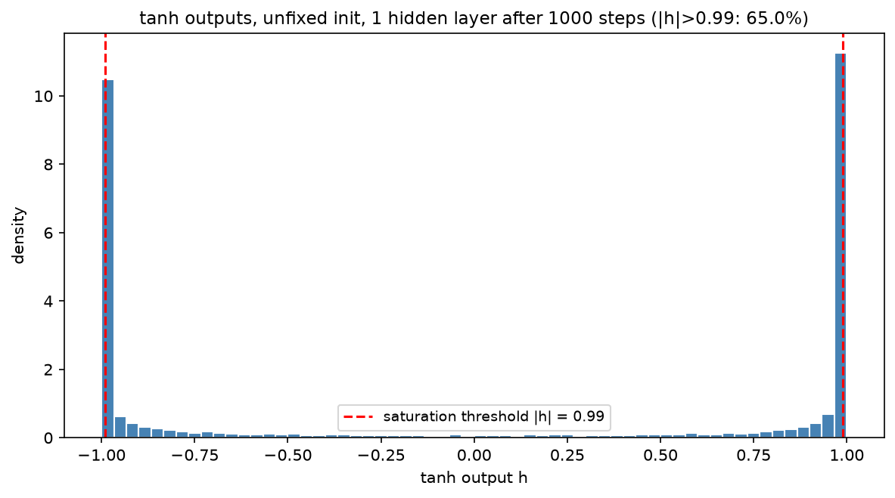

# 01 — 训练诊断：你的模型生病了

## 📖 前置知识：MLP 的"亚健康"状态

在 [Part 2](../../Part2_mlp/) 里，我们搭了一个 MLP —— Embedding → 隐藏层 → 输出层，训练后 loss 能降到 ~2.17。

看起来还行？但 Andrej Karpathy 说：**如果初始化做对了，你能白嫖一大截性能。**

这一课，我们就来当"神经网络医生" 🩺，学会诊断两个最常见的初始化问题。

---

## 🤒 症状 1：初始 Loss 过高

### 期望 vs 现实

在训练开始之前（随机初始化），模型对 27 个字符一无所知 —— 每个字符的概率应该是均匀分布 `1/27`。

对应的交叉熵 loss：

$$-\ln\frac{1}{27} = \ln 27 \approx 3.29$$

⚠️ 但如果你跑一下没修过的网络，初始 loss 可能是 **20 甚至 30+**（脚本 01 实测全训练集 **26.78**；作业题 1 同规格、种子 2147483647 实测 **26.01**）。

这意味着模型对某些字符"过于自信"（给了很高的概率），结果猜错了被打脸。损失函数给了极大的惩罚。

> 📜 完整诊断代码见 [`../scripts/01_diagnose_initial_loss.py`](../scripts/01_diagnose_initial_loss.py)

### 怎么修？

问题出在**输出层**。初始化时最后一层的 logits 太大了，导致 softmax 输出非常尖锐。

修复方法很简单 —— 把输出层的权重缩小：

```python
# 修复前
W2 = torch.randn((n_hidden, vocab_size))

# 修复后：缩小输出层权重
W2 = torch.randn((n_hidden, vocab_size)) * 0.01
b2 = torch.zeros(vocab_size)
```

> 💡 本课只修**输出层**（W2、b2）。隐藏层偏置 b1 保持随机初始化（脚本 01 的口径），它对初始 loss 影响很小；到 02 章加了 BatchNorm 后，b1 会被 BN 的 β 彻底吸收。

```
初始 Loss 对比：

修复前: ████████████████████ 20.0+  😱
修复后: ███ 3.29               😊

差距：训练初期浪费的步数 = 白跑的 epoch！
```

🔑 **关键洞察**：初始 loss = 3.29 意味着模型说"我不知道"，这是最诚实的起点。

---

## 🤒 症状 2：tanh 饱和（梯度消失）

### 什么是 tanh 饱和？

tanh 函数长这样：

```
     1.0 ─ ─ ─ ─ ─ ─ ─ ─ ─ ─ ─ ─ ─ ─
         ╱                            ╲
        ╱                               ╲     ← 饱和区！
       ╱                                  ╲     梯度 ≈ 0
      ╱                                    ╲
─────╱──────────────────────────────────────╲───── 0
    -3  -2  -1   0   1   2   3
```

当 tanh 的输入绝对值很大时（比如 > 3），输出接近 1 或 -1，**梯度几乎为 0**。

这意味着：这个神经元在反向传播时"罢工"了 —— 梯度传不过去！

> 📜 诊断代码见 [`../scripts/02_diagnose_tanh_saturation.py`](../scripts/02_diagnose_tanh_saturation.py)
> 📊 可视化见下面的 tanh 饱和度直方图

### 怎么诊断？

在训练初始化后，统计隐藏层 h = tanh(hpreact) 的值：

```python
h = torch.tanh(hpreact)  # 隐藏层输出

# 统计饱和程度（阈值 0.99：与脚本 02/03/06、作业题 4 统一口径；
# Karpathy 视频演示用的是 0.97——阈值越小判得越严，比较数字时注意口径一致）
saturated = (h.abs() > 0.99).float().mean()
print(f"饱和比例: {saturated * 100:.1f}%")  # 希望这个数很小（健康标准 <5%，按 0.99 口径）
```

```python
# 可视化：本章是单隐藏层 MLP，直接画 h 的分布直方图（存当前目录即可）
import matplotlib.pyplot as plt

plt.hist(h.detach().numpy().flatten(), bins=50, density=True)
plt.axvline(-0.99, color='red', linestyle='--'); plt.axvline(0.99, color='red', linestyle='--')
plt.title('tanh output distribution')
plt.savefig('tanh_hist.png', dpi=150, bbox_inches='tight')
plt.show()
```

> 📊 下图为脚本 02 配置（W1 不缩放，训练 1000 步后）在全训练集上的实测分布：
> 饱和率（|h|>0.99）**65.05%**，hpreact std **6.05**——大部分值挤在 ±1 附近，饱和严重。
> 多层网络的同款直方图（5 条 Tanh 曲线）见 [03 章](03_deep_network.md) 的存档图。



### 为什么饱和 = 梯度消失？

反向传播时 tanh 的梯度是 `1 - t²`（t 是 tanh 输出）：

```
tanh 饱和时的梯度链：

Loss → ... → tanh_grad(1-t²) → ... → 输入

当 t ≈ 1 或 t ≈ -1 时：
  1 - t² ≈ 1 - 1 = 0  ← 梯度被"掐断"了！

多层叠加后：
  梯度 × 0 × 0 × 0 × ... ≈ 0  ← 完全消失 💀
```

---

## 💊 解药：Kaiming 初始化

### 核心思想

我们希望**每一层的输出方差 ≈ 输入方差**，这样信号在多层网络中不会爆炸也不会消失。

He et al. (2015) 提出了 Kaiming 初始化：

```python
# 标准初始化（不好）
W = torch.randn(fan_in, fan_out)

# Kaiming 初始化（好）
W = torch.randn(fan_in, fan_out) * (gain / fan_in ** 0.5)
```

其中 `gain` 取决于激活函数。先补两个名词：`fan_in` 是这一层**读进来**的维度（权重矩阵的行数），`fan_out` 是**写出去**的维度（列数）——上面 `torch.randn(fan_in, fan_out)` 的两个参数就是它们。

| 激活函数 | gain 值 | 说明 |
|----------|---------|------|
| **ReLU** | √2 ≈ 1.41 | 最常用 |
| **tanh** | 5/3 ≈ 1.67 | 我们用的 |
| Linear（无激活） | 1.0 | 线性层 |

> 📜 完整代码见 [`../scripts/03_kaiming_init.py`](../scripts/03_kaiming_init.py)

### 5/3 是怎么来的？（两步推导）

第一步（为什么除 √fan_in）：设输入各分量独立、方差同为 $\sigma_x^2$，权重各分量方差同为 $\sigma_W^2$，则点积输出的方差

$$\mathrm{Var}[y] = \mathrm{fan\_in} \cdot \sigma_W^2 \cdot \sigma_x^2$$

随层宽线性膨胀。要方差守恒就取 $\sigma_W = 1/\sqrt{\mathrm{fan\_in}}$ —— 这就是除 $\sqrt{\mathrm{fan\_in}}$ 的由来。

第二步（为什么还要乘 gain）：激活函数本身会"压缩"方差，gain 是补偿。对 $x \sim N(0,1)$：

- **tanh**：实测 $\mathrm{std}(\tanh(x)) \approx 0.63$，要补回来 gain $\approx 1/0.63 \approx 1.6$，PyTorch 官方经验值取 $5/3$；
- **ReLU**：砍掉负半轴后输出的二阶矩减半（$\mathbb{E}[\mathrm{relu}(x)^2] = 0.5$），He et al. (2015) 按二阶矩守恒得 gain $= \sqrt{2}$。

一行验证：

```python
z = torch.randn(2_000_000)
print(torch.tanh(z).std())                    # ≈ 0.628
print(torch.nn.init.calculate_gain('tanh'))   # 1.6667（= 5/3，PyTorch 官方值）
```

### 为什么是 fan_in^0.5？

直觉理解：如果输入有 `fan_in` 个元素，做点积后结果的方差会放大 `fan_in` 倍。除以 `√fan_in` 就是抵消这个放大。

```
未初始化时，每层方差的变化（以 fan_in=30 为例，每层点积让方差 ×30）：

Layer 1: std≈1.0  →  Layer 2: std≈√30≈5.5  →  Layer 3: std≈30·√30≈164  →  💥 爆炸！

Kaiming 初始化后：

Layer 1: std≈1.0  →  Layer 2: std≈1.0  →  Layer 3: std≈1.0  →  😊 稳定！

（脚本 03 实测：fan_in=30、未缩放时 hpreact std ≈ 5.57 ≈ √30 = 5.48 ✓；上面旧材料的"5.3 / 28.0"把 std 和 var 混排了，已按理论链修正。）
```

### 对我们的 MLP 意味着什么？

```python
# 隐藏层权重用 Kaiming 初始化
W1 = torch.randn((n_embd * block_size, n_hidden)) * (5/3) / ((n_embd * block_size) ** 0.5)

# 输出层权重缩小（避免初始 loss 过高）
W2 = torch.randn((n_hidden, vocab_size)) * 0.01
b2 = torch.zeros(vocab_size)
```

🔑 两步修复后，我们的 MLP：
- 初始 loss 从 20+ → 3.29 ✅
- tanh 饱和比例大幅下降 ✅
- 训练更稳定，收敛更快 ✅

---

## 🧪 课后练习

### 练习 1：验证初始 Loss

> 不看代码，自己写一段程序：随机初始化一个 `(200, 27)` 的权重矩阵，计算均匀分布下的交叉熵 loss。验证是不是 ≈ 3.29。

<details>
<summary>💡 提示</summary>

用 `F.cross_entropy(logits, targets)` 计算。初始化 logits 时权重乘以 0.01，看 loss 是否接近 `-ln(1/27)`。

</details>

### 练习 2：tanh 饱和实验

> 修改 Kaiming 初始化中的 gain 值：分别用 gain=0.1、1.0、5/3、3.0 初始化权重，统计 tanh 饱和比例（|h| > 0.99），画出对比图。

<details>
<summary>💡 提示</summary>

对每种 gain 值，运行一次前向传播，计算 `(h.abs() > 0.99).float().mean()`。观察 gain 太小或太大时发生什么。

</details>

### 练习 3：为什么是 5/3？

> tanh 的 gain = 5/3 ≈ 1.67，ReLU 的 gain = √2 ≈ 1.41。请解释：为什么 tanh 的 gain 反而比 ReLU **大**？
> （提示：分别算"压缩率"——tanh 把 N(0,1) 输入的输出 std 压到约 0.63；ReLU 砍掉负半轴，输出二阶矩只剩 1/2，即 He 公式里的 √2。衰减/压缩得越狠，需要的补偿 gain 就越大。）

---

## 🧭 下一步

诊断和初始化做好了，但还有一个大招没出 —— BatchNorm！

👉 [02 — BatchNorm：深度学习的维生素](02_batchnorm.md)
