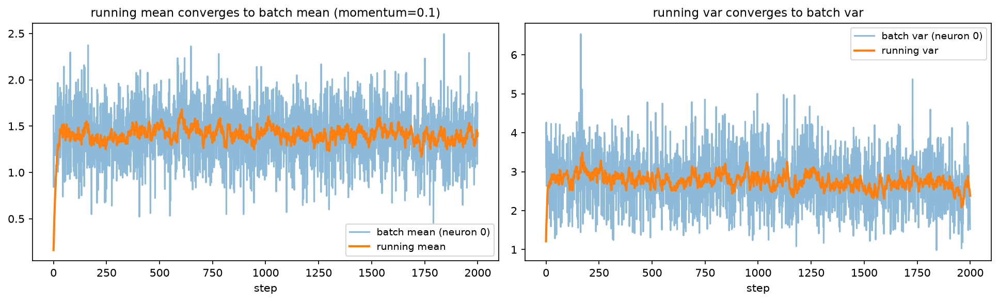
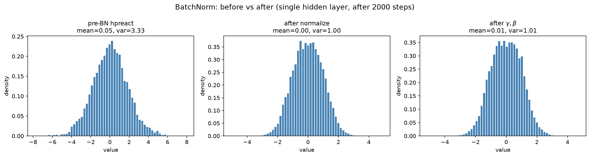

# 02 — BatchNorm：深度学习的维生素

## 🤔 为什么需要 BatchNorm？

上一课我们学了一个"朴素"的方案：**用 Kaiming 初始化让每层的输出保持合理范围**。

但这个方案有个问题 —— 它只在**初始化时**管用。训练开始后，权重不断更新，各层的激活分布还是会逐渐跑偏。

💡 BatchNorm 的核心想法：**别只在初始化时修一次，每一步都自动矫正！**

就像维生素一样，每天吃一粒，保持身体的"均值和方差"在正常范围内 🍊

---

## 🧬 BN 原理

对 mini-batch 中第 $j$ 个特征（沿 batch 维，每列独立做），BN 的完整前向是：

$$\mu_j = \frac{1}{n}\sum_{i=1}^{n} x_{ij}, \qquad \sigma_j^2 = \frac{1}{n}\sum_{i=1}^{n}(x_{ij}-\mu_j)^2$$

$$\hat{x}_{ij} = \frac{x_{ij}-\mu_j}{\sqrt{\sigma_j^2+\epsilon}}, \qquad y_{ij} = \gamma_j\,\hat{x}_{ij} + \beta_j$$

注意两点：方差除的是 $n$（**有偏**，不是 $n-1$，原因见下文「σ 用 1/n 还是 1/(n-1)？」）；$\epsilon$ 加在**方差**上（根号内），保证量纲一致——不是加在 std 上。

### 第一步：标准化（Normalize）

对每个 mini-batch 的激活值，减均值、除以 sqrt(方差 + eps)：

```python
# hpreact 形状: (batch_size, n_hidden)
# 沿 batch 维度（dim=0）计算均值和方差

bnmean = hpreact.mean(0, keepdim=True)                    # (1, n_hidden)
bnvar  = hpreact.var(0, keepdim=True, unbiased=False)     # (1, n_hidden)，有偏方差（除以 n）

# 标准化（eps=1e-5 防除零）
hpreact_norm = (hpreact - bnmean) / torch.sqrt(bnvar + 1e-5)  # 均值 0，方差 ≈1
```

标准化后，每个神经元的激活值大致落在 `[-2, 2]`（正态假设下约 95% 的样本）—— 大部分远离 tanh 饱和区。

### 第二步：可学习参数 γ 和 β

光标准化还不够 —— 如果强行把所有值压成均值 0、方差 1，网络的表达能力就受限了。

所以 BN 引入了**两个可学习参数**：

```python
# γ (gamma/bngain): 缩放参数
# β (beta/bnbias):  偏移参数

hpreact = bngain * hpreact_norm + bnbias
```

```
标准化后的分布：

    -2  -1   0   1   2     ← 均值 0，方差 1
     ║   ║   ║   ║   ║

经过 γ 缩放和 β 偏移后（γ=2, β=3，即 y = 2x + 3）：

    -2  -1   0   1   2      ← 输入 x̂
     │   │   │   │   │
    -1   1   3   5   7      ← 输出 y = 2x̂ + 3
```

🔑 网络可以**自己学**需要什么样的分布。初始时 γ=1、β=0（即不改变标准化结果），训练过程中慢慢调整。

### 第三步：Running Mean/Var（推理时用）

训练时我们用 mini-batch 的均值和方差。但**推理时可能只有一个样本**（batch_size=1），怎么算均值方差？

解决方案：训练时维护一个**指数移动平均**（EMA）的 running mean 和 running var：

```python
bnmean_running = torch.zeros((1, n_hidden))
bnvar_running  = torch.ones((1, n_hidden))   # running 存的是"方差"，不是标准差！

# 训练循环中，每次更新 running stats
# 这里用 0.999/0.001 的系数（等价于 momentum=0.001），更新较慢但更稳定
with torch.no_grad():
    bnmean_running = 0.999 * bnmean_running + 0.001 * bnmean
    bnvar_running  = 0.999 * bnvar_running  + 0.001 * bnvar
```

> ⚠️ **存 std 还是存 var？** Karpathy 视频里这段存的是 std（并口头注明"更规范应存 var"）。本教程统一**存 var**（推理时再开方），与下面的类实现、`scripts/04-06` 和 PyTorch `nn.BatchNorm1d` 一致。两版各自自洽，但混着写必错——"除的时候忘没忘开方"是经典翻车点。

> 💡 **momentum 参数说明**：PyTorch 的 `nn.BatchNorm1d` 默认 `momentum=0.1`（即 `0.9 * running + 0.1 * batch`），更新较快。上面的内联代码用 `0.001`（即 `0.999 * running + 0.001 * batch`），更新较慢但更平滑。两种都可以，区别在于 running stats 的收敛速度。下面的 `BatchNorm1d` 类使用 `momentum=0.1`（PyTorch 默认值）。



> 📊 上图：单隐藏层（n_hidden=200）训练 2000 步，取第 0 号神经元。batch 统计量每步都在抖，running 统计量（实线）用 EMA 把它"滤"成一条平滑收敛的曲线——约 30~50 步后基本稳定（EMA 时间常数 ≈ 1/momentum = 10 步，3~5τ 后收敛）。

```
训练模式：用当前 batch 的 mean/std（精确）
评估模式：用 running mean/std（全局近似）

两者切换：
    model.train()   → 用 batch stats
    model.eval()    → 用 running stats
```

### σ 用 1/n 还是 1/(n-1)？（有偏 vs 无偏，三种口径）

这是教程里最容易"悄悄混用"的细节，一次说清：

| 口径 | 用在哪 | 说明 |
|------|--------|------|
| **有偏方差**（除 $n$，`unbiased=False`） | BN 论文（Ioffe & Szegedy 2015）的归一化 | batch 里的 $n$ 个值就是我们统计的**全部对象**，不是"用样本估计总体"的抽样问题，天然该用 $1/n$ |
| **无偏方差**（除 $n-1$，Bessel 校正） | `torch.var()` / `torch.std()` 的**默认值**（`unbiased=True`） | $n=32$ 时两者之比 $32/31 \approx 1.032$，只差 3%——训练无伤大雅，但**同一篇教程不能两套口径** |
| PyTorch `nn.BatchNorm1d` | 训练归一化用有偏；**`running_var` 里 EMA 的是无偏版** | 实测可验证：喂一个 batch 后 `running_var == 0.9*1 + 0.1*var(unbiased=True)` ✓ |

本课程的从零实现统一：归一化用有偏（`unbiased=False`），`running_var` 也存有偏版（与 PyTorch 在 running 这一处不同，差 3%，教学实现可接受；面试被问到就答"PyTorch 的 running_var 存无偏"）。

---

## 🔧 从零实现

> 📜 完整代码见 [`../scripts/04_batchnorm_implementation.py`](../scripts/04_batchnorm_implementation.py)

### BN 在网络中的位置

```
Embedding → [Linear → BatchNorm → Tanh] × N → Linear → 输出
                           ↑
                      每个隐藏层后面
                      都跟一个 BN
```

> 💡 **关于 b1（Linear 的偏置）**：Linear 后面紧跟 BN 时，b1 会被 BN 的 β 吸收，属于冗余参数。三种处理都合法：干脆不写（本教程内联版）、保留一个随机小偏置（`scripts/04` 写 `b1 * 0.01`，仅作演示）、显式置零（作业题 5 的推荐写法 `b1 = torch.zeros(n_hidden)`）。

### 完整实现

```python
class BatchNorm1d:
    def __init__(self, dim, eps=1e-5, momentum=0.1):
        self.eps = eps              # 防止除零的小数
        self.momentum = momentum    # EMA 的更新速率
        self.training = True        # 训练 or 评估模式

        # 可学习参数（requires_grad=True 让 autograd 跟踪，backward 必需）
        self.gamma = torch.ones(dim, requires_grad=True)   # 缩放
        self.beta = torch.zeros(dim, requires_grad=True)   # 偏移

        # 缓冲区（通过 EMA 更新，不参与反向传播）
        self.running_mean = torch.zeros(dim)
        self.running_var = torch.ones(dim)

    def __call__(self, x):
        if self.training:
            xmean = x.mean(0, keepdim=True)
            xvar = x.var(0, keepdim=True, unbiased=False)  # 有偏方差（除以 n），口径见上文
        else:
            xmean = self.running_mean
            xvar = self.running_var

        # 标准化
        xhat = (x - xmean) / torch.sqrt(xvar + self.eps)
        self.out = self.gamma * xhat + self.beta

        # 训练时更新 running stats
        if self.training:
            with torch.no_grad():
                self.running_mean = (1 - self.momentum) * self.running_mean + self.momentum * xmean
                self.running_var = (1 - self.momentum) * self.running_var + self.momentum * xvar

        return self.out

    def parameters(self):
        return [self.gamma, self.beta]
```

### 在 MLP 中使用

```python
# ---- 最小上下文（承接 Part 2）：----
# import torch.nn.functional as F
# g = torch.Generator().manual_seed(2147483647)
# n_embd, n_hidden, block_size = 10, 200, 3
# Xb, Yb 为一个 mini-batch（构建方式见 Part 2 或 scripts/04）

C  = torch.randn((vocab_size, n_embd), generator=g)
W1 = torch.randn((n_embd * block_size, n_hidden), generator=g) * (5/3)/((n_embd * block_size)**0.5)
W2 = torch.randn((n_hidden, vocab_size), generator=g) * 0.01
b2 = torch.zeros(vocab_size)   # b1 省略：会被 BN 的 β 吸收（见上文说明）

# BN 参数
bngain = torch.ones((1, n_hidden), requires_grad=True)
bnbias = torch.zeros((1, n_hidden), requires_grad=True)
bnmean_running = torch.zeros((1, n_hidden))
bnvar_running = torch.ones((1, n_hidden))    # 存方差（与类实现、脚本统一）

# 前向传播
emb = C[Xb]
embcat = emb.view(emb.shape[0], -1)
hpreact = embcat @ W1

# ---- BatchNorm 层 ----
bnmeani = hpreact.mean(0, keepdim=True)
bnvari = hpreact.var(0, keepdim=True, unbiased=False)   # 有偏方差，与类实现一致
hpreact = bngain * (hpreact - bnmeani) / torch.sqrt(bnvari + 1e-5) + bnbias  # 别忘了 eps

with torch.no_grad():
    bnmean_running = 0.999 * bnmean_running + 0.001 * bnmeani
    bnvar_running = 0.999 * bnvar_running + 0.001 * bnvari
# ----------------------

h = torch.tanh(hpreact)
logits = h @ W2 + b2
loss = F.cross_entropy(logits, Yb)
```

### 推理时

```python
@torch.no_grad()
def split_loss(split):
    x, y = {'train': (Xtr, Ytr), 'val': (Xdev, Ydev)}[split]
    emb = C[x]
    embcat = emb.view(emb.shape[0], -1)
    hpreact = embcat @ W1
    # 用 running stats 代替 batch stats（注意：running 存的是方差，要开方 + eps）
    hpreact = bngain * (hpreact - bnmean_running) / torch.sqrt(bnvar_running + 1e-5) + bnbias
    h = torch.tanh(hpreact)
    logits = h @ W2 + b2
    loss = F.cross_entropy(logits, y)
    print(split, loss.item())
```



> 📊 上图：pre-BN 的 hpreact 分布（var≈3.3）→ 归一化后（mean≈0.00, var≈1.00）→ γβ 变换后（var≈1.01，此时 γ≈1、β≈0，网络还没学出明显偏移；训练越久 γβ 偏离初始值越多）。每步都把分布"拉回"标准正态附近，这就是"维生素"的含义。

| 阶段 | mean | var |
|------|------|-----|
| pre-BN（hpreact） | 0.054 | 3.329 |
| 归一化后（x̂） | 0.000 | 1.000 |
| γβ 变换后（y） | 0.010 | 1.009 |

---

## ⚠️ BN 的坑

### 坑 1：忘记切 training/eval 模式

```python
# ❌ 训练完直接评估，忘了切模式
model.eval()  # ← 必须调这个！

# 或者手动设置
for layer in layers:
    if isinstance(layer, BatchNorm1d):
        layer.training = False
```

如果你不切换，推理时 BN 还在用 batch 的均值方差 —— batch_size=1 时结果会很离谱。

### 坑 2：batch_size=1 时统计量毫无意义

```python
# batch_size=1 时方差恒为 0 —— eps 确实能防除零，
# 但除以 sqrt(1e-5)≈0.003 会把输出放大约 300 倍（爆炸，不是 NaN）。
# 根因是"1 个样本算不出分布"，加 eps 救不了统计无意义。

# 解决方案：
# 1. 训练时 batch_size 必须 > 1（PyTorch nn.BatchNorm1d 对 batch=1 直接抛 ValueError）
# 2. 推理时用 running stats（而不是 batch stats），见坑 1
```

### 坑 3：Running Mean 没收敛

```python
# momentum=0.1 时，EMA 时间常数 ≈ 1/0.1 = 10 步，约 30-50 步后 running stats 基本稳定
# 如果训练步数太少（比如只跑了 100 步），running stats 可能不准

# 解决方案：
# 1. 跑够步数（本课程脚本 04/05 跑 20000 步，早已稳定；Karpathy 视频里跑 200000 步）
# 2. 训练结束后，用整个训练集重新校准一次
with torch.no_grad():
    emb = C[Xtr]
    hpreact = emb.view(emb.shape[0], -1) @ W1
    bnmean = hpreact.mean(0, keepdim=True)  # 精确的全局均值
    bnvar = hpreact.var(0, keepdim=True, unbiased=False)  # 精确的全局方差（统一存 var 口径）
```

---

## 🔁 预习：γ 和 β 的梯度其实很好推（Part 4 正式讲）

完整的 BN 反向传播——尤其 $\partial L/\partial x$（会牵出论文里著名的 $\mathrm{d}\sigma^2$ 项）——在 [Part 4 · 02_forward_and_backward.md 的 Step 12](../../Part4_backprop/tutorial/02_forward_and_backward.md) 逐步推导，并在 [Part 4 · 03_simplified_and_training.md](../../Part4_backprop/tutorial/03_simplified_and_training.md) 压缩成一行公式。这里先热身最温和的两个。

设上游梯度 $g_i = \partial L/\partial y_i$，则

$$\frac{\partial L}{\partial \beta} = \sum_{i=1}^{n} g_i, \qquad \frac{\partial L}{\partial \gamma} = \sum_{i=1}^{n} g_i\,\hat{x}_i$$

直觉：$\beta$ 是对整个 batch 的**平移**，平移的梯度就是把所有样本的梯度**求和**；$\gamma$ 乘在每个样本的 $\hat{x}$ 上，所以求和时带上 $\hat{x}$ 权重。$\partial L/\partial x$ 更曲折——$x_i$ 通过 $\mu$ 和 $\sigma^2$ 牵动 batch 里所有样本，会出现两个"全体求和"的耦合项，这正是 Part 4 的重头戏。

---

## 🧪 课后练习

### 练习 1：去掉 BN 会怎样？

> 把网络中的 BatchNorm 层去掉，只保留 Linear + Tanh。观察训练 loss 曲线有什么变化。然后加回 BN，对比 loss 收敛速度。

<details>
<summary>💡 提示</summary>

去掉 BN 后，深层网络的 loss 曲线通常会：
- 初始 loss 更高
- 训练过程更不稳定（抖动大）
- 最终 loss 也可能更高

</details>

### 练习 2：自己实现 EMA

> 不用 PyTorch 的 `running_mean`，自己维护一个 Python 列表记录每一步的 batch mean。训练结束后，画出 batch mean 随训练步数的变化曲线。观察大约多少步后 running mean 趋于稳定。

<details>
<summary>💡 提示</summary>

```python
mean_history = []
for i in range(max_steps):
    # ... forward pass ...
    mean_history.append(bnmeani.mean().item())

# 画出 mean_history
plt.plot(mean_history)
plt.xlabel('step')
plt.ylabel('batch mean')
```

</details>

### 练习 3：Gamma 和 Beta 的作用

> 初始化时让 gamma=0.5（而不是 1.0），观察 tanh 饱和度有什么变化。再让 beta=1.0（而不是 0），观察 tanh 输出的分布有什么偏移。

---

## 🧭 下一步

BN 学完了，现在我们有了一个稳定的"积木"。接下来用这些积木搭建更深的网络，并学习一套完整的诊断工具箱！

👉 [03 — 深层网络与诊断工具](03_deep_network.md)
