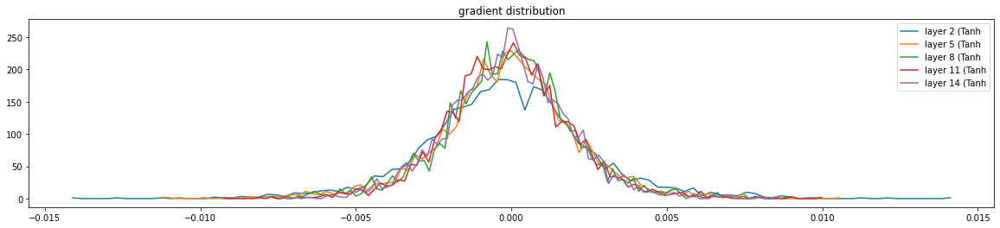
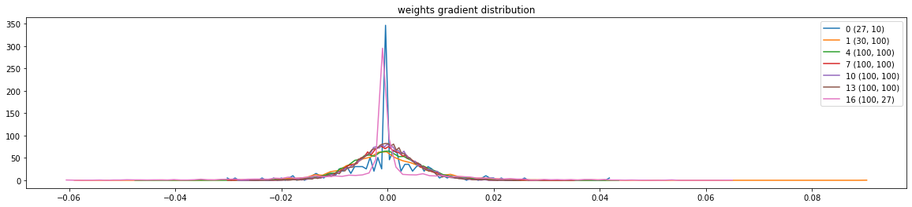
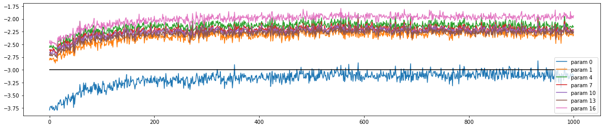

# 03 — 深层网络与诊断工具

## 🏗️ 构建深层网络

前面我们一直在用一个两层 MLP（一个隐藏层）。现在把学到的知识组合起来，搭一个**更深的网络**！

> 📜 完整代码见 [`../scripts/05_deep_network.py`](../scripts/05_deep_network.py)

### 用列表管理多层

关键技巧：把每一层放进一个列表里，前向传播时循环调用：

```python
class Linear:
    def __init__(self, fan_in, fan_out, bias=True):
        # Kaiming 初始化
        self.weight = torch.randn((fan_in, fan_out), generator=g) * (5/3) / fan_in**0.5
        self.bias = torch.zeros(fan_out) if bias else None

    def __call__(self, x):
        self.out = x @ self.weight
        if self.bias is not None:
            self.out += self.bias
        return self.out

    def parameters(self):
        return [self.weight] + ([] if self.bias is None else [self.bias])


class Tanh:
    def __call__(self, x):
        self.out = torch.tanh(x)
        return self.out

    def parameters(self):
        return []
```

### 6 层网络结构

```python
n_embd = 10
n_hidden = 100

C = torch.randn((vocab_size, n_embd), generator=g)

layers = [
    Linear(n_embd * block_size, n_hidden, bias=False), BatchNorm1d(n_hidden), Tanh(),
    Linear(           n_hidden, n_hidden, bias=False), BatchNorm1d(n_hidden), Tanh(),
    Linear(           n_hidden, n_hidden, bias=False), BatchNorm1d(n_hidden), Tanh(),
    Linear(           n_hidden, n_hidden, bias=False), BatchNorm1d(n_hidden), Tanh(),
    Linear(           n_hidden, n_hidden, bias=False), BatchNorm1d(n_hidden), Tanh(),
    Linear(           n_hidden, vocab_size, bias=False), BatchNorm1d(vocab_size),
]
```

```
网络结构（5 个隐藏层 + 1 个输出层）：

Input → Embedding
  │
  ▼
┌──────────────────────────────────────────────┐
│  Linear → BatchNorm → Tanh   ← 隐藏层 1     │
│  Linear → BatchNorm → Tanh   ← 隐藏层 2     │
│  Linear → BatchNorm → Tanh   ← 隐藏层 3     │
│  Linear → BatchNorm → Tanh   ← 隐藏层 4     │
│  Linear → BatchNorm → Tanh   ← 隐藏层 5     │
│  Linear → BatchNorm          ← 输出层        │
└──────────────────────────────────────────────┘
  │
  ▼
CrossEntropy Loss
```

🔑 注意每层后面都跟了 BatchNorm！这是深层网络训练稳定的关键。

### 初始化技巧

```python
with torch.no_grad():
    # 最后一层：降低置信度
    layers[-1].gamma *= 0.1
    # 其他层：Kaiming gain 已经在 Linear.__init__ 里处理了
```

---

## 🔬 4 种诊断工具

> 📜 诊断代码见 [`../scripts/06_diagnostic_tools.py`](../scripts/06_diagnostic_tools.py)

### 工具 1：激活值分布（Activation Distribution）


统计每个 Tanh 层输出的均值、标准差和饱和比例：

```python
for i, layer in enumerate(layers):
    if isinstance(layer, Tanh):
        t = layer.out
        print(f"layer {i} ({layer.__class__.__name__}): "
              f"mean {t.mean():+.2f}, std {t.std():.2f}, "
              f"saturated: {(t.abs() > 0.97).float().mean()*100:.2f}%")
```

```
健康输出示例：
layer 2  (Tanh): mean -0.00, std 0.63, saturated: 2.78%
layer 5  (Tanh): mean +0.00, std 0.64, saturated: 2.56%
layer 8  (Tanh): mean -0.00, std 0.65, saturated: 2.25%
layer 11 (Tanh): mean +0.00, std 0.65, saturated: 1.69%
layer 14 (Tanh): mean +0.00, std 0.65, saturated: 1.88%
```

💡 **健康的标准**：各层 std 接近、饱和率低（< 5%）、mean 接近 0。

### 工具 2：梯度分布（Gradient Distribution）



看反向传播时各层 Tanh 的梯度分布：

```python
for i, layer in enumerate(layers):
    if isinstance(layer, Tanh):
        t = layer.out.grad  # 梯度！
        print(f"layer {i}: grad mean {t.mean():+e}, grad std {t.std():e}")
```

```
layer 2:  grad mean -0.000000, grad std 2.64e-03
layer 5:  grad mean +0.000000, grad std 2.25e-03
layer 8:  grad mean -0.000000, grad std 2.05e-03
layer 11: grad mean +0.000000, grad std 1.89e-03
layer 14: grad mean +0.000000, grad std 1.68e-03
```

💡 **健康的标准**：各层梯度 std 接近，没有某一层梯度突然缩小（梯度消失）或放大（梯度爆炸）。

### 工具 3：参数梯度/数据比率（Grad:Data Ratio）



这是**最重要的指标** 🔑！它告诉我们：参数的梯度有多大，相对于参数本身有多大。

```python
for i, p in enumerate(parameters):
    if p.ndim == 2:
        grad_std = p.grad.std()
        data_std = p.data.std()
        ratio = grad_std / data_std
        print(f"weight {str(p.shape):>12s} | "
              f"grad:data ratio {ratio:.3e}")
```

```
weight     (27, 10) | grad:data ratio 8.01e-03
weight    (30, 100) | grad:data ratio 4.88e-02
weight   (100, 100) | grad:data ratio 5.14e-02
...
```

💡 **含义**：如果 ratio 太大，说明梯度比参数大很多 —— 参数更新的步子太大了，训练会不稳定。如果 ratio 太小，学习太慢。

### 工具 4：更新/数据比率（Update:Data Ratio）⭐ 最重要



```python
# 每步记录
ud = []
with torch.no_grad():
    ud.append([((lr * p.grad).std() / p.data.std()).log10().item()
               for p in parameters])

# 画图
plt.figure(figsize=(20, 4))
for i, p in enumerate(parameters):
    if p.ndim == 2:
        plt.plot([ud[j][i] for j in range(len(ud))])
plt.plot([0, len(ud)], [-3, -3], 'k')  # 理想参考线
```

🔑 **Andrej 的经验法则**：更新/数据比率的 log10 应该在 **-3 左右**（即 `lr * grad.std ≈ 0.001 * data.std`）。

```
理想范围：

log10(update/data)
   0 ┤
  -1 ┤
  -2 ┤                    ← 太大：训练不稳定
  -3 ┤ ─ ─ ─ ─ ─ ─ ─ ─  ← 🎯 理想！
  -4 ┤                    ← 太小：学习太慢
  -5 ┤
```

如果某个参数的曲线远远偏离 -3，说明学习率需要调整，或者初始化有问题。

---

## 📊 四种诊断工具总结

| 工具 | 看什么 | 健康标准 |
|------|--------|----------|
| 激活值分布 | 前向传播中各层的输出 | std 接近、饱和率 < 5% |
| 梯度分布 | 反向传播中各层的梯度 | 各层梯度 std 接近 |
| 梯度/数据比率 | 梯度相对参数的大小 | 各层接近、无极端值 |
| **更新/数据比率** ⭐ | 实际更新步长相对参数 | **log10 ≈ -3** |

💡 **诊断顺序**：先看更新/数据比率（最重要），如果不对，再往前追溯梯度分布和激活值分布。

---

## 📝 课后作业

👉 [Assignment 3](../assignment_3/)

作业内容提示：
- 修改网络深度和宽度，观察对训练的影响
- 去掉 BatchNorm，用 Kaiming 初始化替代，比较效果
- 调整学习率，用更新/数据比率判断学习率是否合适

---

## 🔮 下一课预告

Part 3 我们学会了诊断和稳定训练。但所有东西都依赖 PyTorch 的 `autograd` 自动微分 —— 它是怎么工作的？

在 **Part 4** 里，我们将**手动实现反向传播**！不靠 `loss.backward()`，自己算每一层的梯度。理解了这个，你才算真正懂了神经网络。

```
Part 3 总结：

诊断工具箱                    治疗方案
┌──────────────────┐     ┌──────────────────┐
│ 初始 Loss 过高   │────→│ 输出层权重缩小   │
│ tanh 饱和        │────→│ Kaiming 初始化   │
│ 梯度消失/爆炸    │────→│ BatchNorm        │
│ 更新比率异常     │────→│ 调学习率         │
└──────────────────┘     └──────────────────┘
```

👉 [返回目录](README.md)
