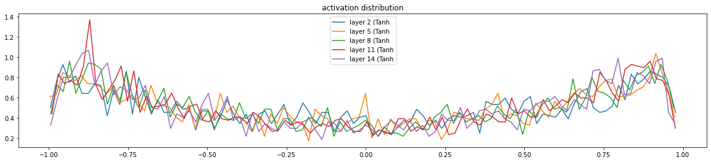
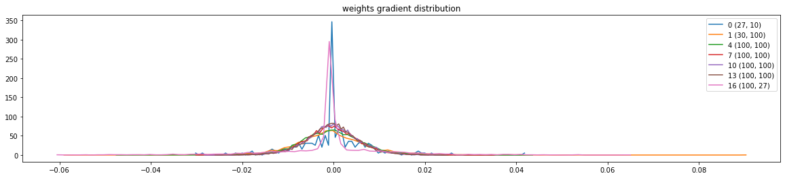
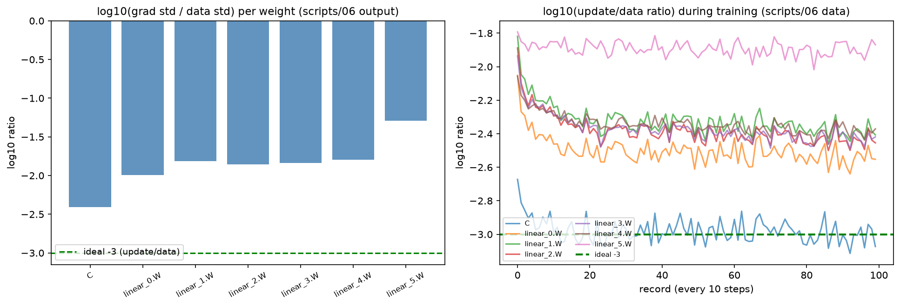
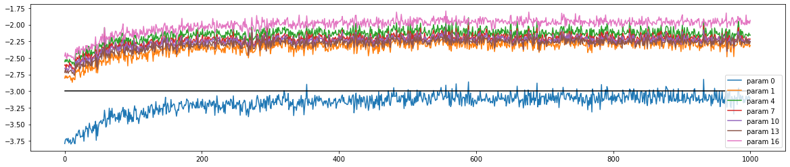

# 03 — 深层网络与诊断工具

## 🏗️ 构建深层网络

前面我们一直在用一个两层 MLP（一个隐藏层）。现在把学到的知识组合起来，搭一个**更深的网络**！

> 📜 完整代码见 [`../scripts/05_deep_network.py`](../scripts/05_deep_network.py)

### 用列表管理多层

关键技巧：把每一层放进一个列表里，前向传播时循环调用：

```python
class Linear:
    def __init__(self, fan_in, fan_out, bias=True):
        # Kaiming 初始化
        self.weight = torch.randn((fan_in, fan_out), generator=g) * (5/3) / fan_in**0.5
        self.bias = torch.zeros(fan_out) if bias else None

    def __call__(self, x):
        self.out = x @ self.weight
        if self.bias is not None:
            self.out += self.bias
        return self.out

    def parameters(self):
        return [self.weight] + ([] if self.bias is None else [self.bias])


class Tanh:
    def __call__(self, x):
        self.out = torch.tanh(x)
        return self.out

    def parameters(self):
        return []
```

### 6 层网络结构

```python
n_embd = 10
n_hidden = 100

C = torch.randn((vocab_size, n_embd), generator=g)

layers = [
    Linear(n_embd * block_size, n_hidden, bias=False), BatchNorm1d(n_hidden), Tanh(),
    Linear(           n_hidden, n_hidden, bias=False), BatchNorm1d(n_hidden), Tanh(),
    Linear(           n_hidden, n_hidden, bias=False), BatchNorm1d(n_hidden), Tanh(),
    Linear(           n_hidden, n_hidden, bias=False), BatchNorm1d(n_hidden), Tanh(),
    Linear(           n_hidden, n_hidden, bias=False), BatchNorm1d(n_hidden), Tanh(),
    Linear(           n_hidden, vocab_size, bias=False),   # ⚠️ 输出层是纯 Linear，不加 BN
]
```

> ⚠️ **输出层不加 BN**：Karpathy 原版给输出层也加了 BN（配合 `gamma *= 0.1`），本课程脚本 [`05_deep_network.py`](../scripts/05_deep_network.py) / [`06_diagnostic_tools.py`](../scripts/06_diagnostic_tools.py) 的输出层是纯 Linear。两种写法都合法；**本课程教程、作业、脚本统一以 scripts/05/06 为准**。代价是初始 loss 略高于 3.29（脚本 05 配置实测 ≈3.91，训练几步即恢复），换来结构更简单。

```
网络结构（5 个隐藏层 + 1 个输出层）：

Input → Embedding
  │
  ▼
┌──────────────────────────────────────────────┐
│  Linear → BatchNorm → Tanh   ← 隐藏层 1     │
│  Linear → BatchNorm → Tanh   ← 隐藏层 2     │
│  Linear → BatchNorm → Tanh   ← 隐藏层 3     │
│  Linear → BatchNorm → Tanh   ← 隐藏层 4     │
│  Linear → BatchNorm → Tanh   ← 隐藏层 5     │
│  Linear（无 BN）             ← 输出层        │
└──────────────────────────────────────────────┘
  │
  ▼
CrossEntropy Loss
```

🔑 注意每个**隐藏层**后面都跟了 BatchNorm（输出层是纯 Linear）！这是深层网络训练稳定的关键。

> 💡 **代码风格说明**：上面用类（`Linear`、`Tanh`、`BatchNorm1d`）来展示网络结构，更直观。实际脚本 [`05_deep_network.py`](../scripts/05_deep_network.py) 中使用了更简洁的字典结构（`{'type': 'linear', 'W': W, 'b': b}`），效果完全相同。两种写法都是正确的，类写法更易读，字典写法更紧凑。**本章引用的所有示例输出均为脚本 06 的实跑结果**（字典写法、seed=42、1000 步短训），可直接对照复现。
>
> 🌱 **关于随机种子**：本 Part 脚本统一用 `seed=42`；作业用 Karpathy 的 `2147483647`。种子不同，数字不能逐位对照，量级一致即可。

### 初始化技巧（以及一个"看起来该有、其实没有"的步骤）

Karpathy 原版在搭好网络后有一行：

```python
with torch.no_grad():
    layers[-1].gamma *= 0.1   # 输出层 BN 的 gamma 缩小 → 初始 logits≈0 → loss≈3.29
```

**本课程脚本里没有这一步**——因为输出层是纯 Linear（见上文），没有 gamma 可缩。Kaiming gain 已经在 `Linear.__init__` 里处理，初始化到此完成。脚本 05 配置实测初始 loss ≈3.91（略高于 3.29 但可接受）。若你想复刻 Karpathy 原版行为，给输出层加 `BatchNorm1d(vocab_size)` 并保留 `gamma *= 0.1` 即可——两种都合法，别把两套结构混搭。

---

## 🔬 4 种诊断工具

> 📜 诊断代码见 [`../scripts/06_diagnostic_tools.py`](../scripts/06_diagnostic_tools.py)

### 工具 1：激活值分布（Activation Distribution）

```python
# 可视化：各层激活值直方图 → 生成 ../images/cell015_output02.png
import matplotlib.pyplot as plt

plt.figure(figsize=(20, 4))
legends = []
for i, layer in enumerate(layers[:-1]):
    if isinstance(layer, Tanh):
        t = layer.out
        hy, hx = torch.histogram(t, density=True)
        plt.plot(hx[:-1].detach(), hy.detach())
        legends.append(f'layer {i} ({layer.__class__.__name__})')
plt.legend(legends)
plt.title('Activation Distribution')
plt.savefig('../images/cell015_output02.png', dpi=150, bbox_inches='tight')
plt.show()
```



统计每个 Tanh 层输出的均值、标准差和饱和比例：

```python
for i, layer in enumerate(layers):
    if isinstance(layer, Tanh):
        t = layer.out
        print(f"layer {i} ({layer.__class__.__name__}): "
              f"mean {t.mean():+.2f}, std {t.std():.2f}, "
              f"saturated: {(t.abs() > 0.99).float().mean()*100:.2f}%")  # 0.99 口径，见 01 章
```

```
健康输出示例（scripts/06 实跑：深层网 1000 步后，|h|>0.99 口径，字典写法所以名字是 tanh_N）：

tanh_0 | mean=-0.0006 | std=0.6408 | 饱和率=0.5%
tanh_1 | mean=-0.0010 | std=0.6466 | 饱和率=0.4%
tanh_2 | mean= 0.0037 | std=0.6517 | 饱和率=0.3%
tanh_3 | mean=-0.0033 | std=0.6575 | 饱和率=0.3%
tanh_4 | mean=-0.0073 | std=0.6535 | 饱和率=0.1%
```

💡 **健康的标准**：各层 std 接近（此处 0.64~0.66）、饱和率低（**< 5%，0.99 口径**）、mean 接近 0。

### 工具 2：梯度分布（Gradient Distribution）

```python
# 可视化：各层梯度直方图 → 生成 ../images/cell016_output02.png
import matplotlib.pyplot as plt

plt.figure(figsize=(20, 4))
legends = []
for i, layer in enumerate(layers[:-1]):
    if isinstance(layer, Tanh):
        t = layer.out.grad
        hy, hx = torch.histogram(t, density=True)
        plt.plot(hx[:-1].detach(), hy.detach())
        legends.append(f'layer {i} ({layer.__class__.__name__})')
plt.legend(legends)
plt.title('Gradient Distribution')
plt.savefig('../images/cell016_output02.png', dpi=150, bbox_inches='tight')
plt.show()
```


看反向传播时各层的梯度分布。类写法里看 Tanh 层输出梯度（`layer.out.grad`）；脚本 06 是字典写法，打印的是**权重矩阵**的梯度——两者结论一致（各层同数量级）：

```python
for i, layer in enumerate(layers):
    if isinstance(layer, Tanh):
        t = layer.out.grad  # 梯度！（类写法）
        print(f"layer {i}: grad mean {t.mean():+e}, grad std {t.std():e}")
```

```
权重梯度示例（scripts/06 实跑，字典写法）：

linear_0.W | grad_mean= 0.000004 | grad_std=0.003097 | data_std=0.305584
linear_1.W | grad_mean=-0.000008 | grad_std=0.002557 | data_std=0.167617
linear_2.W | grad_mean=-0.000001 | grad_std=0.002359 | data_std=0.168321
linear_3.W | grad_mean= 0.000010 | grad_std=0.002424 | data_std=0.167588
linear_4.W | grad_mean= 0.000006 | grad_std=0.002737 | data_std=0.171186
linear_5.W | grad_mean=-0.000000 | grad_std=0.008333 | data_std=0.162274
```

💡 **健康的标准**：各层梯度 std 接近（此处隐藏层都在 0.0024~0.0031，同一数量级），没有某一层梯度突然缩小（梯度消失）或放大（梯度爆炸）。输出层（linear_5.W）略大属正常。

### 工具 3：参数梯度/数据比率（Grad:Data Ratio）

```python
# 可视化：参数梯度分布 → 生成 ../images/cell017_output01.png
import matplotlib.pyplot as plt

plt.figure(figsize=(20, 4))
legends = []
for i, p in enumerate(parameters):
    t = p.grad
    if p.ndim == 2:
        hy, hx = torch.histogram(t, density=True)
        plt.plot(hx[:-1].detach(), hy.detach())
        legends.append(f'{i} {tuple(p.shape)}')
plt.legend(legends)
plt.title('Weights Gradient Distribution')
plt.savefig('../images/cell017_output01.png', dpi=150, bbox_inches='tight')
plt.show()
```



> 📌 注意：上面这张是**权重梯度直方图**（看形状）；本工具真正要看的"比率"是下面代码里的数值，以及这张实测柱状图（脚本 06 同款数据）：



这是判断**各层训练是否均衡**的关键指标：参数的梯度有多大，相对于参数本身有多大。

```python
for i, p in enumerate(parameters):
    if p.ndim == 2:
        grad_std = p.grad.std()
        data_std = p.data.std()
        ratio = grad_std / data_std
        print(f"weight {str(p.shape):>12s} | "
              f"grad:data ratio {ratio:.3e}")
```

```
grad:data 比率示例（scripts/06 实跑）：

C          | grad/data = 0.003919   (log10 ≈ -2.41)
linear_0.W | grad/data = 0.010136   (log10 ≈ -1.99)
linear_1.W | grad/data = 0.015256   (log10 ≈ -1.82)
linear_2.W | grad/data = 0.014016   (log10 ≈ -1.85)
linear_3.W | grad/data = 0.014465   (log10 ≈ -1.84)
linear_4.W | grad/data = 0.015988   (log10 ≈ -1.80)
linear_5.W | grad/data = 0.051349   (log10 ≈ -1.29)
```

💡 **健康的标准（量化）**：各层 log10(grad/data) 落在同一数量级（上面实测 -2.4 ~ -1.3），无某一层极端偏离（比如独自掉到 -6 或窜到 0）。如果 ratio 太大，梯度比参数大很多，训练不稳定；太小则学习太慢。

### 工具 4：更新/数据比率（Update:Data Ratio）⭐ 最重要

```python
# 可视化：更新/数据比率随训练步数变化 → 生成 ../images/cell018_output00.png
import matplotlib.pyplot as plt

plt.figure(figsize=(20, 4))
legends = []
for i, p in enumerate(parameters):
    if p.ndim == 2:
        plt.plot([ud[j][i] for j in range(len(ud))])
        legends.append(f'param {i}')
plt.plot([0, len(ud)], [-3, -3], 'k')  # 理想值 ~1e-3
plt.legend(legends)
plt.title('Update-to-Data Ratio (log scale)')
plt.savefig('../images/cell018_output00.png', dpi=150, bbox_inches='tight')
plt.show()
```



```python
# 每 10 步记录一次（scripts/06 的实际写法：按参数名存历史）
ud_ratio_history = {name: [] for name in param_names}
for j, (p, name) in enumerate(zip(parameters, param_names)):
    if p.ndim >= 2:  # 只看权重矩阵，不看偏置
        ratio = (lr * p.grad).std().item() / p.data.std().item()
        ud_ratio_history[name].append(ratio)

# 画图：log10 尺度 + -3 参考线
for name, ratios in ud_ratio_history.items():
    if 'W' in name:
        plt.plot([math.log10(r) for r in ratios], alpha=0.7, label=name)
plt.axhline(y=-3, color='green', linestyle='--', linewidth=2, label='ideal -3')
```

```
训练结束时的最终比率（scripts/06 实跑，1000 步）：

✅ C          | log10(ratio) = -3.07 | ratio = 0.000845
✅ linear_0.W | log10(ratio) = -2.55 | ratio = 0.002803
✅ linear_1.W | log10(ratio) = -2.41 | ratio = 0.003917
✅ linear_2.W | log10(ratio) = -2.45 | ratio = 0.003511
✅ linear_3.W | log10(ratio) = -2.42 | ratio = 0.003814
✅ linear_4.W | log10(ratio) = -2.37 | ratio = 0.004258
✅ linear_5.W | log10(ratio) = -1.87 | ratio = 0.013517
```

🔑 **Andrej 的经验法则**：更新/数据比率的 log10 应该在 **-3 左右**（即 `lr * grad.std ≈ 0.001 * data.std`）。上例里末层（linear_5.W）系统性偏高属正常，与 Karpathy 原版行为一致。

```
理想范围：

log10(update/data)
   0 ┤
  -1 ┤
  -2 ┤                    ← 太大：训练不稳定
  -3 ┤ ─ ─ ─ ─ ─ ─ ─ ─  ← 🎯 理想！
  -4 ┤                    ← 太小：学习太慢
  -5 ┤
```

如果某个参数的曲线远远偏离 -3，说明学习率需要调整，或者初始化有问题。

---

## 📊 四种诊断工具总结

| 工具 | 看什么 | 健康标准 |
|------|--------|----------|
| 激活值分布 | 前向传播中各层的输出 | std 接近、饱和率 < 5% |
| 梯度分布 | 反向传播中各层的梯度 | 各层梯度 std 接近 |
| 梯度/数据比率 | 梯度相对参数的大小 | 各层同数量级（实测 log10 ≈ -2.4~-1.3）、无极端值 |
| **更新/数据比率** ⭐ | 实际更新步长相对参数 | **log10 ≈ -3** |

💡 **诊断顺序**：先看更新/数据比率（最重要），如果不对，再往前追溯梯度分布和激活值分布。

---

## 📝 课后作业

👉 [Assignment 3](../../../assignments/assignment_3/)

作业内容提示：
- 修改网络深度和宽度，观察对训练的影响
- 去掉 BatchNorm，用 Kaiming 初始化替代，比较效果
- 调整学习率，用更新/数据比率判断学习率是否合适

---

## 🔮 下一课预告

Part 3 我们学会了诊断和稳定训练。但所有东西都依赖 PyTorch 的 `autograd` 自动微分 —— 它是怎么工作的？

在 **Part 4** 里，我们将**手动实现反向传播**！不靠 `loss.backward()`，自己算每一层的梯度。理解了这个，你才算真正懂了神经网络。

```
Part 3 总结：

诊断工具箱                    治疗方案
┌──────────────────┐     ┌──────────────────┐
│ 初始 Loss 过高   │────→│ 输出层权重缩小   │
│ tanh 饱和        │────→│ Kaiming 初始化   │
│ 梯度消失/爆炸    │────→│ BatchNorm        │
│ 更新比率异常     │────→│ 调学习率         │
└──────────────────┘     └──────────────────┘
```

👉 [返回目录](README.md)
