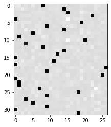

# 02 前向 + 反向逐步推导 🔬

> 把 MLP+BN 的前向传播展开成计算图，然后一步步从 loss 推回梯度。

## 前向传播计算图

先看数据在网络中是怎么流动的（以 batch_size=32 为例）：

```
Xb (32,3)              Yb (32,)
   │                      │
   ▼                      │
 emb = C[Xb]  (32,3,10)  │
   │                      │
   ▼                      │
 embcat = view  (32,30)   │
   │                      │
   ▼                      │
 hprebn = embcat@W1+b1    │
   (32,64)                │
   │                      │
   ▼                      │
 ┌─ BatchNorm ───┐        │
 │ μ  = mean(0)  │        │
 │ diff = x - μ  │        │
 │ σ²  = var(0)  │        │
 │ x̂  = diff/σ  │        │
 │ y  = γ·x̂ + β │        │
 └─────┬────────┘         │
       ▼                  │
 hpreact (32,64)          │
       │                  │
       ▼                  │
 h = tanh(hpreact) (32,64)│
       │                  │
       ▼                  │
 logits = h@W2+b2 (32,27) │
       │                  │
       ▼                  │
 ┌─ Softmax+NLL ─┐       │
 │ max = max(1)   │       │
 │ norm = x - max │       │
 │ exp            │       │
 │ sum / inv      │       │
 │ probs → log    │       │
 └─────┬─────────┘       │
       ▼                  ▼
     loss = -logprobs[range(B), Yb].mean()
```

## 12 步反向传播推导

核心思想：**每步梯度 = 上游梯度 × 局部梯度**

> 配图参考（Karpathy 原始 notebook 输出）：
> 

### Step 1: loss → dlogprobs

```
loss = -logprobs[range(B), Yb].mean()
```

**推导：**
- `mean()` → 乘 `1/B`
- 负号 → 乘 `-1`
- 只有 Yb 对应位置有非零梯度

```python
dlogprobs = torch.zeros_like(logprobs)  # (B, 27)
dlogprobs[torch.arange(B), Yb] = -1.0 / B
```

### Step 2: dlogprobs → dprobs

```
logprobs = log(probs)   →   d/dx log(x) = 1/x
```

```python
dprobs = dlogprobs * (1.0 / probs)
```

### Step 3: dprobs → dcounts_sum_inv + dcounts（第一部分）

```
probs = counts × counts_sum_inv   （逐元素乘法）
```

乘法求导：两个分支都要传梯度。

```python
dcounts_sum_inv = (dprobs * counts).sum(1, keepdim=True)  # (B,1)
dcounts = dprobs * counts_sum_inv                          # (B,27)
```

### Step 4: dcounts_sum_inv → dcounts_sum

```
counts_sum_inv = counts_sum ** -1   →   d/dx x⁻¹ = -x⁻²
```

```python
dcounts_sum = dcounts_sum_inv * (-counts_sum ** -2)
```

### Step 5: dcounts_sum → dcounts（补充）

```
counts_sum = counts.sum(1, keepdim=True)
```

每个 `counts[i,j]` 对 `counts_sum[i]` 的贡献是 1，所以：

```python
dcounts += torch.ones_like(counts) * dcounts_sum
```

> ⚠️ 注意：`dcounts` 在 Step 3 已经有值了，这里是 **累加**！

### Step 6: dcounts → dnorm_logits

```
counts = norm_logits.exp()   →   d/dx eˣ = eˣ
```

```python
dnorm_logits = dcounts * counts   # counts 就是 e^norm_logits
```

### Step 7: dnorm_logits → dlogits + dlogit_maxes

```
norm_logits = logits - logit_maxes
```

```python
dlogits = dnorm_logits.clone()                       # (B,27)
dlogit_maxes = (-dnorm_logits).sum(1, keepdim=True)  # (B,1)
```

### Step 8: dlogit_maxes → dlogits（补充）

```
logit_maxes = logits.max(1)   →   只在最大值位置有梯度
```

```python
max_indices = logits.argmax(dim=1)
dlogit_maxes_grad = torch.zeros_like(logits)
dlogit_maxes_grad[torch.arange(B), max_indices] = dlogit_maxes.squeeze()
dlogits += dlogit_maxes_grad
```

> 🎯 Step 7+8 合起来就是 CE 的简化反传（下节课展开）

### Step 9: dlogits → dh + dW2 + db2

```
logits = h @ W2 + b2   （矩阵乘法 + bias）
```

矩阵乘法的链式法则：

```python
dh   = dlogits @ W2.T     # (B, 200) — 传给 h
dW2  = h.T @ dlogits      # (200, 27) — 传给 W2
db2  = dlogits.sum(0)     # (27,) — 传给 b2
```

### Step 10: dh → dhpreact

```
h = tanh(hpreact)   →   d/dx tanh(x) = 1 - tanh²(x)
```

```python
dhpreact = dh * (1.0 - h ** 2)
```

### Step 11: dhpreact → dbngain + dbnbias + dbnraw

```
hpreact = bngain × bnraw + bnbias
```

```python
dbngain = (dhpreact * bnraw).sum(0, keepdim=True)  # (1, 64)
dbnbias = dhpreact.sum(0, keepdim=True)              # (1, 64)
dbnraw  = dhpreact * bngain                          # (32, 64)
```

### Step 12: dbnraw → dhprebn（BatchNorm 反向传播）

这是最复杂的一步，因为 BN 的每一步统计量都依赖于所有样本。

```
bnraw = bndiff × bnvar_inv
bndiff = hprebn - bnmeani
bnvar = bndiff².mean(0)
bnvar_inv = (bnvar + ε)^{-0.5}
bnmeani = hprebn.mean(0)
```

逐步推导（5 个子步骤）：

```python
# 12a: dbnraw → dbndiff + dbnvar_inv
dbndiff = dbnraw * bnvar_inv
dbnvar_inv = (dbnraw * bndiff).sum(0, keepdim=True)

# 12b: dbnvar_inv → dbnvar
dbnvar = dbnvar_inv * (-0.5) * (bnvar + 1e-5) ** -1.5

# 12c: dbnvar → dbndiff2
dbndiff2 = torch.ones_like(bndiff2) * (dbnvar / batch_size)

# 12d: dbndiff2 → dbndiff（补充）
dbndiff += dbndiff2 * 2.0 * bndiff

# 12e: dbndiff → dbnmeani + dhprebn
dbnmeani = -dbndiff.sum(0, keepdim=True)
dhprebn = dbndiff + torch.ones_like(hprebn) * (dbnmeani / batch_size)
```

### Extra: dhprebn → dW1, db1, demb, dC

```python
dembcat = dhprebn @ W1.T
dW1 = embcat.T @ dhprebn
db1 = dhprebn.sum(0)
demb = dembcat.view(emb.shape)
dC = torch.zeros_like(C)
for i in range(B):
    for j in range(block_size):
        dC[Xb[i,j]] += demb[i,j]
```

## 梯度验证

手写梯度到底对不对？用 autograd 当标准答案来比：

```python
def cmp(name, dt, t):
    """比较手动梯度 dt 和 autograd 梯度 t"""
    exact = torch.allclose(dt, t, atol=1e-5)
    maxdiff = (dt - t).abs().max().item()
    print(f"  {'✅' if exact else '❌'} {name:15s} | max diff = {maxdiff:.2e}")
```

> 运行 [`03_verify_gradients.py`](../scripts/03_verify_gradients.py) 查看完整验证结果。
> 
> 所有参数的梯度误差应该 < 1e-5 ✅

## 配套脚本

| 脚本 | 内容 |
|------|------|
| [`01_forward_pass_steps.py`](../scripts/01_forward_pass_steps.py) | 逐步展开前向传播 |
| [`02_backprop_step_by_step.py`](../scripts/02_backprop_step_by_step.py) | 12 步反向传播 |
| [`03_verify_gradients.py`](../scripts/03_verify_gradients.py) | 梯度验证工具 |

## 🧪 课后练习

1. **修改网络**：把 `n_hidden` 从 64 改成 100，重新跑前向+反向。观察哪些梯度形状变了？哪些没变？

2. **梯度消失**：把 `W2` 的初始化改大 10 倍（`* 1.0` 而不是 `* 0.1`），观察 `dhpreact` 的分布。会发生什么？为什么？

3. **不加 logit_maxes**：前向传播时不减最大值（直接 `counts = logits.exp()`），会发生什么？为什么 Karpathy 要减最大值？

---

**下一步** → [03 简化公式与手动训练](03_simplified_and_training.md)
