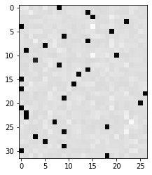

# 02 前向 + 反向逐步推导 🔬

> 把 MLP+BN 的前向传播展开成计算图，然后一步步从 loss 推回梯度。

> 📐 **规模约定**：以 batch_size=32、n_hidden=64 为例（本 Part 脚本 01-05 用 64，是为了打印形状方便调试；Part 3 与本 Part 脚本 06 的训练配置用 200）。隐层宽度只影响数字，不影响下面任何推导。

## 前向传播计算图

先看数据在网络中是怎么流动的：

```
Xb (32,3)              Yb (32,)
   │                      │
   ▼                      │
 emb = C[Xb]  (32,3,10)  │
   │                      │
   ▼                      │
 embcat = view  (32,30)   │
   │                      │
   ▼                      │
 hprebn = embcat@W1+b1    │
   (32,64)                │
   │                      │
   ▼                      │
 ┌─ BatchNorm ───┐        │
 │ μ  = mean(0)  │        │
 │ diff = x - μ  │        │
 │ σ²  = var(0)  │        │
 │ x̂  = diff/σ  │        │
 │ y  = γ·x̂ + β │        │
 └─────┬────────┘         │
       ▼                  │
 hpreact (32,64)          │
       │                  │
       ▼                  │
 h = tanh(hpreact) (32,64)│
       │                  │
       ▼                  │
 logits = h@W2+b2 (32,27) │
       │                  │
       ▼                  │
 ┌─ Softmax+NLL ─┐       │
 │ max = max(1)   │       │
 │ norm = x - max │       │
 │ exp            │       │
 │ sum / inv      │       │
 │ probs → log    │       │
 └─────┬─────────┘       │
       ▼                  ▼
     loss = -logprobs[range(B), Yb].mean()
```

## 前向传播参考代码（12 步推导的变量来源）

下面 12 步用到的所有前向变量都出自这一段（完整可运行版含数据加载，见 [`01_forward_pass_steps.py`](../scripts/01_forward_pass_steps.py)）。这里假设已经拿到一个 mini-batch `Xb, Yb` 与初始化好的参数：

```python
B = 32            # batch size（下面反复用到）

# 前向传播（展开所有中间变量，与脚本 01 逐步一致）
emb = C[Xb]                                                      # (B, 3, 10)
embcat = emb.view(emb.shape[0], -1)                              # (B, 30)
hprebn = embcat @ W1 + b1                                        # (B, 64)
bnmeani = hprebn.mean(0, keepdim=True)                           # (1, 64) 均值
bndiff = hprebn - bnmeani                                        # (B, 64)
bndiff2 = bndiff**2                                              # (B, 64)
bnvar = bndiff2.mean(0, keepdim=True)                            # (1, 64) 方差（1/n 有偏口径）
bnvar_inv = (bnvar + 1e-5) ** -0.5                               # (1, 64)
bnraw = bndiff * bnvar_inv                                       # (B, 64)
hpreact = bngain * bnraw + bnbias                                # (B, 64)
h = torch.tanh(hpreact)                                          # (B, 64)
logits = h @ W2 + b2                                             # (B, 27)
logit_maxes = logits.max(1, keepdim=True).values                 # (B, 1)
norm_logits = logits - logit_maxes                               # (B, 27)
counts = norm_logits.exp()
counts_sum = counts.sum(1, keepdim=True)                         # (B, 1)
counts_sum_inv = counts_sum**-1                                  # (B, 1)
probs = counts * counts_sum_inv                                  # (B, 27)
logprobs = probs.log()
loss = -logprobs[torch.arange(B), Yb].mean()                     # 标量
```

## 12 步反向传播推导

核心思想：**每步梯度 = 上游梯度 × 局部梯度**

> 🔑 **变量命名约定**：代码中的 `dX` 表示 $\partial L/\partial X$（loss 对 X 的偏导），不是 `dX` 的微分。
>
> 例如：`dprobs` 表示 $\partial L/\partial \mathrm{probs}$，`dlogprobs` 表示 $\partial L/\partial \mathrm{logprobs}$。
>
> 链式法则的每一步都是 $\partial L/\partial x = \partial L/\partial y \times \partial y/\partial x$，对应代码 `dx = dy * (局部导数)`。
> 注意局部导数只看当前这一步的函数关系，`dy` 是从 loss 一路传下来的**上游梯度**。

> 🔑 **广播的反传元规则**：前向里因广播被"复制"的维度，反传时把梯度**对该维求和**还原回原形状——广播等于复制，复制等于乘 1 的多路相加，相加的反传就是求和。本 Part 反复用到：
>
> - `(B,1)` 参与 `(B,27)` 的逐元素运算 → 对广播维求和：`dlogit_maxes = (-dnorm_logits).sum(1, keepdim=True)`（Step 7）
> - `(1,·)` 或标量参与全矩阵运算 → `torch.ones_like(x) * d`（Step 5、Step 12c）
> - `(27,)` 的 bias 加到 `(B,27)` → `db2 = dlogits.sum(0)`（Step 9）

> 配图参考（Karpathy 原始 notebook 输出）—— dlogits 的热力图，可以看到只有正确类别的位置有非零梯度：
>
> ```python
> # 可视化：dlogits 热力图 → 生成 ../images/cell018_output01.png
> import matplotlib.pyplot as plt
>
> plt.figure(figsize=(4, 4))
> plt.imshow(dlogits.detach(), cmap='gray')
> plt.colorbar()
> plt.title('dlogits (Gradient of Logits)')
> plt.savefig('../images/cell018_output01.png', dpi=150, bbox_inches='tight')
> plt.show()
> ```
>
> 
>
> 这张是 notebook 原始输出的单图；脚本 04 生成了更完整的对比热力图（含正确类标注与 L1 范数），见 [03 章](03_simplified_and_training.md)。

### Step 1: loss → dlogprobs

前向关系与局部导数：

$$L = -\frac{1}{B} \sum_i \mathrm{logprobs}_{i, y_i}$$

**推导：**
- `mean()` → 乘 $1/B$
- 负号 → 乘 $-1$
- 只有 $y_i$ 对应位置有非零梯度

```python
dlogprobs = torch.zeros_like(logprobs)  # (B, 27)
dlogprobs[torch.arange(B), Yb] = -1.0 / B
```

### Step 2: dlogprobs → dprobs

$$\mathrm{logprobs} = \log(\mathrm{probs}) \quad\Rightarrow\quad \frac{d \log x}{dx} = \frac{1}{x}$$

```python
dprobs = dlogprobs * (1.0 / probs)
```

### Step 3: dprobs → dcounts_sum_inv + dcounts（第一部分）

$$\mathrm{probs} = \mathrm{counts} \odot \mathrm{counts\_sum\_inv}$$

乘法求导：两个分支都要传梯度（$\odot$ 是逐元素乘）。

```python
dcounts_sum_inv = (dprobs * counts).sum(1, keepdim=True)  # (B,1)
dcounts = dprobs * counts_sum_inv                          # (B,27)
```

### Step 4: dcounts_sum_inv → dcounts_sum

$$\mathrm{counts\_sum\_inv} = \mathrm{counts\_sum}^{-1} \quad\Rightarrow\quad \frac{d x^{-1}}{dx} = -x^{-2}$$

```python
dcounts_sum = dcounts_sum_inv * (-counts_sum ** -2)
```

### Step 5: dcounts_sum → dcounts（补充）

$$\mathrm{counts\_sum}_i = \sum_j \mathrm{counts}_{i,j}$$

每个 `counts[i,j]` 对 `counts_sum[i]` 的贡献是 1，所以：

```python
dcounts += torch.ones_like(counts) * dcounts_sum
```

> ⚠️ 注意：`dcounts` 在 Step 3 已经有值了，这里是 **累加**！

### Step 6: dcounts → dnorm_logits

$$\mathrm{counts} = \exp(\mathrm{norm\_logits}) \quad\Rightarrow\quad \frac{d e^x}{dx} = e^x$$

```python
dnorm_logits = dcounts * counts   # counts 就是 e^norm_logits
```

### Step 7: dnorm_logits → dlogits + dlogit_maxes

$$\mathrm{norm\_logits} = \mathrm{logits} - \mathrm{logit\_maxes}$$

```python
dlogits = dnorm_logits.clone()                       # (B,27)
dlogit_maxes = (-dnorm_logits).sum(1, keepdim=True)  # (B,1)
```

### Step 8: dlogit_maxes → dlogits（补充）

$$\mathrm{logit\_maxes}_i = \max_j \mathrm{logits}_{i,j} \quad\Rightarrow\quad \frac{\partial\, \mathrm{logit\_maxes}_i}{\partial\, \mathrm{logits}_{i,j}} = \mathbb{1}(j = \arg\max_k \mathrm{logits}_{i,k})$$

即梯度只落在取到最大值的位置。

```python
max_indices = logits.argmax(dim=1)
dlogit_maxes_grad = torch.zeros_like(logits)
dlogit_maxes_grad[torch.arange(B), max_indices] = dlogit_maxes.squeeze()
dlogits += dlogit_maxes_grad
```

> 💡 `dlogit_maxes` 形状是 `(B, 1)`，这里用 `squeeze()` 压成 `(B,)` 去做 scatter。批量 B=1 时它会连带压掉 batch 维导致形状错位，稳妥写法是 `squeeze(1)`（只压 max 维）。

> 🎯 Step 7+8 合起来就是 CE 的简化反传（下节课展开）

### Step 9: dlogits → dh + dW2 + db2

$$\mathrm{logits} = h \cdot W_2 + b_2$$

矩阵乘法的链式法则（回顾 01 章的 $dL/dA = dL/dC \cdot B^T$）：

```python
dh   = dlogits @ W2.T     # (B, 64) — 传给 h
dW2  = h.T @ dlogits      # (64, 27) — 传给 W2
db2  = dlogits.sum(0)     # (27,) — 传给 b2
```

### Step 10: dh → dhpreact

$$h = \tanh(\mathrm{hpreact}) \quad\Rightarrow\quad \frac{d \tanh x}{dx} = 1 - \tanh^2 x$$

```python
dhpreact = dh * (1.0 - h ** 2)
```

> 💡 局部导数写成 $1 - h^2$（用**输出** $h$ 表达）而不是 $1 - \tanh^2(\mathrm{hpreact})$：这样缓存了 h 就不必重算一遍 tanh——"重算 vs 缓存"的经典权衡，也是 autograd 的常见做法。

### Step 11: dhpreact → dbngain + dbnbias + dbnraw

$$\mathrm{hpreact} = \gamma \odot \mathrm{bnraw} + \beta$$

```python
dbngain = (dhpreact * bnraw).sum(0, keepdim=True)  # (1, 64)
dbnbias = dhpreact.sum(0, keepdim=True)              # (1, 64)
dbnraw  = dhpreact * bngain                          # (32, 64)
```

### Step 12: dbnraw → dhprebn（BatchNorm 反向传播）

这是最复杂的一步，因为 BN 的每一步统计量都依赖于所有样本。先把 5 条前向关系写全：

$$\mathrm{bnraw} = \mathrm{bndiff} \odot \mathrm{bnvar\_inv}$$

$$\mathrm{bnvar\_inv} = (\mathrm{bnvar} + \varepsilon)^{-1/2}$$

$$\mathrm{bnvar} = \frac{1}{n} \sum_B \mathrm{bndiff}^2$$

$$\mathrm{bndiff} = \mathrm{hprebn} - \mathrm{bnmeani}$$

$$\mathrm{bnmeani} = \frac{1}{n} \sum_B \mathrm{hprebn}$$

注意 $\mathrm{bnvar}$ 用的是 $1/n$ 的**有偏**口径（`mean(0)`，与 PyTorch BN 训练态一致）——03 章简化公式的系数与它配套。

逐步推导（5 个子步骤）：

```python
# 12a: dbnraw → dbndiff + dbnvar_inv（乘法两分支）
dbndiff = dbnraw * bnvar_inv
dbnvar_inv = (dbnraw * bndiff).sum(0, keepdim=True)
```

12a 的代数含义：$\mathrm{bnraw}$ 对 $\mathrm{bndiff}$ 的局部导数是 $\mathrm{bnvar\_inv}$，对 $\mathrm{bnvar\_inv}$ 的局部导数是 $\mathrm{bndiff}$。

```python
# 12b: dbnvar_inv → dbnvar（幂法则）
dbnvar = dbnvar_inv * (-0.5) * (bnvar + 1e-5) ** -1.5
```

12b 对应 $u^{-1/2}$ 的导数 $-\tfrac{1}{2} u^{-3/2}$（其中 $u = \mathrm{bnvar} + \varepsilon$）。

```python
# 12c: dbnvar → dbndiff2（均值反传：对 batch 维求"平均"，即除以 n）
dbndiff2 = torch.ones_like(bndiff2) * (dbnvar / batch_size)
```

12c 对应 $\partial\, \mathrm{bnvar} / \partial\, \mathrm{bndiff}^2_{i} = 1/n$——这正是前向 $1/n$ 口径在反传里的对应项。

```python
# 12d: dbndiff2 → dbndiff（补充：平方的导数，累加而非覆盖）
dbndiff += dbndiff2 * 2.0 * bndiff
```

12d 对应 $x^2$ 的导数 $2x$。

```python
# 12e: dbndiff → dbnmeani + dhprebn
dbnmeani = -dbndiff.sum(0, keepdim=True)
dhprebn = dbndiff + torch.ones_like(hprebn) * (dbnmeani / batch_size)
```

12e 两条路：减法给 $\mathrm{bnmeani}$ 的梯度取负号再对 batch 求和；均值再散回每个样本时又除以 $n$。可以看到**均值链和方差链的分子分母都是 1/n**——逐步版与 1/n 有偏前向完全自洽。

### Extra: dhprebn → dW1, db1, demb, dC

```python
dembcat = dhprebn @ W1.T
dW1 = embcat.T @ dhprebn
db1 = dhprebn.sum(0)
demb = dembcat.view(emb.shape)
dC = torch.zeros_like(C)
for i in range(B):
    for j in range(block_size):
        dC[Xb[i,j]] += demb[i,j]
```

> 📝 Extra 里有 `db1`，因为教程 02/脚本 01-05 的网络带 b1；脚本 06 的训练网络**无 b1**（被 BN 的 β 取代），所以 03 章的训练清单里没有这一步。

## 梯度验证

手写梯度到底对不对？用 autograd 当标准答案来比：

```python
def cmp(name, dt, t):
    """比较手动梯度 dt 和 autograd 梯度 t"""
    exact = torch.allclose(dt, t, atol=1e-5)
    maxdiff = (dt - t).abs().max().item()
    print(f"  {'✅' if exact else '❌'} {name:15s} | max diff = {maxdiff:.2e}")
```

> 运行 [`03_verify_gradients.py`](../scripts/03_verify_gradients.py) 查看完整验证结果。
>
> 所有参数的梯度误差应该 < 1e-5 ✅（实测 7 个参数最大 3.73e-09，余量约 1000 倍）

## autograd 只存叶子：is_leaf 与 retain_grad

跑上面验证时你可能注意到：**参数的 `.grad` 有值，中间变量（如 `hprebn`）的 `.grad` 却是 `None`**。这不是 bug，而是 autograd 的设计：

- 反向传播结束后，PyTorch 默认只给**叶子张量**（`torch.tensor(...)` 直接创建、`requires_grad=True` 的那些，即 `is_leaf=True`）保留 `.grad`——中间变量的梯度用完即弃，省内存。
- 想保留某个中间变量的梯度做调试/教学，就在 backward **之前**调用 `x.retain_grad()`。

3 行复现这个坑：

```python
W = torch.randn(3, 3, requires_grad=True)
h = torch.tanh(W @ x)      # tanh 的输出是非叶子张量（is_leaf=False）
h.sum().backward()
print(W.grad)              # ✅ 叶子参数，梯度有值
print(h.grad)              # ⚠️ None —— 非叶子的 .grad 默认不保留
```

规范演示（与脚本 03 的"完整中间变量验证"一段一一对应）：

```python
h = torch.tanh(W @ x)
h.retain_grad()      # ← backward 之前显式要求保留非叶子张量的梯度
h.sum().backward()
print(h.grad)        # 现在有值了
```

[`03_verify_gradients.py`](../scripts/03_verify_gradients.py) 用 `retain_grad()` 重跑了一遍前向，把 7 个中间变量梯度全部对比了一遍（实测最大 5.59e-09，同样远小于 1e-5）——这也是"为什么 Tutorial 反复强调 cmp() 范式"的完整版示范。

## 配套脚本

| 脚本 | 内容 |
|------|------|
| [`01_forward_pass_steps.py`](../scripts/01_forward_pass_steps.py) | 逐步展开前向传播 |
| [`02_backprop_step_by_step.py`](../scripts/02_backprop_step_by_step.py) | 12 步反向传播 |
| [`03_verify_gradients.py`](../scripts/03_verify_gradients.py) | 梯度验证工具（含 retain_grad 演示） |

## 🧪 课后练习

1. **修改网络**：把 `n_hidden` 从 64 改成 100，重新跑前向+反向。观察哪些梯度形状变了？哪些没变？

2. **梯度消失**：把 `W2` 的初始化改大 10 倍（`* 1.0` 而不是 `* 0.1`），观察 `dhpreact` 的分布。会发生什么？为什么？

3. **不加 logit_maxes**：前向传播时不减最大值（直接 `counts = logits.exp()`），会发生什么？为什么 Karpathy 要减最大值？

---

**下一步** → [03 简化公式与手动训练](03_simplified_and_training.md)
