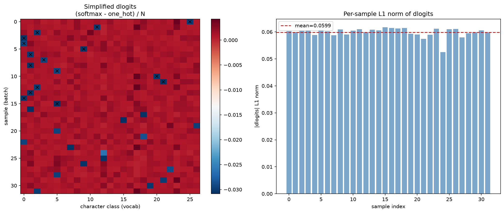
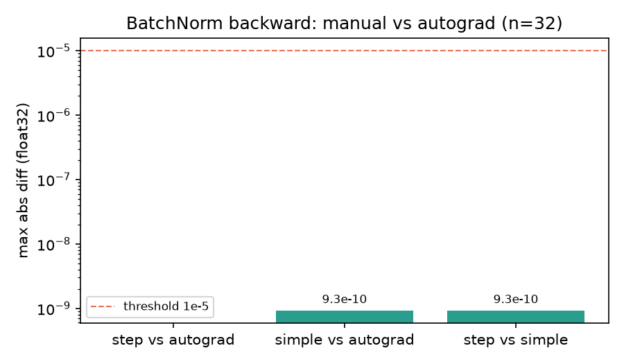
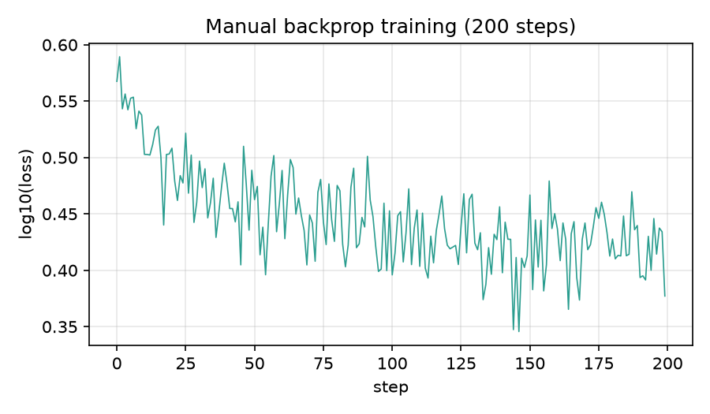

# 03 简化公式与手动训练 🚀

> 12 步太多？一行代码就能搞定 CrossEntropy 和 BatchNorm 的反传！

## CrossEntropy 简化反传

前面我们用 8 步（Step 1-8）才从 loss 算到 dlogits。但其实整个 CrossEntropy 的反向传播可以简化成 **3 行代码** 🪄

```python
dlogits = F.softmax(logits, 1)       # 先算 softmax
dlogits[range(n), Yb] -= 1           # 正确类别位置减 1
dlogits /= n                          # 除以 batch size
```

### 为什么？

CrossEntropy Loss 对 logits 的梯度有一个优雅的解析解。记第 $i$ 个样本的 logits 为 $z_i$（行向量）、正确类别为 $y_i$、$p = \mathrm{softmax}(z_i)$、batch size 为 $n$：

$$\frac{\partial L}{\partial \mathrm{logits}_{i,j}} = \frac{p_j - \mathbb{1}(j = y_i)}{n}$$

三行推导（想自己走一遍的对照）：

1. 单样本 loss 是 $L_i = -\log p_{y_i}$，其中 $p = \mathrm{softmax}(z_i)$。
2. 关键事实：$\log\text{-sum-exp}$ 的导数恰好是 softmax 本身，即 $\partial \log \sum_k e^{z_k} / \partial z_j = p_j$。
3. 于是 $\partial L_i / \partial z_j = p_j - \mathbb{1}(j = y_i)$；loss 取了 mean，所以整体再除 $n$。

### 直觉理解

- softmax 输出的是概率分布 → 模型给每个类别的"信任度"
- 正确类别位置减 1 → "你对正确答案的信心还不够，要再加把劲"
- 其他位置就是概率值本身 → "你对错误答案太有信心了，要压下去"
- 整体效果：**正确类别概率 ↑，其他类别概率 ↓**

> 运行 [`04_cross_entropy_backward.py`](../scripts/04_cross_entropy_backward.py) 查看三方对拍验证（逐步 / 简化 / autograd，实测全部 max diff < 6e-09 ✅）+ 热力图。下图就是脚本生成的 `images/dlogits_heatmap.png`（同源）：



## BatchNorm 简化反传

BatchNorm 的逐步反传（Step 12）有 5 个子步骤，但也可以压缩成 **一行公式** 🎯

为了书写简洁，记上游梯度 $d = \dfrac{\partial L}{\partial\, \mathrm{hpreact}}$，$\hat{x} = \mathrm{bnraw}$，$\gamma = \mathrm{bngain}$，$s = \mathrm{bnvar\_inv}$，$\sum_B$ 表示沿 batch 维求和：

$$\frac{\partial L}{\partial\, \mathrm{hprebn}} = \frac{\gamma \, s}{n} \left( n \, d \; - \; \sum_B d \; - \; \hat{x} \odot \sum_B (d \odot \hat{x}) \right)$$

对应的一行 Python 代码（第三项系数为 1，配套本仓库的 1/n 有偏方差前向）：

```python
dhprebn = bngain * bnvar_inv / n * (
    n * dhpreact
    - dhpreact.sum(0)
    - bnraw * (dhpreact * bnraw).sum(0)
)
```

### 公式拆解

三个项分别代表：

| 项 | 含义 |
|----|------|
| $n \cdot d$ | 直接传播（$\hat{x}$ 里含 $x$ 本身） |
| $-\sum_B d$ | 减均值 $\mu$ 的修正（$\mu$ 依赖于所有样本） |
| $-\hat{x} \odot \sum_B (d \odot \hat{x})$ | 除标准差 $\sigma$ 的修正 |

### ⚠️ 第三项的系数由前向方差口径决定（常见误区）

上面公式的第三项系数是 **1**——它不是随意省略，而是由前向的方差口径决定的：

- 本 Part 前向是 `bnvar = bndiff2.mean(0)`，即 1/n 的**有偏**方差（与 PyTorch BatchNorm 训练态一致）→ 第三项系数为 **1**；
- 若前向改用无偏方差 `bndiff2.sum(0) / (n - 1)` → 第三项系数才是 $n/(n-1)$；
- **两者不可混用**：1/n 前向配 $n/(n-1)$ 系数会带来约 $4.6 \times 10^{-5}$（n=32）的**系统性偏差**——恰好略超 1e-5 阈值，极易被误判成浮点噪声。它不是"Bessel 校正"，就是口径错配。

一行公式怎么从 Step 12 来？把 12a-12e 代入合并：方差链 12c 里的 1/n（`dbnvar / batch_size`）与前向 `mean(0)` 的 1/n 正好抵消，整理后第三项系数恰为 1。若把前向方差换成 1/(n-1) 口径重推同一条路径，就会得到系数 $n/(n-1)$——那是"无偏方差前向"的公式，不要套在 1/n 前向上。

> 运行 [`05_batchnorm_backward.py`](../scripts/05_batchnorm_backward.py) 查看验证。实测（n=32，float32）：逐步 vs autograd = 0.00e+00，简化 vs autograd = **9.31e-10**，逐步 vs 简化 = 9.31e-10，全部 < 1e-5 ✅。对拍误差条形图见 `images/bn_backward_comparison.png`：



## 完整手动训练

把前面的所有简化公式串起来，就能用 **手动梯度** 训练整个网络！

### 手动反向传播清单

与脚本 06 的网络对应（**无 b1**——它被 BatchNorm 的 β 取代；若用教程 02 那种带 b1 的网络，还需补一步 `db1 = dhprebn.sum(0)`）：

```
1️⃣  CrossEntropy 反传（3 行）
    dlogits = softmax(logits)
    dlogits[正确位置] -= 1
    dlogits /= n

2️⃣  Linear 2 反传
    dh   = dlogits @ W2.T
    dW2  = h.T @ dlogits
    db2  = dlogits.sum(0)

3️⃣  Tanh 反传
    dhpreact = dh * (1 - h²)

4️⃣  BatchNorm 反传（1 行）
    dhprebn = ... (公式见上)
    dbngain = (dhpreact * bnraw).sum(0)
    dbnbias = dhpreact.sum(0)

5️⃣  Linear 1 反传
    dembcat = dhprebn @ W1.T
    dW1     = embcat.T @ dhprebn

6️⃣  Embedding 反传
    demb = dembcat.view(emb.shape)
    dC[Xb[i,j]] += demb[i,j]  (对每个位置累加，scatter 操作)
```

### 训练循环

> 以下为示意伪码（`n = batch_size`，`Xb / Yb` 为当前 mini-batch，变量定义见脚本 06；`lr` 衰减、running stats 等工程细节也在脚本里）：

```python
for step in range(max_steps):
    # 前向传播（展开所有中间变量）
    emb = C[Xb]
    embcat = emb.view(emb.shape[0], -1)   # (B, 30)
    hprebn = embcat @ W1
    # ... BatchNorm ...
    h = tanh(hpreact)
    logits = h @ W2 + b2
    loss = cross_entropy(logits, Yb)

    # 手动反向传播（不用 loss.backward()！）
    dlogits = softmax(logits); dlogits[range(n), Yb] -= 1; dlogits /= n
    # ... 其余梯度 ...

    # 参数更新
    C.data -= lr * dC
    W1.data -= lr * dW1
    # ...
```

### 训练出了什么？

训练闭环还差最后一块：评估与采样（完整代码在 [`06_manual_training.py`](../scripts/06_manual_training.py)）。实测锚点数字（`--quick` 档 1000 步，可直接复现）：

| 时点 | 数字 | 说明 |
|------|------|------|
| 训练前 | 全量初始 loss ≈ 3.3177（脚本 01 实测） | 略高于均匀锚点 $\ln 27 \approx 3.296$，因 $W_2 \times 0.1$ 初始化 + BN，属正常 |
| Step 0 | batch loss ≈ 3.6944 | 单个 mini-batch 的噪声，比全量值偏高 |
| 训练后 | Train 2.4665 / Dev 2.4617 / Test 2.4579 | 用 BN running stats 做推理评估 |
| 采样 | cana. / nay. / avin. / kle. ... | 结构已像名字，更长训练更像 |

loss 下降曲线（脚本 06 自动保存到 `images/loss_curve_manual_training.png`）：



> 想更充分训练？直接 `python 06_manual_training.py`（默认 200000 步）；赶时间用 `--quick`（1000 步）或 `STEPS=2000 python 06_manual_training.py` 自定义步数。

## 📝 课后作业

学完本 Part 后，完成 **[Assignment 4](../../../assignments/assignment_4/)**：

| 题目 | 内容 | 难度 |
|------|------|------|
| 1 | forward_pass | 实现逐步前向传播函数 | ⭐⭐ |
| 2 | backward_tanh / linear / bn_scale / softmax_ce | 实现单步反向传播（4 个函数） | ⭐⭐⭐ |
| 3 | cross_entropy_backward | 实现简化 CE 反传 | ⭐⭐ |
| 4 | batchnorm_backward | 实现简化 BN 反传 | ⭐⭐⭐ |
| 5 | manual_train（拓展） | 手动梯度训练 | ⭐⭐⭐⭐ |

## 🎯 本 Part 总结

| 你学到了什么 | 关键公式 |
|-------------|---------|
| 前向传播展开 | 每步保存中间变量 |
| 12 步反传 | 链式法则 × 12 |
| CE 简化反传 | softmax → 减1 → 除N |
| BN 简化反传 | 一行公式（第三项系数与前向方差口径匹配）|
| 手动训练 | 不用 loss.backward() 也能训练 |

## 🔮 下一课预告：Part 5 WaveNet

Part 4 的网络用固定的 3 个上下文字符预测下一个字符。但如果上下文更长呢？

Part 5 将引入 **WaveNet** 架构：
- 用层次化的方式处理越来越大的上下文
- 从 "3个字符 → 1个预测" 升级到 "8+个字符 → 1个预测"
- 引入 **dilated causal convolution** 的思想

```
Part 4: [a][b][c] → Linear → ... → 下一个字符
Part 5: [a][b][c][d][e][f][g][h] → WaveNet → ... → 下一个字符
                                  ┌─┐
                              ┌───┤ ├─┐
                          ┌───┤   └─┤ ├───┐
                      ┌───┤   │    │ │   ├───┐
                    [a] [b] [c] [d] [e] [f] [g] [h]
```

---

**做完作业了吗？** → [Assignment 4](../../../assignments/assignment_4/)
