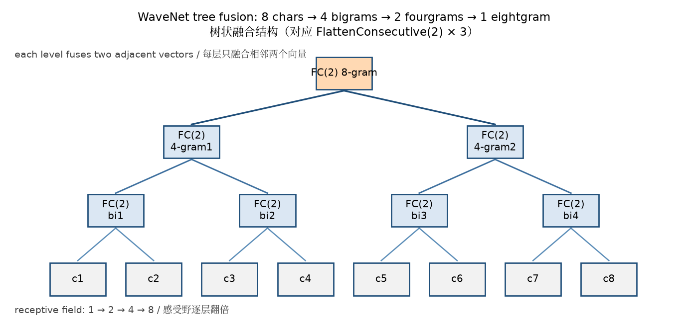

# 02 — WaveNet 架构：层次化融合

> 🌊 从"一口吞下 8 个字符"到"先消化 2 个，再消化 4 个，最后消化 8 个"。

## 动机：为什么不能直接展平？

之前的方法：8 个字符的 embedding 展平成 80 维向量，直接送进 Linear 层。

```
8 chars → 展平成 80 维 → Linear(80, 200) → ...
```

**问题**：80 维向量一次性混合所有信息，网络很难学到"相邻字符之间的关系"；而且首层参数量随上下文线性增长（80×200 = 16,000）。

**WaveNet 的思路**：逐步融合，从局部到全局。

```
8 chars → 4 bigrams → 2 fourgrams → 1 eightgram
```

每一步只融合相邻的两个向量，形成层次化的特征提取。首层只需 Linear(20, 200)，参数是展平版的 1/4。

> 📷 下面的实测对比会说明：在本教程的训练规模下，展平版和层次化的最终 loss 几乎打平——层次化的直接收益是**更少的参数和更清晰的结构先验**，loss 优势要放大模型/加长训练才兑现（见 03 章）。

## 树状融合结构

```
                    [8-gram 表征]
                   /              \
            [4-gram]            [4-gram]
           /        \          /        \
      [bigram]  [bigram]  [bigram]  [bigram]
       /  \      /  \      /  \      /  \
      c1  c2   c3  c4    c5  c6    c7  c8
```

从底向上，每层把两个相邻向量融合成一个。


*Tree fusion: 8 characters are merged pairwise by 3 FlattenConsecutive(2) layers into one 8-gram representation. / 树状融合：8 个字符经 3 层 FC(2) 两两合并，最终得到一个 8-gram 表征。*

## 关键洞察：Linear 支持多维输入

```python
x = torch.randn(4, 8, 10)   # (B, T, C)
W = torch.randn(10, 20)      # (C, H)
y = x @ W                     # (4, 8, 20)  ← 自动广播！
```

Linear 层**只在最后一个维度做矩阵乘法**。前面的维度（B, T）自动保留。

这意味着我们可以：
1. 不展平 T 维度
2. 直接在 3D tensor 上做 Linear 变换
3. 在每一步 FlattenConsecutive 后接 Linear

## FlattenConsecutive 层

```python
class FlattenConsecutive:
    def __init__(self, n):
        self.n = n

    def __call__(self, x):
        B, T, C = x.shape
        assert T % self.n == 0, f"T={T} 不能被 n={self.n} 整除"
        # (B, T, C) → (B, T//n, C*n)
        x = x.view(B, T // self.n, C * self.n)
        self.out = x
        return self.out

    def parameters(self):
        return []
```

两个细节：

- **整除断言**：`T % n != 0` 时 `view` 会给出错误的结果而不是报错，所以显式 `assert`。这也是作业题 1 的要求。
- **`parameters()` 返回空列表**：它没有可训练参数，但这个方法必须存在——`Sequential.parameters()` 会逐层调用 `layer.parameters()`，缺了它，把该层放进模型后调 `model.parameters()` 会直接 `AttributeError`。

**示例**：

```
输入:  (B, 8, 10)   — 8 个字符，每个 10 维
FC(2): (B, 4, 20)   — 4 个 bigram，每个 20 维
FC(2): (B, 2, 40)   — 2 个 fourgram，每个 40 维
FC(2): (B, 1, 80)   — 1 个 eightgram，80 维
```

注意拼接顺序：`view` 把**相邻**两个位置沿通道维排在一起——输出的第 i 组 = [位置 2i, 位置 2i+1]，即"c1c2 | c3c4 | ..."。

## WaveNet 完整架构

```python
model = Sequential([
    Embedding(vocab_size, n_embd),
    # 层 1: 8 → 4
    FlattenConsecutive(2),
    Linear(n_embd * 2, n_hidden, bias=False),
    BatchNorm1d(n_hidden),
    Tanh(),
    # 层 2: 4 → 2
    FlattenConsecutive(2),
    Linear(n_hidden * 2, n_hidden, bias=False),
    BatchNorm1d(n_hidden),
    Tanh(),
    # 层 3: 2 → 1
    FlattenConsecutive(2),
    Linear(n_hidden * 2, n_hidden, bias=False),
    BatchNorm1d(n_hidden),
    Tanh(),
    # 输出层
    Linear(n_hidden, vocab_size),
])
```

### 形状链：从 (B, 8, 27) 到 (B, 27)

逐层 forward（B 是 batch 大小，`n_embd=10, n_hidden=68`）：

| 层 | 输出 shape | 说明 |
|---|---|---|
| Embedding | (B, 8, 10) | 8 个字符各查成 10 维 |
| FlattenConsecutive(2) | (B, 4, 20) | 相邻两个拼接 |
| Linear → BN → Tanh | (B, 4, 68) | 只动最后一维 |
| FlattenConsecutive(2) | (B, 2, 136) | |
| Linear → BN → Tanh | (B, 2, 68) | |
| FlattenConsecutive(2) | (B, 1, 136) | |
| Linear → BN → Tanh | (B, 1, 68) | T 已经是 1 |
| Linear(68, 27) | **(B, 1, 27)** | logits 出来了，但还带着一个 1 |

最后一层的输出是 3D 的 `(B, 1, 27)`，而 `F.cross_entropy` 要 2D 的 `(B, 27)`。末级 T=1，所以 Linear 直接作用在 `(B, 1, 68)` 上就行，**不需要再接 Flatten**——但要手动收掉那个 1：

```python
logits = model(Xb)                       # (B, 1, 27)
loss = F.cross_entropy(logits.view(-1, logits.shape[-1]), Yb)   # (B, 27) vs (B,)
```

`logits.view(-1, logits.shape[-1])`（或等价地 `logits.squeeze(1)`）把 `(B, 1, 27)` 收成 `(B, 27)`。采样时同理：`probs = F.softmax(logits.view(-1, 27), dim=1)`。这个"收尾"是作业题 4 思考题的考点，也是从 3D 中间层回到 2D 输出的最后一跳。

## 扩大上下文窗口

`build_dataset` 里 `context = context[1:] + [ix]` 就是滑动窗口：弹掉最老的一个、添进最新的一个（Part 2 起一直如此，从未变过）。把 `block_size` 从 3 改成 8，上下文长度即翻近 3 倍。

展平 MLP（`n_hidden=200`）在本仓库的实测（seed=42，CPU）：

| block_size | 上下文示例（预测 `a`） | 验证 loss（20K 步） | 脚本锚点 |
|------------|----------------------|--------------------|----------|
| 3 | `emm` → `a` | ≈2.17 | [02_fix_lr_plot.py](../scripts/02_fix_lr_plot.py) 默认档 |
| 8 | `.....emm` → `a`（左补 5 个起始符） | ≈2.11 | [03_increase_context.py](../scripts/03_increase_context.py) 默认档 |

把上下文从 3 加到 8，验证 loss 降了约 0.06——有帮助，但幅度有限。（Karpathy 视频里 200K 步的长训练能到 ~2.10/~2.05；本教程的 20K 步档复现不到那个数，需以你自己的运行为准。）

**展平吃亏吗？** 在这个训练预算下：不吃亏。同一预算的 WaveNet 小模型验证 loss ≈2.10（见 [05_wavenet_architecture.py](../scripts/05_wavenet_architecture.py) 默认档），与展平的 ≈2.11 几乎打平。层次化融合的真正优势在别处：

1. **首层参数**：展平 `Linear(80, 200)` 要 16,000 参数，WaveNet 首层 `Linear(20, 200)` 只要 4,000；
2. **结构先验**："相邻先融合"的归纳偏置，层数 O(log T) 就能覆盖全部上下文；
3. **可扩展**：这两点在更大模型、更长训练下才兑现成 loss 优势——03 章放大后 dev 压到 ≈2.00，而展平 MLP 加大 n_hidden 的性价比会越来越差。

## view vs cat

把相邻两个位置拼到一起，有两种写法：

```python
# 方法 1: view（重解释 stride，零拷贝）
x = x.view(B, T // 2, C * 2)

# 方法 2: cat（分配新内存并复制）
left = x[:, ::2, :]     # 偶数位置 (B, T/2, C)
right = x[:, 1::2, :]   # 奇数位置 (B, T/2, C)
x = torch.cat([left, right], dim=2)
```

对这个写法，两者的**结果严格相等**（脚本 04 演示 4 实测 `allclose = True`）：cat 的第 i 组恰好也是 [位置 2i, 位置 2i+1]，与 view 的内存顺序一致。差别不在结果，在**代价**——view 只改 shape 和 stride，零拷贝；cat 要分配新内存并把数据复制一遍。训练循环每层都做这个操作，差异会累积。

但要小心：cat 的"等价"依赖切片顺序。如果写成 `cat([x[:, :T//2], x[:, T//2:]], dim=2)`（前一半 + 后一半），得到的配对就完全不同了。view 的语义永远是"内存顺序相邻"，不会配错。

## 代码参考

- 👉 [03_increase_context.py](../scripts/03_increase_context.py) — block_size 扩大到 8
- 👉 [04_flatten_consecutive.py](../scripts/04_flatten_consecutive.py) — FlattenConsecutive 演示
- 👉 [05_wavenet_architecture.py](../scripts/05_wavenet_architecture.py) — 完整 WaveNet 架构

## 下一步

架构搭好了，但训练时发现 BatchNorm 在 3D 输入上有 bug。

👉 [03 — 训练与 Bug 修复](03_training_and_bugs.md)
