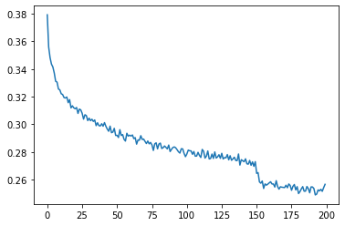
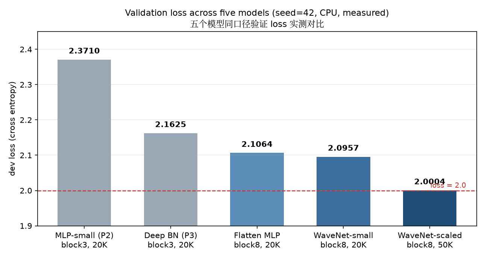

# 03 — 训练与 Bug 修复

> 🐛 波折之后才能到达终点。BatchNorm 的 3D bug 是 WaveNet 训练的关键障碍。

## BatchNorm1D 的 3D Bug

### 问题

WaveNet 中间层的输出是 **3D tensor** `(B, T, C)`，但我们之前写的 BatchNorm1d 只考虑了 2D：

```python
# Bug 版本
xmean = x.mean(dim=0, keepdim=True)  # 对 3D 输入: shape (1, T, C)
```

这会导致每个时间步**独立**归一化，而不是在整个 batch × time 上归一化。

### 修复

在 Part 3 的 2D 版上只改一处：`__call__` 的 reduce 维度按 `x.ndim` 分支。下面是完整的方法（与 [06_batchnorm_3d_fix.py](../scripts/06_batchnorm_3d_fix.py) 一致，可直接替换 01 章的 BatchNorm1d）：

```python
def __call__(self, x):
    if self.training:
        if x.ndim == 2:
            dim_reduce = 0          # (B, C) → 在 B 维度上 reduce
        else:
            dim_reduce = (0, 1)     # (B, T, C) → 在 B 和 T 维度上 reduce

        xmean = x.mean(dim=dim_reduce, keepdim=True)  # shape (1, 1, C) 或 (1, C)
        xvar = x.var(dim=dim_reduce, keepdim=True, unbiased=False)
        with torch.no_grad():
            sq = (0,) if x.ndim == 2 else (0, 1)
            self.running_mean = (1 - self.momentum) * self.running_mean + self.momentum * xmean.squeeze(sq)
            self.running_var = (1 - self.momentum) * self.running_var + self.momentum * xvar.squeeze(sq)
    else:
        if x.ndim == 2:
            xmean = self.running_mean.unsqueeze(0)
            xvar = self.running_var.unsqueeze(0)
        else:
            xmean = self.running_mean.unsqueeze(0).unsqueeze(0)
            xvar = self.running_var.unsqueeze(0).unsqueeze(0)
    xhat = (x - xmean) / torch.sqrt(xvar + self.eps)
    self.out = self.gamma * xhat + self.beta
    return self.out
```

一句话记忆：**"batch" 的语义在序列模型里是 B×T**——每个通道的一套统计量要在所有 batch 位置和所有时间步上一起算。

**关键**：
- `running_mean` 和 `running_var` 始终是 1D tensor `(C,)`
- 2D eval：`unsqueeze(0)` → `(1, C)` 广播到 `(B, C)`
- 3D eval：`unsqueeze(0).unsqueeze(0)` → `(1, 1, C)` 广播到 `(B, T, C)`
- `unbiased=False`：用有偏方差（除以 N 而非 N-1）。这与归一化本身用的方差一致；PyTorch 官方 `nn.BatchNorm1d` 更新 running_var 时反而用无偏估计，属于实现细节，知道即可。

### 验证

下面的小实验出自 [06_batchnorm_3d_fix.py](../scripts/06_batchnorm_3d_fix.py)（把 01 章的 `BatchNorm1d` 换成本节修复版即可直接运行）：

```python
# 3D 输入 (B=32, T=4, C=10)
x3d = torch.randn(32, 4, 10)
bn = BatchNorm1d(10)
y = bn(x3d)

print(f"running_mean shape: {bn.running_mean.shape}")  # (10,) — 始终 1D
print(f"输出均值: {y.mean():.6f}")   # 实测 -0.000000
print(f"输出标准差: {y.std():.6f}")  # 实测 1.000386

# eval 模式：running stats 冻结，且 3D 广播不报错
bn.training = False
y_eval = bn(torch.randn(16, 4, 10))
print(y_eval.shape)                                   # (16, 4, 10)
print(bn.running_mean.shape == (10,))                 # True — eval 不更新
```

对照 bug 版（`dim=0` 一路 reduce）：mean shape 是 `(1, 4, 10)` 而不是 `(1, 1, 10)`——每个时间步被独立归一化。更隐蔽的是，bug 版的 eval 分支只有一次 `unsqueeze`，`(1, C)` 对 `(B, T, C)` 会**碰巧广播成功、不报错**，但统计量从训练起就没更新过——loss 表面正常，模型却没学到该学的归一化。

## 放大训练

把网络容量增大：

| 参数 | 小模型 | 放大模型 |
|------|--------|---------|
| n_embd | 10 | 24 |
| n_hidden | 68 | 128 |
| 参数量 | 22,397（实测） | **76,579（实测）** |
| batch_size | 32 | 128 |
| 训练步数 | 20K | 50K |
| 学习率 | 0.1 → 0.01 @15K | 0.1 → 0.05 @30K → 0.01 @40K |

```python
model = Sequential([
    Embedding(vocab_size, 24),  # 更大的 embedding
    FlattenConsecutive(2), Linear(48, 128, bias=False), BatchNorm1d(128), Tanh(),
    FlattenConsecutive(2), Linear(256, 128, bias=False), BatchNorm1d(128), Tanh(),
    FlattenConsecutive(2), Linear(256, 128, bias=False), BatchNorm1d(128), Tanh(),
    Linear(128, vocab_size),
])
```

（放大后训练加长到 50K 步，学习率分三段衰减：0.1 → 0.05（30K 步）→ 0.01（40K 步）；见脚本 07。）

### 参数量怎么手算？

别背结论，会算才敢用。规则：`Embedding = vocab×n_embd`；每个 `Linear = fan_in×fan_out`（`bias=False` 无偏置）；每个 `BatchNorm1d = 2×C`（γ+β）；输出层 `Linear(n_hidden, 27)` 再加 `27`。

放大模型逐层算：

<div class="derivation">

<div class="d-title">🧮 推导：放大模型逐层参数量（合计 76,579，与脚本 07 打印一致）</div>

$$\begin{aligned} \text{Embedding}(27,24)&:\ 27\times 24 &&= 648\\ \text{Linear}(48,128)&:\ 48\times 128 &&= 6{,}144\\ \text{BN}(128)&:\ 2\times 128 &&= 256\\ \text{Linear}(256,128)&:\ 256\times 128 &&= 32{,}768\\ \text{BN}(128)&: &&= 256\\ \text{Linear}(256,128)&: &&= 32{,}768\\ \text{BN}(128)&: &&= 256\\ \text{Linear}(128,27)&:\ 128\times 27+27 &&= 3{,}483\\ \text{Total}&: &&= 76{,}579 \end{aligned}$$

</div>

小模型同法：270 + 1,360+136 + 9,248+136 + 9,248+136 + 1,863 = **22,397**（脚本 05 打印一致）。

### 性能对比（本仓库实测，seed=42，CPU）

| 模型 | block_size | 训练 | 验证 loss | 复现命令 |
|------|-----------|------|----------|---------|
| MLP 最小配置（Part 2） | 3 | 20K 步 | 2.3710 | `Part2_mlp/scripts/05_minibatch_training.py`（n_embd=2, n_hidden=100） |
| 深层 BN（Part 3） | 3 | 20K 步 | 2.1625 | `Part3_batchnorm/scripts/05_deep_network.py`（n_hidden=100） |
| 展平 MLP（n_hidden=200） | 8 | 20K 步 | 2.1064 | `Part5_wavenet/scripts/03_increase_context.py` |
| WaveNet 小模型 | 8 | 20K 步 | 2.0957 | `Part5_wavenet/scripts/05_wavenet_architecture.py` |
| **WaveNet 放大** | **8** | **50K 步** | **2.0004**（test 1.9948） | `Part5_wavenet/scripts/07_scaled_wavenet.py` |

（全部为 seed=42 的默认档实测，数值随线程数/硬件有 ±0.01 浮动。视频原配置训练更长：MLP ~2.10、深层 ~2.07、放大 WaveNet ~1.99——趋势一致，但**视频数字在本教程的步数档下不可直接复现**，请以自己的运行为准。）

放大 + 加长训练后，验证 loss 从 ≈2.10 压到 **2.0004**（测试集 1.9948）——基本贴着 2.0 的心理线；想稳定 < 2.0，需要视频里更大的训练预算或作业题 5 的调参（更多步数/更细的 lr 调度）。

值得注意的对照：展平 MLP（2.106）与 WaveNet 小模型（2.096）在这个预算下几乎打平。层次化的收益是**参数效率**（首层 4,000 vs 16,000）加上放大后的扩展性——容量和训练预算上去之后，差距才拉开（2.37/2.33 级别的 block3 旧架构 vs 2.00）。

作为参照，下面是原 notebook（视频配置、训练更长）留下的 loss 曲线——只有趋势可参考，无坐标轴标注，不代表本教程步数档的实测：


*Loss curve from the original notebook (video configuration, longer training). / 原 notebook 的训练 loss 曲线：快速下降后缓慢收敛，lr 衰减处有台阶。仅作趋势示意。*

## 卷积预览：WaveNet 的另一种视角

我们用 FlattenConsecutive + Linear 实现的层次融合，与 **Dilated Causal Convolution**（膨胀因果卷积）看数据的方式相同——**感受野都按 1→2→4→8 指数增长**：

```
传统卷积（kernel=2）:
  c1 c2 c3 c4 c5 c6 c7 c8
  ├─┤ ├─┤ ├─┤ ├─┤ ├─┤ ├─┤ ├─┤
  (每次看 2 个相邻字符)

膨胀卷积（dilation=2）:
  c1 c2 c3 c4 c5 c6 c7 c8
  ├─────┤ ├─────┤ ├─────┤
  (每次看间隔 2 的字符)

膨胀卷积（dilation=4）:
  c1 c2 c3 c4 c5 c6 c7 c8
  ├───────────┤
  (每次看间隔 4 的字符)
```

准确的说法是**感受野等价，算子不等价**：

- **我们的方式**：FlattenConsecutive + Linear 是 kernel=stride=2 的**非重叠**融合——每层 T 减半，第 3 层后 T=1，位置信息被逐步"折叠"；
- **WaveNet 原文**：stride=1 的膨胀**滑窗**，窗口重叠、每层输出保持原时间分辨率 T，可以在任意长度序列上继续堆。

两者在"每层看多远"这件事上等价（这正是 roadmap 要求掌握的等价视角），但不是同一个算子：序列很长、或需要保留逐时间步输出（如音频合成）时，滑窗卷积才是正确工具。

> 💡 这就是为什么论文叫 "WaveNet"——它最初是为音频波形设计的，用膨胀因果卷积处理超长序列。

## 代码参考

- 👉 [06_batchnorm_3d_fix.py](../scripts/06_batchnorm_3d_fix.py) — BatchNorm 3D bug 修复（秒级，自验证）
- 👉 [07_scaled_wavenet.py](../scripts/07_scaled_wavenet.py) — 放大训练（完整档 CPU 约 15-25 分钟；`--quick` 1000 步约 1 分钟；`STEPS=2000` 自定义短程档）


*Dev loss across five models, same seed and hardware (MLP-small 2.3710 → scaled WaveNet 2.0004). / 五个模型同口径（seed=42、CPU、20K 或 50K 步）验证 loss 对比：从 Part 2 最小 MLP 的 2.37 一路压到放大 WaveNet 的 2.00。*

## 课后作业

动手实践！去完成练习：

👉 [Assignment 5](../../../assignments/assignment_5/)
