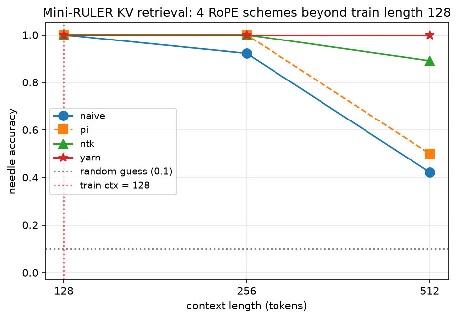

# 12 — 毕业指南：从本课脚本到官方 minimind 仓库

> 🧭 前 10 章我们用课程脚本把 minimind 从零长到毕业（v9）。这一章是"最后一公里"：
> 只靠本指南（不读原仓库 README），在官方仓库里跑通
> **train_tokenizer → train_pretrain → train_full_sft → train_dpo**，并用 `eval_llm.py` 交出数字；
> 再加三个进阶实验（RoPE 外推四件套 / 迷你 RULER / MoE 负载均衡）作为面试加分项。
>
> 内容基于 minimind master（2026-08 核对，Apache-2.0）。上游更新较快，若对不上以原仓库为准。

> **验证边界（诚实声明）**：本指南的**事实**（脚本路径、参数默认值、数据文件名与格式、
> 配置字段、时长报价）已逐一对照 minimind master 源码核验；课程内实验（07/12/13 号脚本、
> `my_minimind --stage 5..9`）已在本机全量跑通并落盘证据（`temp/out/logs/`）；
> **官方仓库端到端跑通**需要下载 2.9GB 数据 + 单卡数小时，未纳入课程自动验证，请按第 5 节成本现实自行执行。

## 🎯 学习目标

- ✅ **跑通** 官方 minimind 四件套（tokenizer → pretrain → SFT → DPO）并交出 eval_llm.py 数字
- ✅ **对照** 课程脚本与官方 trainer 的字段级映射（知道每个参数放大成什么）
- ✅ **解释** 长上下文外推四方案（naive/PI/NTK/YaRN）的 ppl 与 needle 检索实测排序
- ✅ **评估** 长上下文能力的三层验证法（NIAH 冒烟 / RULER 类合成套件 / 真实任务榜单）

## 📖 前置知识

- **必须掌握**：本 Part 02-11 章（尤其 09-11 章三阶段训练）——本指南假设你理解每个阶段在做什么、
  为什么这么配超参
- **建议掌握**：[Part 8 02 章](../../Part8_post_training/tutorial/02_sft_and_chat.md) 的 SFT 数据格式
  （官方 SFT 数据同构）
- **可选**：一块 ≥8GB 显存的 NVIDIA GPU（租的也行，见"成本现实"；进阶实验的
  12 号脚本 CPU 也能跑、13 号 GPU 更快）

## 第 0 步：结构对照——课程脚本 ↔ 官方文件

官方仓库的**训练脚本在 `trainer/` 目录**（不在根目录，别找错）：

| 本课脚本 | minimind 官方 | 关键差异 |
|---|---|---|
| `01_bpe_tokenizer.py`（自训对照版） | `trainer/train_tokenizer.py` | 官方用 HF `tokenizers` 的 ByteLevel BPE，词表 6400，在 sft 语料上训练；课程版在 pretrain sample 上自训并对照（01 章：重合度 39.2%） |
| `my_minimind.py`（`MiniMindForCausalLM`） | `model/model_minimind.py` | 架构同构（RMSNorm+RoPE+GQA+SwiGLU+tie+QK-Norm）；官方多 flash-attn、YaRN 选项 |
| `my_minimind.py --stage 7` | `trainer/train_pretrain.py` | 官方吃 `pretrain_t2t_mini.jsonl`（中文问答对）；full 档超参逐项对齐 |
| `my_minimind.py --stage 8` | `trainer/train_full_sft.py` | 官方 loss mask 只监督 `<|im_start|>assistant` 到 `<|im_end|>` 段（10 章讲的 token 子序列扫描同款） |
| `my_minimind.py --stage 9` | `trainer/train_dpo.py` | 官方 beta=0.15、lr=4e-8（"建议 ≤5e-8 避免遗忘"）；sum 口径（11 章讲了三处与教科书的不同） |
| `my_minimind.py --stage 6` 的 `graduate()` | `eval_llm.py` | 官方是交互式 chat；榜单跑 lm-evaluation-harness |

## 第 1 步：环境与数据

课程侧已经就位（`scripts/00_download_data.py` 下载到 `Part7_minimind/dataset/`，
sample 三件套 + 官方 tokenizer）。跑**官方仓库**则：

```bash
git clone https://github.com/jingyaogong/minimind && cd minimind
pip install torch transformers datasets tokenizers modelscope accelerate

# 官方推荐最小组合（共 ~2.9GB，ModelScope 国内快；断点续传：重跑同一条命令）
modelscope download --dataset gongjy/minimind_dataset \
  pretrain_t2t_mini.jsonl sft_t2t_mini.jsonl dpo.jsonl --local_dir ./dataset
```

| 文件 | 大小 | 用途 | 每行格式（jsonl） |
|---|---|---|---|
| `pretrain_t2t_mini.jsonl` | 1.2GB | 预训练 | `{"text": "如何才能摆脱拖延症？..."}` |
| `sft_t2t_mini.jsonl` | 1.6GB | SFT（多轮对话） | `{"conversations": [{"role":"user","content":"你好"},{"role":"assistant","content":"你好！"}]}` |
| `dpo.jsonl` | 53MB | DPO | `{"chosen": [{"content":"Q","role":"user"},{"content":"好回答","role":"assistant"}], "rejected": [{...坏回答...}]}` |

> 💡 网上老教程里的 `pretrain_hq.jsonl` / `sft_512.jsonl` 是**已废弃的旧文件名**，现在都是 `*_t2t_*` 命名。

## 第 2 步：配置对照——把课程版放大回官方规模

| 配置 | hidden | layers | q/kv heads | vocab | rope θ | 参数量 |
|---|:---:|:---:|:---:|:---:|:---:|---:|
| 本课 toy 档（无 GPU 自动） | 64 | 2 | 4/2 | 6400 | 1e6 | ~0.5M |
| **本课 GPU 档（= minimind2-small）** | **512** | **8** | **8/2** | 6400 | **1e6** | **26M** |
| minimind-3（官方 master 默认） | 768 | 8 | 8/4 | 6400 | 1e6 | 64M |
| minimind-3-moe | 768 | 8 | 8/4（4 专家 top-1） | 6400 | 1e6 | 198M 总参 / 每 token 激活 64M |

> ⚠️ 三个容易看漏的字段：① `intermediate_size` 官方**两代公式**不同——已发布的 26M
> （minimind2-small）用 `int(hidden·8/3)` 对齐 64 → **1408**（≈2.75×，守恒解）；现 master
> （minimind-3 起）用 `ceil(π·hidden/64)·64` → **768→2432 / 512→1664**（演变史见
> [07 章](07_ffn_moe.md)）。② `max_position_embeddings=32768`、`tie_word_embeddings=True`、
> 26M 的 `rms_norm_eps=1e-5`（minimind-3 为 1e-6）。③ 26M 的 kv_heads 是 **2**（不是 4）——
> GQA 压得更狠。

**配置变化的因果**（面试常问"参数放大 10 倍，超参怎么跟着动"）：
- **lr 降**：模型越大梯度噪声越小但发散风险越大，26M 用 5e-4，百 M 降到 ~3e-4；
- **batch（×梯度累积）升**：更大 effective batch 稳住大模型训练（官方 pretrain effective = 32×8=256）；
- **seq_len 升**：预训练 340 → SFT 768 → DPO 1024，随阶段需要的上下文变长；
- **warmup/cosine**：官方把 schedule 封装成 cosine 从 1.0×lr 衰减到 **0.1×lr**，无独立 warmup 参数——
  小模型短训练可以直接不 warmup。

## 第 3 步：四阶段训练（官方默认超参，可直接抄）

```bash
# ① 分词器（官方不建议重训，直接用仓库自带 minimind_tokenizer；想重训：）
python trainer/train_tokenizer.py

# ② 预训练：epochs=2, bs=32, accum=8(effective 256), lr=5e-4, seq=340, bf16
python trainer/train_pretrain.py --epochs 2 --batch_size 32 --accumulation_steps 8 \
  --learning_rate 5e-4 --max_seq_len 340 --data_path ./dataset/pretrain_t2t_mini.jsonl \
  --save_weight pretrain --dtype bfloat16

# ③ SFT：epochs=2, bs=16, lr=1e-5, seq=768（从 pretrain 权重续）
python trainer/train_full_sft.py --epochs 2 --batch_size 16 --learning_rate 1e-5 \
  --max_seq_len 768 --data_path ./dataset/sft_t2t_mini.jsonl \
  --from_weight pretrain --save_weight full_sft

# ④ DPO：epochs=1, bs=4, lr=4e-8(≤5e-8!), beta=0.15, seq=1024（从 SFT 权重续）
python trainer/train_dpo.py --epochs 1 --batch_size 4 --learning_rate 4e-8 \
  --max_seq_len 1024 --data_path ./dataset/dpo.jsonl --beta 0.15 \
  --from_weight full_sft --save_weight dpo
```

产物在 `./out/`（如 `pretrain_512.pth` → `full_sft_512.pth` → `dpo_512.pth`）。
课程侧等价物：`my_minimind.py --stage 7/8/9 --profile full`（超参与上面逐项对齐）。

## 第 4 步：验收——交出具体数字

```bash
# 交互式对话冒烟测试
python eval_llm.py --weight_mode 1 --load_weight 1 --hidden_size 512  # 加载 out/dpo_512.pth

# 榜单（官方用 lm-evaluation-harness）
lm_eval --model hf --model_args pretrained=<你的transformers格式权重> \
  --tasks ceval cmmlu arc_easy piqa --batch_size 8
```

**预期行为对照表**（判断自己训没训对；课程版在 09-11 章末尾已逐阶段演示）：

| 阶段 | 问它一句话，应该... |
|---|---|
| pretrain 后 | 输出**流利中文但答非所问**（续写"问句"而不是回答） |
| SFT 后 | **能按一问一答格式说话**，内容可能仍简单/有错 |
| DPO 后 | 风格更"讨喜"，长答案结构更好（幅度不大，lr 极小是故意的） |

参考量级（官方 minimind-3，lm-eval-harness）：ceval 24.89 / cmmlu 25.38 / arc_easy 28.49 / piqa 50.65——
小模型在多选任务上接近随机（25-30%）是**正常的**，看相对变化而不是绝对分数。

## 第 5 步：成本现实（没有卡也能跑）

| 项 | 数字 |
|---|---|
| 官方实测（RTX 3090 单卡，bf16，dense 64M） | pretrain ≈1.21h + SFT ≈1.10h ≈ **2.3h**，市价约 ¥3 |
| 显存 | 26M/64M bf16 + effective batch 256 → **<24GB**，3090/4090 单卡即可 |
| 租卡 | AutoDL / 智星云 / 仙宫云等按时租用 3090/4090，¥1-2/小时档；跑完全流程一杯奶茶钱 |
| 数据 | 2.9GB，ModelScope 国内直连一般 10-30 分钟（或 `--sample-only --no-full` 只要 48MB 走课程 quick 档） |

> 💡 建议：先租 2 小时把 ②③ 跑通看到模型说话，再决定要不要补 ④——正反馈最快。

## 第 6 步：进阶实验（面试加分项）

### 🧪 实验 1：RoPE 长上下文四件套（ppl 版）

**RoPE 长上下文四件套**（minimind 内置 `inference_rope_scaling` 选项）：

| 方法 | 做法 | 关键数字 |
|---|---|---|
| naive（直接外推） | 角度表算到新长度，什么都不改 | 训练外的旋转角全是分布外 → 外推区 ppl 明显劣化 |
| Position Interpolation | 位置 m → m/s 压进训练范围 | Llama-1 7B 2k→32k 只需 ~1000 步微调（论文实验口径）；高频维度被过度压缩 → 零样本必掉点 |
| NTK-aware | 改 base：θ' = θ·s^(dim/(dim-2)) | 高频几乎不动（局部序保留），小倍数可近零样本外推 ~2× |
| YaRN | 逐维 ramp 混合 PI/NTK + 注意力温度 √(1/t)=0.1·ln(s)+1 | 7B 128k 模型 400+200 步微调（s=16 用 400 步到 64k、s=32 再加 200 步），比 PI 省 ~10× token |

> 🔑 **YaRN 三部件**（实现对照 HF `modeling_rope_utils.py`，论文 [2309.00071](https://arxiv.org/abs/2309.00071)）：
> ① `find_correction_dim` 反解"在训练长度内转 32 圈 / 1 圈"的维度边界；
> ② 逐维 ramp：高频维（短波长）原样外推、低频维（长波长）全插值、中间线性过渡；
> ③ 温度：softmax 前给 q 乘 √(1/t)=0.1·ln(s)+1 微微锐化注意力（论文/HF 官方做法是
> √(1/t) 同时乘 q、k，等价于 logit ×1/t；本课脚本只乘 q，玩具尺度上两者几乎不可区分）。
> 📝 命名对照：论文 Eq.11 只用无下标的 α=1 / β=32；HF 把 β 重命名为 `beta_fast=32`（高频维
> 边界）、α 重命名为 `beta_slow=1`（低频维边界）——取值与边界一一对应，只是多了 fast/slow 后缀。

**亲手实验**：跑本课 [12_rope_scaling.py](../scripts/12_rope_scaling.py)——
同一模型只换位置方案，实测"训练 128 → 推理 256"（s=2）的外推 ppl。语料为**官方 mini 预训练
数据**（6400 BPE 词表；RTX 4090 / torch 2.6.0 / 2026-09 实测，CPU 复跑趋势一致；
PI 为连续插值实现——位置 m/s 是小数，角度表相邻行线性插值，若直接整数截断会让相邻
token 位置重合、ppl 假性变差）：

```text
方案                          ppl @ctx=128（训练内）   ppl @ctx=256（外推）
① naive（直接外推）             77.71                  84.58
② PI（位置 ÷2，连续插值）       88.16                  84.55
③ NTK（base×s^(d/(d-2))）       78.53                  78.45
④ YaRN（ramp+温度1.069）        80.85                  77.63
```

📊 三个读数：**训练内** PI 崩到 88+（它把见过的位置也压掉一半，零样本等于换位置分布——
"PI 必须配微调"不是论文套话，是实测）；**外推区** naive 劣化 +8.8%（77.71→84.58）；
**YaRN 外推区最优**（77.63，甚至低于自己训练内的 80.85——插值把低频维压回训练范围，
抵消了外推噪声）。注意 6400 词表语料的 ppl 天然比字符级高一个量级（每步在更多候选里犹豫），
**只看同一语料内的相对排序**。

### 🧪 实验 2：迷你 RULER（needle 检索版）——ppl 不等于"记得住"

> 🧭 衔接：实验 1 的 ppl 只测"读得顺不顺"（下一 token 概率），不测"从 2 万字里**取回某条具体信息**"。
> 长上下文的实用能力是后者——这正是 RULER 论文的核心主张。

跑本课 [13_long_context_eval.py](../scripts/13_long_context_eval.py)：
合成 KV 检索任务（`"a3,b7,…,a3,b7,… ?b → 7"`，字典 21 对、每对出现两次、query 问一个 key 的值），
同一模型（训练长度 128）在 {128, 256, 512} 三档 × 四方案上的 needle 准确率
（RTX 4090 / torch 2.6.0 / 2026-09 实测，随机猜 = 0.100）：

```text
ctx (s)      naive      pi     ntk    yarn
128 (s=1)    1.000   1.000   1.000   1.000   ← 训练内四方案数学上等价（sanity check）
256 (s=2)    0.922   1.000   1.000   1.000
512 (s=4)    0.422   0.500   0.891   1.000   ← naive 崩、PI 零样本不稳、yarn 满分
```

📊 与实验 1 互补且互相印证：ppl 里 yarn ≤ ntk < naive，检索准确率里 yarn ≥ ntk ≫ naive。



*上图 `images/output_long_context.png` 由 13 号脚本生成（12 号脚本不画图）。*

> ⚠️ 该脚本训练段在 CPU 上约 45 秒（实测 GPU 约 5-15 秒，随卡与 autotune 波动）：检索电路
> （归纳头）不是渐进变好，而是训练到 ~2000 步"顿悟"式出现（loss 长平台后 accuracy 0.3→1.0
> 跳变），步数不能再砍。

### 🧪 实验 3：MoE 负载均衡——aux loss 到底救了什么

跑 `python my_minimind.py --stage 5`（实验③）：4 簇"有结构"的输入诱惑路由器偏心，
对比 α = 0 / 0.01（Switch 论文推荐）/ 5e-4（minimind 默认）三档
（RTX 4090 / 2026-09 实测，证据 `temp/out/logs/exp07_moe_load_balance.csv`）：

```text
α (aux系数)   gini ↓   max/mean ↓   任务 loss   专家负载 f_i
0             0.533    2.53         0.0065     [0.00 0.23 0.00 0.23 0.21 0.32 0.00 0.01]
0.01          0.115    1.34         0.0234     [0.11 0.12 0.09 0.14 0.11 0.11 0.16 0.17]
5e-4          0.087    1.28         0.0190     [0.14 0.14 0.12 0.16 0.11 0.11 0.09 0.12]
```

📊 α=0 时 8 个专家里 **3 个彻底失业**（f_i=0.00）——rich-get-richer；α>0 把负载拉平
（gini 0.53→0.09，最忙专家从平均 2.5 倍降到 1.3 倍），代价是任务 loss 从 0.0065 升到
0.019-0.023：**均衡是用一点点任务性能换"所有专家都活着"**。DeepSeek-V3 已改用无 aux loss
的 per-expert bias 法（[arXiv 2408.15664](https://arxiv.org/abs/2408.15664)）——系数是超参，不是定律。

### 为什么 NIAH 不够：长上下文要怎么评测？

大海捞针（NIAH，在长文里藏一句话再问出来）曾是最流行的长上下文演示，但它会**严重高估**能力：

- 🔑 [RULER（arXiv 2404.06654）](https://arxiv.org/abs/2404.06654)：评测了 17 个**声称 ≥32K 上下文**的模型——
  它们在朴素 NIAH 上都接近满分，但在更难的变体（多针、多跳追踪、聚合）上大幅掉点，
  **只有一半能在 32K 长度上维持满意表现**。NIAH 只代表"最表层的一种长上下文理解"。
- 📊 [LongBench v2（arXiv 2412.15204）](https://arxiv.org/abs/2412.15204)：503 道 8k～2M 词的多选题，
  直接作答的最好模型只有 **50.1%** 准确率（o1-preview 靠更长推理链到 57.7%，15 分钟限时的人类专家 53.7%）——
  真实长文理解远未解决。
- 📝 [HELMET（arXiv 2410.02694）](https://arxiv.org/abs/2410.02694)：主张用"现实任务"（代码库、多轮对话、
  长依赖阅读理解等）取代纯合成 NIAH 来衡量有效上下文。

💡 面试答法："长上下文能力要分三层验证——① NIAH 只能当冒烟测试；② 合成任务套件（RULER：
needle/多跳/聚合，我们脚本 13 是其迷你版）量'有效上下文长度'；③ 真实任务榜单
（LongBench v2 / HELMET）看落地。只报上下文窗口大小的营销数字，一测一个不吱声。"

### 🧪 进阶实验：概念检验与动手实践

<details>
<summary>进阶 Q1: 为什么 YaRN 在外推区（77.63）的 ppl 反而低于自己训练内（80.85）？</summary>
A: 训练内的 80.85 含"温度 1.069 锐化 + 大部分维对被（部分或完全）插值"的轻微扰动；外推时，
naive 的痛点是低频维的旋转角超出训练范围（分布外），YaRN 把这些维插值压回训练范围，消掉的
噪声比引入的扰动多，于是出现"外推更好"的反直觉读数。这也提醒：ppl 对比要在**同一方案自身**
的训练内/外推两栏看，跨方案的绝对值受各自扰动影响。
</details>

<details>
<summary>进阶 Q2: PI 为什么"训练内也崩"？NTK 为什么不崩？</summary>
A: PI 把**所有**位置 m→m/s：模型在训练长度内见过的位置分布被整体压掉一半（训练时位置 64
对应的角度，推理时出现在位置 32），等于换了一个位置分布——零样本必然掉点，所以论文都配
微调（~1000 步）。NTK 只改 base、按频率分摊压缩：高频维（决定相邻 token 局部顺序）几乎
不动，低频维分担压缩，位置-角度映射保持连续单调，训练内的行为几乎不变。
</details>

<details>
<summary>进阶 Q3: 13 号脚本的检索任务为什么把字典设计成"每对出现两次"？</summary>
A: 这是把任务改造成"归纳头（induction head）电路"可解的形式——第一次出现 `[k]→v` 建立
关联，第二次出现 `[k]` 时模型靠"找上一次 k 后面跟了什么"来答题（+1 偏移的归纳电路），
比"死记 21 对字典"更容易在几千步内涌现，也更贴近真实长上下文的"检索"用法（RULER 的
多键变体同理）。若每对只出现一次，模型只能靠记忆，小模型上收敛极慢甚至不收敛。
</details>

### 动手实践：把外推倍数拉到 s=4

**任务**：修改 [12_rope_scaling.py](../scripts/12_rope_scaling.py) 的外推档位
（`EVAL_CTX` 从 256 改为 512，s=4），重跑并记录四方案的 ppl 排序。

**验收标准**：
- [ ] `ppl@512` 排序仍满足 `yarn ≤ ntk < naive`（PI 允许仍最差）
- [ ] YaRN 温度随 s=4 变为 `0.1·ln(4)+1 ≈ 1.139`（输出里有打印）
- [ ] 能用一句话解释"为什么 s 越大，naive 与其他三者的差距越大"（低频维分布外的比例上升）
- [ ] （进阶）再跑 [13_long_context_eval.py](../scripts/13_long_context_eval.py)
      对照 ctx=512 档的 needle 准确率，验证"ppl 排序与检索能力排序一致"

## 🎯 面试直通车

<details>
<summary>Q1: 你复现过 minimind？三个阶段的 lr 差一个数量级，为什么？</summary>
A: pretrain 5e-4（随机初始化，需要大步子从零学统计规律）；SFT 1e-5（预训练权重已很好，
大 lr 会灾难性遗忘语言能力，只微调"格式与指令遵循"）；DPO 4e-8（对齐阶段动的是偏好分布，
lr 稍大就会把 SFT 能力打崩——原仓库注释明说"≤5e-8 避免遗忘"）。核心：越靠后的阶段，
改动越"表面"、越需要保住底层能力，lr 递减 1-2 个数量级是通用规律。
</details>

<details>
<summary>Q2: SFT 的 loss mask 具体遮哪里？为什么不遮 prompt？</summary>
A: 只对 `<|im_start|>assistant\n` 到 `<|im_end|>` 之间的 token 算 CE，prompt 与 padding 全部
置 -100。因为训练目标是"学会回答"而不是"学会复述问题"——不 mask 的话模型会浪费容量去
拟合用户输入的分布，还会学会自问自答的怪格式。
</details>

<details>
<summary>Q3: DPO 的 β=0.15 意味着什么？调大调小会怎样？</summary>
A: β 是"离参考模型的信任度"：β·(Δπ − Δref) 过 sigmoid。β 大 → 更信任参考模型、更新保守，
不容易遗忘但偏好学得慢；β 小 → 更激进，偏好摆动大、容易退化（verbose/repetition）。
官方 0.15 配 lr 4e-8 是小模型上稳定的一档。
</details>

## ✅ 验收标准

- [ ] 只靠本指南，在 minimind2-small（26M）上跑完 ②③④，`out/` 有三个权重
- [ ] `eval_llm.py` 加载 DPO 权重能对话，且行为符合"预期行为对照表"
- [ ] 能不看资料说出：t2t 数据格式、loss mask 位置、四阶段超参及"为什么这么定"
- [ ] （加分）跑了 `my_minimind.py --stage 5`，能解释 α 三档的 gini/任务 loss 变化
- [ ] （加分）跑了 12 + 13 号脚本，能解释四件套的 ppl/准确率排序、YaRN 温度因子
      √(1/t)=0.1·ln(s)+1，以及"为什么 NIAH 不够"

## 🔗 相关资源

- 🐙 [jingyaogong/minimind](https://github.com/jingyaogong/minimind)（Apache-2.0）
- 📦 [数据集 ModelScope](https://www.modelscope.cn/datasets/gongjy/minimind_dataset/files) / [HF 合集](https://huggingface.co/collections/jingyaogong/minimind)
- 📄 [YaRN (arXiv 2309.00071)](https://arxiv.org/abs/2309.00071) · [Position Interpolation (2306.15595)](https://arxiv.org/abs/2306.15595)
- 📄 [RULER 长上下文评测 (2404.06654)](https://arxiv.org/abs/2404.06654) · [LongBench v2 (2412.15204)](https://arxiv.org/abs/2412.15204) · [HELMET (2410.02694)](https://arxiv.org/abs/2410.02694)
- 📄 [Switch Transformer (2101.03961)](https://arxiv.org/abs/2101.03961) · [DeepSeek-V3 aux-free balancing (2408.15664)](https://arxiv.org/abs/2408.15664)

---

[← 上一章：阶段三 DPO](11_dpo.md) | [Part 7 README](README.md) | [选修下一章：MLA 与 NSA →](13_attention_mla_nsa.md)
